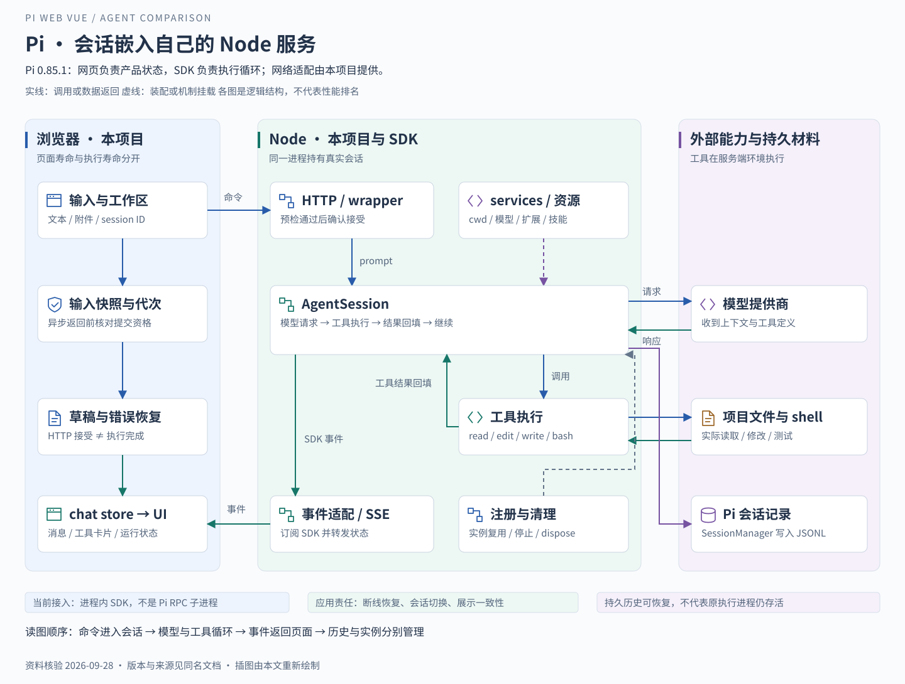

# Pi Agent：把运行能力嵌进自己的工作台

> 基线：本项目安装的 `@earendil-works/pi-coding-agent` 0.85.1；核验日期 2026-09-28。先理解“谁执行、谁展示”，再看接口名称。

## 一 从一个实际需求开始

假设用户在网页选择一个本地项目，输入“找到发送失败后草稿丢失的原因，修复并运行相关测试”。我们希望网页显示模型回答、文件修改和测试输出；用户切换面板时，执行不应跟着组件销毁。

Pi 提供了这个任务所需的 Agent 会话能力。本项目把它放进 Node 服务，自己实现网页、状态同步与文件查看。因此，要区分三个层次：

| 层次        | 提供什么                                           | 在当前项目中的位置        |
| ----------- | -------------------------------------------------- | ------------------------- |
| Pi 终端产品 | 可直接交互的编程工具，以及终端内的会话操作         | 并非本项目的网页界面      |
| Pi SDK      | 创建会话、发送输入、订阅事件、工具执行和上下文管理 | 由服务端导入并调用        |
| pi-web-vue  | 工作区、路由、消息展示、文件 Inspector、配置管理   | 用户直接操作的 Web 工作台 |

Pi 同时提供交互、打印或 JSON、RPC、SDK 等使用方式。本项目选择 SDK 嵌入；不能因为代码文件叫 `rpc-manager.ts`，就推断这里启动了 Pi RPC 子进程。[Pi 0.85.1 产品说明](https://github.com/earendil-works/pi/blob/v0.85.1/packages/coding-agent/README.md)、[本地实例管理](../../../server/utils/rpc-manager.ts)。

## 二 设计目标怎样落到架构上

**第一，把执行寿命与页面寿命分开。** 真实会话由服务端持有，页面保存会话身份和展示状态。这样浏览器断开后，仍有机会重新观察服务端对象；但 Node 进程退出后，原内存执行不会凭空继续。

**第二，把“命令被接受”与“任务已结束”分开。** 用户不必等整段 Agent 执行完成才获得发送反馈。当前 wrapper 在预检通过后确认接受，后续进度和结束经事件流返回。这是本项目对 SDK 的适配，不是把 `session.prompt()` 的完成语义改成了“仅入队”。

**第三，把通用循环与产品交互分开。** Pi 负责模型和工具循环；项目负责将事件变成消息、工具卡片、加载状态和错误提示。SDK 不会自动知道本产品什么时候应保留草稿或切换文件标签。

读图时先走上方的命令路径，再沿绿色结果回路返回。Node 内的会话是执行主体；左侧 Vue 状态是执行结果的展示投影，不是另一份独立 Agent。

## 三 一次修改任务怎样走完整条路

1. **确定运行目录与会话。** 页面传入工作区和会话身份；服务端创建或打开 SessionManager，加载该目录相关的服务与资源，创建 AgentSession。同一会话的请求尽量复用同一 wrapper。
2. **提交用户意图。** 前端发送文本和附件，wrapper 调用会话的 prompt。预检拒绝由请求报错；已经接受之后的运行变化走事件通道。
3. **模型要求读取代码。** 模型拿到上下文与工具定义，产生工具调用。调用描述只有名称和参数，真正读文件的是 Node 中的工具。
4. **读取结果进入下一次推理。** 工具返回内容，SDK 将结果接回会话。模型据此提出编辑，再调用相应工具修改文件。
5. **执行测试并继续判断。** shell 工具返回退出状态和输出。模型可以继续修复，也可以给出最终说明；“模型说修好了”与“测试通过”应有不同证据。
6. **将过程投影到网页。** SDK 事件经过 wrapper 与 SSE 进入 chat store，消息按调用 ID 配对工具结果，组件显示过程。最后由运行终态收束展示，不以 HTTP 成功代替任务完成。

SDK 文档定义 `prompt`、`subscribe`、`abort`、压缩和会话状态；应用链路见 [服务端 wrapper](../../../server/utils/rpc-manager.ts)、[SSE](../../../server/utils/event-stream.ts)、[chat store](../../../app/stores/chat.ts)。这些位置说明当前实现，不表示已做过本专题场景的真实模型测试。[SDK 基线](https://github.com/earendil-works/pi/blob/v0.85.1/packages/coding-agent/docs/sdk.md)。

## 四 理解几个真正影响接入的机制

### 会话、持久记录、运行资源各有职责

AgentSession 提供当前会话的交互操作，SessionManager 管理历史记录。0.85.1 还区分了 AgentSessionRuntime：替换活跃会话、恢复、分叉等操作属于 runtime 层；替换后需要重新绑定该会话的事件订阅。

当前项目采用自己的按 ID 注册与恢复机制，通过 services 和会话工厂接入。它并没有因为 SDK 存在 runtime API 就自动拥有全部 runtime 交互。这一点在升级 SDK 或实现历史分支时尤其重要。[SDK 的 Core Concepts](https://github.com/earendil-works/pi/blob/v0.85.1/packages/coding-agent/docs/sdk.md)。

### 历史记录不等于下一次模型输入

Pi 支持树状会话记录与上下文压缩。记录用于保留历史与分支，模型当前可见内容则可能经过压缩。网页能展示旧消息，不等于模型会原样收到全部旧消息。当前项目的历史读取、统计和压缩说明见 [会话存储与上下文](../../learning/08-会话存储与上下文.md)。

### 扩展负责增加机制，技能负责提供知识

扩展可以注册工具并介入事件，技能与提示模板为任务提供材料；它们对循环产生影响的方式不同。用一个技能写“每次修改都先确认”，不能替代执行前真正可强制的权限检查。

Pi 基线 README 明确把内置子代理、计划模式、权限弹窗和 MCP 留给扩展或外部环境实现。因此“Pi 可以扩展”和“当前项目已经拥有多代理审批流程”是两个结论。当前能力中心能管理资源，也不等于所有终端扩展的交互都能直接在网页工作。[Pi Philosophy 与 Extensions](https://github.com/earendil-works/pi/blob/v0.85.1/packages/coding-agent/README.md)、[本项目能力中心](../../learning/10-模型配置与能力中心.md)。

## 五 自建 Web 到底复用了多少

| 已可复用的底座         | 应用仍要承担的事情                     |
| ---------------------- | -------------------------------------- |
| 模型调用与工具结果回填 | 将 SDK 事件转成稳定的网络契约          |
| 会话记录与压缩         | 工作区、会话路由和旧请求隔离           |
| 流式事件与取消入口     | 草稿恢复、断线补齐、取消后的展示一致性 |
| 工具与资源加载         | 文件访问边界、配置编辑和扩展交互适配   |

这里的工程判断是：Pi 适合“执行底座尽量复用，产品状态与交互由自己掌握”的目标。代价是应用要拥有更多集成代码，尤其是生命周期与恢复逻辑。SDK 支持 abort，并不意味着前端只放一个停止按钮就完成取消：仍需等待执行状态变化、处理残留工具卡片和输入恢复。

还有一个容易忽略的边界：文件 Inspector 的路径校验只约束那条文件 API，不能据此声称 Agent 的 shell 已被同样规则隔离。执行安全需要约束真实工具环境。Pi 的扩展确认、容器或其他隔离方案应按部署需求选择，不能用页面权限替代。

## 六 面试时怎样说明选择

> 从当前实现看，我们需要的是一个由自己的 Node 服务持有的 Agent 会话，同时保留工作区、消息和文件界面的控制权。Pi 的 SDK 能提供工具循环、会话和事件，应用围绕它做 HTTP、SSE 和前端状态适配。这使实现边界比较清楚，但也要求应用负责断线、会话切换和草稿等一致性问题。
>
> 我不会说 Pi 比其他方案更强。若目标是快速复用成熟的编程工作流，可以评估 OpenCode 服务；如果要频繁替换运行时内部能力，则需要进一步比较 DeepSeek Harness 的组合方式。

**追问：为什么不直接让浏览器调用模型？** 因为任务还需要本地工具、会话存储与执行环境。浏览器直连模型只改变模型请求的位置，不会自动获得这些能力。

**追问：Pi 更新后，哪些地方最容易受影响？** 会话创建接口、事件形状和资源加载边界会影响适配层；前端消息模型应尽量通过应用契约隔离这些变化。这里是维护策略，不宣称已经实现完整版本兼容层。

**自测：** 能否不用函数名，说明“HTTP 接受成功后断线，工具仍在执行”时浏览器、Node、历史文件各自知道什么？能说明这一点，才真正理解了嵌入边界。

下一篇：[OpenCode](02-OpenCode.md) · 返回 [专题目录](README.md)。
