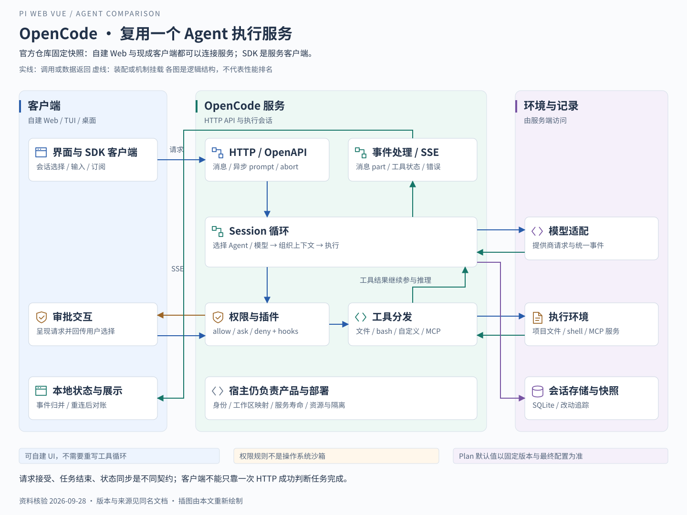

# OpenCode 从编程产品到可复用 Agent 服务

调研日期：2026-09-28。核验版本：`anomalyco/opencode@b471c2b4495747353af768fbf2e0790c9d820ce2`。本文读取官方文档源码与实现，没有安装或运行 OpenCode；请求路径是根据源码重建的典型执行过程，不是本项目的实测记录。

## 从使用场景理解设计目标

假设开发者要求“读取这个项目，修改消息发送逻辑，然后运行相关测试”。OpenCode 面对的是连续开发工作：模型既需要理解文件，也需要执行命令，还要把工具结果带回下一轮判断。与此同时，同一个执行过程可能由终端界面、桌面界面或自建 Web 发起。官方明确将 TUI 作为服务端的客户端，并提供独立的 `opencode serve`、OpenAPI 3.1 描述和事件流接口。[服务架构](https://github.com/anomalyco/opencode/blob/b471c2b4495747353af768fbf2e0790c9d820ce2/packages/web/src/content/docs/server.mdx)

**分析判断：**它的核心设计取舍是把“执行编程任务”放在服务端，把“如何展示和操控任务”交给客户端。因此，OpenCode 同时是可直接使用的编程产品，也是能够复用的 Agent 后端。把它描述为“只有 CLI，不能接自建 UI”是不成立的；但把 SDK 理解成浏览器内运行的完整 Agent 内核，同样不准确。

## 架构如何支撑一次真实开发任务

图中 HTTP 承载命令请求，SSE 承载状态通知；模型与工具形成反馈循环，文件和命令实际发生在运行服务端的环境。客户端显示的文字只是这个过程的一部分。

1. **建立任务上下文。**客户端创建或选取 session，并提交包含文本、模型和 agent 等信息的消息。服务端同时提供等待结果的消息接口和立即返回的 `prompt_async`，后者可以配合事件订阅更新界面。会话、消息及 part 有各自标识，便于把文本和工具执行归入对应任务。[请求接口](https://github.com/anomalyco/opencode/blob/b471c2b4495747353af768fbf2e0790c9d820ce2/packages/web/src/content/docs/server.mdx)
2. **组织可供模型使用的上下文。**会话循环读取压缩后的有效消息，选择 agent 和模型，再组合工具集合。项目规则可来自 `AGENTS.md` 等指令文件；源码还记录已加载的指令，避免同一轮重复附加。[会话循环](https://github.com/anomalyco/opencode/blob/b471c2b4495747353af768fbf2e0790c9d820ce2/packages/opencode/src/session/prompt.ts#L1088) [指令加载](https://github.com/anomalyco/opencode/blob/b471c2b4495747353af768fbf2e0790c9d820ce2/packages/opencode/src/session/instruction.ts#L60)
3. **读取项目。**模型可以先通过 glob、grep 定位文件，再通过 read 获取内容。工具向模型提供说明和参数 schema，服务端执行实际操作并返回结果。这里不是预先把整个仓库塞进提示词，而是由模型按任务逐步获取所需证据。[工具契约](https://github.com/anomalyco/opencode/blob/b471c2b4495747353af768fbf2e0790c9d820ce2/packages/web/src/content/docs/tools.mdx) [工具装配](https://github.com/anomalyco/opencode/blob/b471c2b4495747353af768fbf2e0790c9d820ce2/packages/opencode/src/session/tools.ts#L92)
4. **修改文件。**模型产生 edit、write 或 apply_patch 调用。服务端处理参数、目录边界和权限；以 edit 为例，实现包含文件锁、外部目录检查以及编辑授权请求。插件可以在工具执行前后介入。文件改动成功后，工具结果继续参与模型推理，而不是只在界面里显示一条“已修改”。[编辑实现](https://github.com/anomalyco/opencode/blob/b471c2b4495747353af768fbf2e0790c9d820ce2/packages/opencode/src/tool/edit.ts#L69) [执行钩子](https://github.com/anomalyco/opencode/blob/b471c2b4495747353af768fbf2e0790c9d820ce2/packages/opencode/src/session/tools.ts#L102)
5. **运行测试并反馈。**模型可调用 bash 执行项目适用的测试命令，读取输出后继续修正，最终给出结果。是否选择正确测试、是否充分覆盖风险，仍取决于任务要求、模型判断和可用环境，框架并不自动证明修改正确。会话循环明确区分继续、停止与需要压缩的情况。[Shell 工具说明](https://github.com/anomalyco/opencode/blob/b471c2b4495747353af768fbf2e0790c9d820ce2/packages/web/src/content/docs/tools.mdx) [循环出口](https://github.com/anomalyco/opencode/blob/b471c2b4495747353af768fbf2e0790c9d820ce2/packages/opencode/src/session/prompt.ts#L1272)

在核验提交中，默认模型运行路径使用 AI SDK 执行提供方请求和工具调度，再转换为统一的 LLMEvent 流；另有显式开启的实验性 native 路径，不能说所有请求都只经过一种实现。处理器消费事件，更新文本、工具状态、错误及快照信息。[模型适配边界](https://github.com/anomalyco/opencode/blob/b471c2b4495747353af768fbf2e0790c9d820ce2/packages/opencode/src/session/llm.ts#L224) [事件处理器](https://github.com/anomalyco/opencode/blob/b471c2b4495747353af768fbf2e0790c9d820ce2/packages/opencode/src/session/processor.ts)

## 工具 上下文 会话和权限的分工

**工具负责执行，上下文负责让模型知道发生了什么。**内置工具、自定义工具和 MCP 都能参与任务，但具体可见集合受到模型适配、配置及权限影响。MCP 支持本地与远程服务；其工具会增加上下文成本，因此扩展数量不是越多越好。[注册与筛选](https://github.com/anomalyco/opencode/blob/b471c2b4495747353af768fbf2e0790c9d820ce2/packages/opencode/src/tool/registry.ts#L291) [MCP 文档](https://github.com/anomalyco/opencode/blob/b471c2b4495747353af768fbf2e0790c9d820ce2/packages/web/src/content/docs/mcp-servers.mdx)

**会话持久化与模型上下文不是同一件事。**源码以 SQLite 表保存 session、message、part 等记录；循环根据有效历史构造模型输入，在窗口不足时触发 compaction。保存过完整记录，不等于每次都把完整记录交给模型。快照则服务于改动追踪和会话内回退，不能据此推导它能撤销任意外部 API 或 Shell 副作用。[存储结构](https://github.com/anomalyco/opencode/blob/b471c2b4495747353af768fbf2e0790c9d820ce2/packages/core/src/session/sql.ts#L22) [压缩触发](https://github.com/anomalyco/opencode/blob/b471c2b4495747353af768fbf2e0790c9d820ce2/packages/opencode/src/session/prompt.ts#L1161) [快照配置](https://github.com/anomalyco/opencode/blob/b471c2b4495747353af768fbf2e0790c9d820ce2/packages/web/src/content/docs/config.mdx)

**权限是操作决策，不等于操作系统隔离。**规则支持 allow、ask、deny，以及针对路径或命令模式的匹配；工具执行上下文合并 agent 与 session 权限，并调用授权服务。自建界面必须呈现待授权请求并回传选择，不能把等待授权误当作卡死。[权限规则](https://github.com/anomalyco/opencode/blob/b471c2b4495747353af768fbf2e0790c9d820ce2/packages/web/src/content/docs/permissions.mdx) [授权接入](https://github.com/anomalyco/opencode/blob/b471c2b4495747353af768fbf2e0790c9d820ce2/packages/opencode/src/session/tools.ts#L81)

这里存在值得保留的**文档与源码差异**：权限文档称 `.env` 默认 deny，固定提交的 agent 默认规则实际为 ask；agents 文档称 Plan 默认对编辑和 bash 询问，源码则禁止普通编辑、放行计划文件，且该段没有设置 bash 为 ask。本文以该提交源码说明默认值，不把 Plan 标签解释成严格只读沙箱；实际部署仍需核对最终配置。[默认规则与 Plan 实现](https://github.com/anomalyco/opencode/blob/b471c2b4495747353af768fbf2e0790c9d820ce2/packages/opencode/src/agent/agent.ts#L119) [对应文档](https://github.com/anomalyco/opencode/blob/b471c2b4495747353af768fbf2e0790c9d820ce2/packages/web/src/content/docs/agents.mdx)

## 扩展与自建 Web 应该复用什么

插件是本地或 npm 加载的 JS/TS 模块，可提供工具和事件钩子；agent 配置定义提示词、模型与权限，主 agent 与子 agent 分担不同任务；MCP 则连接外部工具服务。这些扩展点处于不同层级：增加业务工具不要求重写会话循环，换一个交互界面也不要求重写模型调用。[插件机制](https://github.com/anomalyco/opencode/blob/b471c2b4495747353af768fbf2e0790c9d820ce2/packages/web/src/content/docs/plugins.mdx) [Agent 配置](https://github.com/anomalyco/opencode/blob/b471c2b4495747353af768fbf2e0790c9d820ce2/packages/web/src/content/docs/agents.mdx)

官方 `@opencode-ai/sdk` 是类型化服务客户端：`createOpencode` 可启动服务并建立客户端，`createOpencodeClient` 可连接已存在的服务；类型由 OpenAPI 生成。对自建 Web，更自然的方案是连接受控后端，而非在页面中启动本地进程。[SDK 边界](https://github.com/anomalyco/opencode/blob/b471c2b4495747353af768fbf2e0790c9d820ce2/packages/web/src/content/docs/sdk.mdx)

| 可复用的已有能力            | 自建产品仍需承担的责任               |
| --------------------------- | ------------------------------------ |
| 会话 消息 模型调用 工具循环 | 业务工作区与会话映射 草稿和交互设计  |
| HTTP API SSE 文件查询与差异 | 事件归并 断线后状态对账 文件预览体验 |
| 权限请求与回复机制          | 授权界面 权限策略 审计与用户身份绑定 |
| 服务端运行与基础认证配置    | 部署 生命周期 资源限制 多用户隔离    |

右栏是架构分析提出的宿主责任，不是已经验证本项目实现的功能。官方服务提供可配置的 Basic Auth 和 CORS，但这些机制本身不能证明它具备业务所需的多租户授权和工作区隔离。[服务认证](https://github.com/anomalyco/opencode/blob/b471c2b4495747353af768fbf2e0790c9d820ce2/packages/web/src/content/docs/server.mdx)

## 适用取舍与面试表达

**分析判断：**需要快速获得成熟编程工作流、支持不同客户端，并接受已有 session、tool、permission 协议时，OpenCode 很有复用价值。若产品必须自行决定每个执行步骤、隔离策略和领域状态模型，就要评估适配既有运行时的成本；这不能仅凭“有 SDK”就判定为低成本集成。

面试可以这样回答：

> 我把 OpenCode 理解为客户端与 Agent 执行服务分离的编程系统。用户请求进入会话循环，服务端组织项目规则和历史，模型通过工具读取、修改文件、执行测试，再根据结果继续。它已经提供 HTTP、SSE 和类型化 SDK，因此能接自建 Web。真正需要设计的是客户端如何恢复状态、承接权限请求，以及服务端如何隔离用户和工作区。我会复用已有执行能力，同时明确产品层和运行环境仍由谁负责。

上述表达说明的是调研得到的架构理解，不应改写为“我已接入 OpenCode”或“已经完成多租户生产验证”。
