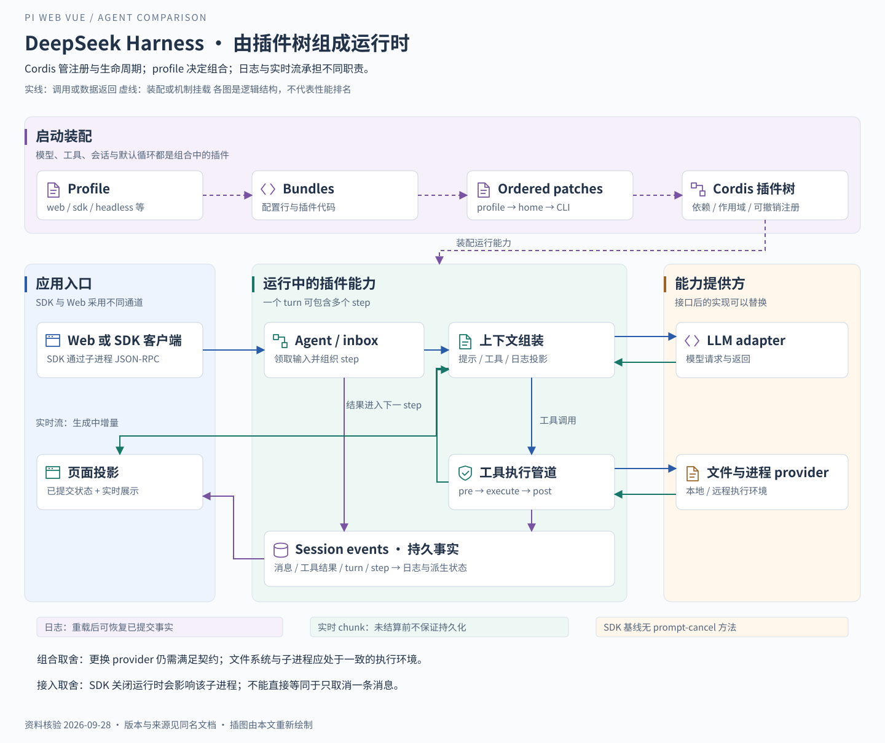

# DeepSeek Harness：把运行时组织成可替换的能力组合

> 核验日期：2026-09-28。基线为官方仓库提交 `21638c56315ae6a2b552d6091945d3144c9af32e`。该快照的 [README](https://github.com/deepseek-ai/deepseek-harness/blob/21638c56315ae6a2b552d6091945d3144c9af32e/README.md) 标注 developer preview，明确预告破坏兼容性的变更。

## 一 从“更换执行环境”理解它的定位

仍然是“读取项目、修改文件、运行测试”。今天任务在本地执行，明天可能希望把文件和 shell 移到远程隔离环境，同时保留相同的模型与界面。再往后，还想替换模型适配、会话存储或任务循环。

如果这些能力都写死在主循环里，每次变化都会影响大量代码。DeepSeek Harness 的设计选择是：**模型适配、工具注册、会话日志，甚至 Agent 循环自身，都通过 Cordis 插件组合。** 它同时提供可使用的应用形态和可组合的运行底座，不是只有“DeepSeek 模型 API 的调用封装”。[官方架构说明](https://github.com/deepseek-ai/deepseek-harness/blob/21638c56315ae6a2b552d6091945d3144c9af32e/docs/architecture.md)。

理解它时，先问“当前组合加载了什么”，再问“这个项目支持什么”。仓库里存在某个插件，不能证明每个 profile 都启用了它。

## 二 三个设计决定

### 用插件生命周期管理能力

Cordis 插件向共享 context 提供服务、事件监听和可撤销的注册。卸载插件时，相应注册跟随作用域撤销。这里的插件不只是“工具列表里多一项”，也可以提供模型适配、存储或默认循环。

这能降低替换单项能力对其他模块的影响，但代价是需要理解依赖、作用域和卸载时机。可替换意味着必须满足契约，不意味着任意删除插件后系统仍然有效。

### 用 profile 与 bundle 组织产品

profile 描述使用哪组 bundle；bundle 携带插件配置及代码。配置按 bundle 顺序、profile patch、home patch、命令行 patch 逐层组合。这个机制让定制应用主要通过组合与替换实现。

基线提供 `web`、`headless`、`sdk`、`sdk-minimal`、`acp` 等 profile。通常的应用组合复用 base；**sdk-minimal 是显式维护完整精简树的例外，并非简单追加在 base 上。** profile 是能力装配，不是用户对话中的“模型角色”。[Profiles and bundles](https://github.com/deepseek-ai/deepseek-harness/blob/21638c56315ae6a2b552d6091945d3144c9af32e/docs/architecture.md)。

### 让持久事实与实时观察各走合适的通道

Session event 记录需要重载后保留的事实；Agent event 表示正在发生的执行；能力事件连接工具、文件和策略。这样 UI 可以实时增量更新，同时从持久日志恢复已经提交的状态。

上方虚线表示启动时的插件装配。中部实线表示一次任务运行。下方区分持久事件与实时通知：两者都可能让界面变化，但只有前者能直接承担重载后的事实来源。

## 三 共同场景中的完整任务路径

1. **启动所需 profile。** 装配循环、模型适配、工具、文件系统、执行环境、记录与交互策略。选择 Web 或 SDK，会改变应用入口，不必改变所有能力实现。
2. **接收会话输入。** Agent 的 inbox 接收用户任务，循环领取输入并开始 turn。一个 turn 可以包含多个 step；一个 step 对应一次模型请求及其工具执行。
3. **组装模型输入。** 系统提示、工具 schema 和运行上下文参与组装，随后从日志派生模型历史。模型看到哪些能力，取决于当前注册与作用域。
4. **模型发出文件读取请求。** 工具执行经过前置、执行和后置环节；文件能力由对应 provider 实现，结果写入会话。
5. **模型继续修改与测试。** 新工具结果形成下一步推理的依据。shell 和文件系统应指向同一执行世界，否则可能出现“读取的是本地文件，测试跑在另一份目录”的错误组合。
6. **提交结果并更新界面。** 持久的消息与工具结果留在日志里，实时流负责正在生成的显示。工具结果仍要求后续模型处理时，继续下一 step；没有待完成的工作后才关闭 turn。

这些路径来自 [Turn flow 与 Capability seams](https://github.com/deepseek-ai/deepseek-harness/blob/21638c56315ae6a2b552d6091945d3144c9af32e/docs/architecture.md)。这里用“读取、修改、测试”解释同一循环，不表示已经运行该任务或测得效果。

## 四 为什么日志比消息气泡更重要

日志不仅保存用户和助手文本，还记录 turn、step、工具调用及结果等事实。模型历史通过 `deriveMessages()` 派生，UI、恢复和其他读者也可以使用持久事件。

基线特别区分已提交的助手消息与失败、重试、取消尝试。实时 chunk 在进程中发布，结算后才形成完整的持久记录。因此应同时理解两点：

- 日志能够解释**已提交**的模型输入和执行事实。
- 进程在结算前硬退出，不能假定最后所有流式内容已经持久化。

上下文压缩同样遵守这种区分：较早内容可以在模型可见视图中被摘要替换，原内容仍留在日志里。压缩服务定义、实际摘要 backend 和手动命令是不同组件；只加载服务定义不会自动完成摘要。[Session log](https://github.com/deepseek-ai/deepseek-harness/blob/21638c56315ae6a2b552d6091945d3144c9af32e/docs/architecture.md)、[Compaction 契约](https://github.com/deepseek-ai/deepseek-harness/blob/21638c56315ae6a2b552d6091945d3144c9af32e/packages/compaction/compaction/README.md)。

## 五 权限、扩展与协作如何理解

| 机制                    | 在该架构中的职责                             | 需要保留的边界                           |
| ----------------------- | -------------------------------------------- | ---------------------------------------- |
| 工具注册与能力 provider | 将模型可调用的动作接到实际文件、shell 等服务 | 工具名称不决定执行位置，provider 才决定  |
| Sandbox 与审批策略      | 分别约束执行环境和何时需要批准               | 权限 preset 组合两者，不自己替代执行策略 |
| 插件与事件              | 改变能力、观察执行、拦截生命周期             | 注册存在不等于所有入口都支持交互         |
| 子代理 provider         | 在统一接口后选择不同子代理实现               | 共享目录、独立上下文和进程隔离是不同维度 |
| Agent Teams             | 在子代理上增加任务板、成员与邮箱             | 官方架构将它标为实验性、按需启用         |

权限 preset 例如把 sandbox mode 与 approval policy 组合为界面选择；其正确性依赖真实执行器与审批服务。不能把一个 UI 下拉框当作沙箱本身。[权限预设](https://github.com/deepseek-ai/deepseek-harness/blob/21638c56315ae6a2b552d6091945d3144c9af32e/docs/subsystems/permission-presets.md)、[能力与协作架构](https://github.com/deepseek-ai/deepseek-harness/blob/21638c56315ae6a2b552d6091945d3144c9af32e/docs/architecture.md)。

## 六 自建工作台时有两类不同工作

### 改造已有应用组合

已有 Web 应用可以作为组合起点，通过插件提供界面与业务能力。优势是继续利用既有装配和状态体系；代价是新功能需要理解它的插件、事件和 UI 契约，而不是随意把现有 Vue 组件搬进去。

### 从自己的后端驱动 SDK

基线 TypeScript SDK 的 `DeepSeekHarness` 在首次使用时启动运行时子进程，并通过 **stdio JSON-RPC** 通信。它不是把完整 AgentSession 放进调用者进程。较低层的 `HarnessClient.prompt()` 返回入队回执；较高层 `run()` 收集从回执到 Agent idle 的活动区间。

这个差异会影响产品语义：同一区间可能包含其他排队输入或 steering，因此 `finalResponse` 是区间内最后提交的根会话助手文本，不能一概当成某个 prompt 的独占答案。[TypeScript SDK 客户端](https://github.com/deepseek-ai/deepseek-harness/blob/21638c56315ae6a2b552d6091945d3144c9af32e/packages/sdk/client/README.md)。

该 SDK 线路还有明确限制：

- 没有 prompt 中途取消方法；放弃执行需关闭运行时。
- 没有单会话关闭方法；SDK 创建的 Agent 保持到进程关闭。
- 双向请求中用于后续审批流的部分尚未实现，不能从 Web 的审批能力推导 SDK 已具备同样交互。

这些限制**只针对已查的 SDK 线路**，不能扩大为整个 DeepSeek Harness 产品没有取消或审批能力。[SDK 客户端限制](https://github.com/deepseek-ai/deepseek-harness/blob/21638c56315ae6a2b552d6091945d3144c9af32e/packages/sdk/client/README.md)、[SDK 服务端限制](https://github.com/deepseek-ai/deepseek-harness/blob/21638c56315ae6a2b552d6091945d3144c9af32e/packages/sdk/server/README.md)。

对当前工作台而言，若采用此路线，需要重新处理子进程寿命、会话映射、事件转换与停止按钮契约，不能只替换 npm 包名。是否一进程一会话、如何避免关闭时影响其他会话，应先用隔离原型验证。

## 七 适用场景与面试表达

我的工程判断是：当产品需要持续替换运行时能力、共享多个应用组合，或把执行迁往不同环境时，这种插件化很有价值。若只需嵌入单会话循环，组合体系和 preview 变更也会带来额外理解与维护成本。没有实测，不能判断它比 Pi 快、便宜或更会写代码。

> DeepSeek Harness 的特色不是插件数量，而是插件可以深入到模型、工具、记录和循环这些运行边界。产品由 profile 和 bundle 装配，持久事件与实时事件分工明确。我们若需要这种可替换性，就值得评估；但当前 SDK 是子进程协议接入，还要核验取消、审批和会话寿命是否满足工作台的要求。

**追问：Everything is a plugin 是否代表模块可以随便换？** 不代表。替换者仍要满足服务接口、事件语义和生命周期，文件与进程等相关能力还必须落在一致的执行环境。

**追问：日志都在，是否可以恢复正在运行的进程？** 日志恢复的是已记录事实和上下文，不能直接恢复已经消失的 shell 进程或未结算流。重新执行还可能重复副作用，需要另行定义恢复策略。

**自测：** 如果把 SDK 的关闭操作当成“停止当前消息”，同一子进程中的其他会话会怎样？这个问题能帮助判断自己是否真正理解调用边界。

下一篇：[Claude Code 类 Harness](04-Claude-Code类Harness.md) · 返回 [专题目录](README.md)。
