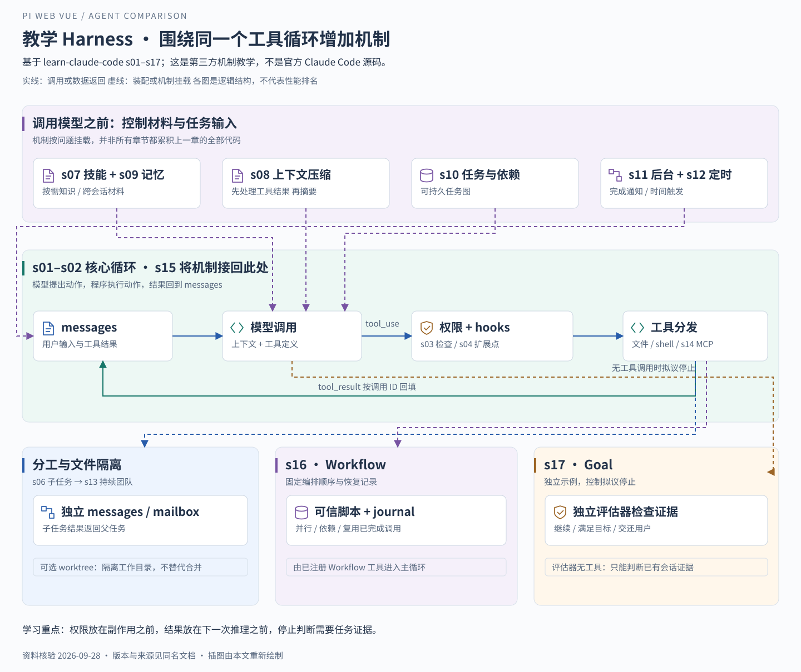

# Claude Code 类 Harness：基于 learn-claude-code

> 核验日期：2026-09-28；基线 `0dcafa2ae053a1ddd6a72f265431104b08a5aa13`。这是 shareAI-lab 的第三方教学项目，**不是官方 Claude Code 源码**。本文说明示例如何实现机制，不据此推断官方产品内部实现。

## 一 为什么把教学项目放进比较

使用 Pi 或 OpenCode，可以从接口进入一个已经组织好的运行时。学习 learn-claude-code，则是把运行时拆开：从“模型提出工具调用，程序执行并回填结果”开始，逐步观察为什么需要权限、上下文、任务和协作。

它适合回答“这些能力为什么存在，应该放在哪一层”。选型时不能把教学章节列表当作成熟产品的能力清单。尤其不能因为课程包含 memory、teams 和 goal，就宣布其生产可靠性高于其他方案。[项目定位与课程边界](https://github.com/shareAI-lab/learn-claude-code/blob/0dcafa2ae053a1ddd6a72f265431104b08a5aa13/README.md)。

共同场景仍是“读取项目、修改文件、运行测试”。我们先看最少需要什么，再用复杂任务暴露原始循环的不足。

## 二 最小循环已经能做什么

最小实现维护 messages，把它和工具定义发给模型。若模型输出工具调用，程序执行工具，将带调用 ID 的结果写回 messages，随后再次调用模型；没有工具调用时返回文本。

这里最重要的关系是：**模型提出动作，程序执行动作，工具结果成为后续决策依据。** 程序不必预先规定“读第几个文件之后必须编辑”，但需要约束哪些动作可以执行。

对应共同场景：

1. 输入“修复问题并测试”，成为用户消息。
2. 模型选择 bash 或文件工具读取目录与源码。
3. 工具返回内容，模型获得实际证据，而不是仅凭文件名猜实现。
4. 模型要求编辑，程序执行写入，结果再次回填。
5. 模型运行测试，根据输出修复或结束。

这条主线由 [s01 最小循环](https://github.com/shareAI-lab/learn-claude-code/tree/0dcafa2ae053a1ddd6a72f265431104b08a5aa13/s01_agent_loop) 与 [s02 工具分发](https://github.com/shareAI-lab/learn-claude-code/tree/0dcafa2ae053a1ddd6a72f265431104b08a5aa13/s02_tool_use) 说明。读取、编辑和测试的具体顺序由模型与实际结果共同决定，不保证每次都严格相同。

## 三 从问题推导新增机制

先看中间的工具回路，再看上下两排机制怎样进入它。下方 s16 与 s17 是不同方向的扩展：一个固定编排顺序，一个检查是否允许结束，并非“再加几个工具”那么简单。

| 遇到的问题                     | 当前章节               | 增加的机制与理由                             |
| ------------------------------ | ---------------------- | -------------------------------------------- |
| 工具能执行危险操作             | s03 Permission         | 在执行前判断允许、拒绝或请求批准             |
| 每加一次日志都要改主循环       | s04 Hooks              | 把前后置行为放到明确扩展点                   |
| 多步骤任务容易遗漏             | s05 TodoWrite          | 显式记录当前计划，不只依赖散落的对话         |
| 调研内容挤满主上下文           | s06 Subagent           | 子任务使用独立 messages，返回汇总结果        |
| 专业知识太多，全部加载浪费窗口 | s07 Skill Loading      | 先展示目录，需要时再载入内容                 |
| 文件与测试输出持续膨胀         | s08 Context Compact    | 先处理大工具结果，必要时再摘要历史           |
| 跨会话仍需记住有用信息         | s09 Memory             | 分别处理选择、提取与整合                     |
| 任务跨多轮，存在前后依赖       | s10 Task System        | 将任务和依赖保存成可追踪结构                 |
| 慢操作阻塞当前交互             | s11 Background Tasks   | 后台执行，完成后通知回主循环                 |
| 工作需要按时间触发             | s12 Cron Scheduler     | 把时间触发与当前对话解耦                     |
| 多人协作需要共享状态           | s13 Agent Teams        | 持续队友、邮箱、任务领取及可选 worktree      |
| 需要连接外部工具               | s14 MCP Plugin         | 将发现的外部工具加入统一工具池               |
| 单独机制需要共同运行           | s15 Integrated Harness | 将输入、上下文、权限、工具和通知接回同一循环 |
| 固定流程不应每次靠模型重排     | s16 Workflow Runtime   | 注册脚本负责编排，日志支持恢复已完成调用     |
| 没有新工具调用不等于目标完成   | s17 Goal Loop          | 独立评估拟议停止，决定继续还是交还控制       |

编号采用根目录当前主线。旧十二章中“子代理 s04”等编号不适用于此表；项目 README 明确保留旧目录仅供过渡。[当前章节映射](https://github.com/shareAI-lab/learn-claude-code/blob/0dcafa2ae053a1ddd6a72f265431104b08a5aa13/README.md)。

## 四 四个值得真正理解的设计取舍

### 权限检查的位置正确，不代表规则已经完备

s03 把检查放在工具执行之前。这样模型即使提出某个命令，也不等于程序必须执行。但是示例的危险命令匹配用于展示检查位置，文档明确说明它不是完整安全边界。

对 Web 产品而言，需要在所有真实执行入口实施一致策略，并考虑 shell 语法、路径、进程和部署环境。把示例 deny list 复制进去，不能据此宣称具备安全沙箱。[s03 Permission](https://github.com/shareAI-lab/learn-claude-code/blob/0dcafa2ae053a1ddd6a72f265431104b08a5aa13/s03_permission/README.md)。

### 子代理隔离上下文，worktree 隔离工作目录

s06 给子任务新的消息列表，避免主会话承担所有探索细节；返回的通常是结果摘要。它解决信息隔离，不自动解决并行写同一文件的冲突。

s13 再增加持续队友、文件邮箱、共享任务板与领取锁。可选 worktree 将任务绑定到另一个工作目录，控制修改冲突，但成果仍需合并与验证。该章也明确没有直接携带 s11 后台任务和 s12 定时机制，所以章节并非每一节都机械叠加所有前文代码。[s06](https://github.com/shareAI-lab/learn-claude-code/blob/0dcafa2ae053a1ddd6a72f265431104b08a5aa13/s06_subagent/README.md)、[s13](https://github.com/shareAI-lab/learn-claude-code/blob/0dcafa2ae053a1ddd6a72f265431104b08a5aa13/s13_agent_teams/README.md)。

### 压缩是有损信息管理，不只是“删旧消息”

s08 先为大结果建立预算与落盘，再裁剪和替换旧工具结果，最后才在需要时用模型摘要历史。这个顺序先处理可重新读取的材料，再处理较难恢复的对话信息。

理解重点是成本与信息损失：落盘结果可按路径再读，摘要更短却可能漏掉约束。不能把压缩成功当成任务准确性不变的证据。[s08 Context Compact](https://github.com/shareAI-lab/learn-claude-code/blob/0dcafa2ae053a1ddd6a72f265431104b08a5aa13/s08_context_compact/README.md)。

### Workflow 管过程，Goal 管结束条件

s16 由宿主注册可信脚本，模型选择名称与参数；脚本决定并行和依赖，journal 允许恢复时复用匹配的已完成调用。这适合“先检查多个维度，再验证，再汇总”等固定形态。它不是授权模型提交任意脚本执行。

s17 则在模型准备停止时加入独立评估。评估器读取目标和会话中的证据，决定是否继续；它自身没有工具，不能重新运行测试。因此“评估通过”也受已有证据质量限制，不能取代真实测试退出码。该章是聚焦目标机制的独立示例，不是比 s16 更完整的产品运行时。[s16 Workflow](https://github.com/shareAI-lab/learn-claude-code/blob/0dcafa2ae053a1ddd6a72f265431104b08a5aa13/s16_workflow_runtime/README.md)、[s17 Goal](https://github.com/shareAI-lab/learn-claude-code/blob/0dcafa2ae053a1ddd6a72f265431104b08a5aa13/s17_goal_loop/README.md)。

## 五 s15 如何把机制重新接成完整任务

用户输入先经过输入 hooks，待处理的后台通知和定时输入进入循环。调用模型前，处理上下文预算，组装记忆、技能与工具信息。模型给出工具调用后，先过 hooks 与权限，再分发给内置工具、MCP 或后台执行。结果和后置 hooks 的处理继续回到 messages。

这段主线说明“机制应放在哪个时间点”：技能在模型需要知识时加载，权限在副作用发生之前检查，工具结果在下一轮推理之前进入上下文，通知在被消费后影响后续任务。[s15 Integrated Harness](https://github.com/shareAI-lab/learn-claude-code/blob/0dcafa2ae053a1ddd6a72f265431104b08a5aa13/s15_integrated_harness/README.md)。

若读取文件失败，错误应成为模型可以理解的执行结果；若用户拒绝工具操作，流程必须保留拒绝事实，不能伪装成已修改。教学代码适合观察这些控制位置，产品还需要定义稳定错误协议、取消传播与持久恢复。

## 六 从教学实现到 Web 产品还缺什么

| 可以学习或复用的思路              | 产品化时仍需证明                            |
| --------------------------------- | ------------------------------------------- |
| 工具分发与结果配对                | API、流式协议和事件版本在多客户端下是否稳定 |
| 权限管道与 hooks                  | 策略能否约束全部执行入口，是否有真实隔离    |
| 持久任务、邮箱与 workflow journal | 崩溃一致性、重复投递、并发修改和副作用恢复  |
| 压缩与 memory                     | 原始证据能否追溯，提取与摘要质量如何验证    |
| 团队协作与目标评估                | 资源预算、失败收束、结果验证和用户接管      |

教学仓库还带有课程 Web 展示，但这不等于给当前 Vue 工作台提供了成熟的 Agent 服务接口。若据此自建服务，运行时、接口、前端投影和部署责任大部分都需要自己确定。[仓库课程与 Web Platform 说明](https://github.com/shareAI-lab/learn-claude-code/blob/0dcafa2ae053a1ddd6a72f265431104b08a5aa13/README.md)。

## 七 面试时怎样使用这份材料

> 我通过 learn-claude-code 理解 Claude Code 类 Harness 的设计问题：循环保持模型调用与工具回填，外围机制逐步解决权限、上下文、长任务和协作。它帮助我理解运行时该承担哪些责任，但它是第三方教学实现，不能当成官方 Claude Code 源码。当前项目使用 Pi，我会把这些机制作为分析和改进框架，而不是声称自己已经实现了课程中的全部能力。

**追问：为什么不直接基于教程造一个？** 可以用于学习或验证特殊机制，但产品需要持续维护协议、安全与恢复。若通用底座已经满足需求，复用底座能把精力放在真正的产品差异上；如果目的就是研究运行时，教学实现才是更直接的起点。

**自测：** 测试命令已提交但还没返回，模型说“完成了”，应由哪个机制拦住结束？答案应同时涉及执行状态、工具结果与目标证据，而不只是再加一句提示词。

下一篇：[横向比较与面试表达](05-横向比较与面试表达.md) · 返回 [专题目录](README.md)。
