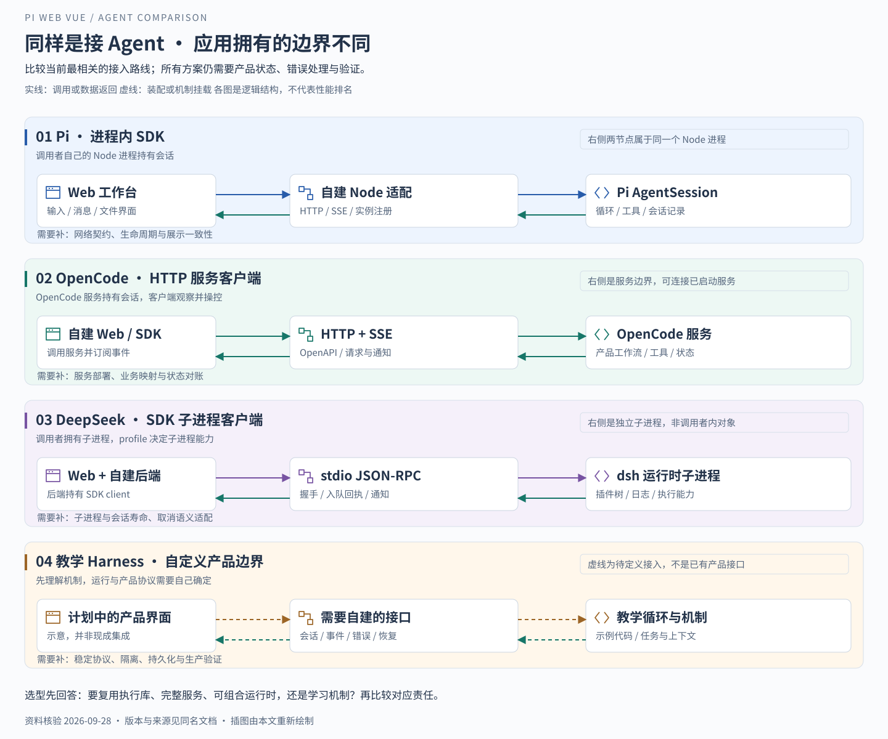

# 横向比较与面试表达

> 核验日期 2026-09-28。版本与提交统一见 [资料基线](README.md#本次比较的资料基线)。本篇比较的是接入方式与工程责任，没有效果、速度或成本实测排名。

## 一 先问目标，再问选谁

如果目标是“今天开始用 Agent 改代码”，现成产品的工作流很重要；如果目标是“做自己的 Web 工作台”，执行边界和应用接口更重要；如果目标是“学会构建运行时”，可解释、可拆解的机制更重要。

因此四个对象不能只排成“谁功能最多”：Pi 有现成 CLI，也提供嵌入 SDK；OpenCode 有完整产品，也能作为服务；DeepSeek Harness 同时提供应用组合和运行时定制；learn-claude-code 首先是教学材料。它们的交集是模型与工具循环，交付给开发者的边界并不相同。

## 二 定位与交付形态

| 对象              | 主要观察角度                     | 本文采用的接入路线              | 资料性质                            |
| ----------------- | -------------------------------- | ------------------------------- | ----------------------------------- |
| Pi 0.85.1         | 最小编程 Harness 与嵌入能力      | Node 中直接创建 SDK 会话        | 官方版本文档加当前应用源码          |
| OpenCode          | 编程产品与客户端服务端体系       | HTTP API、SDK 客户端与 SSE      | 官方仓库固定快照                    |
| DeepSeek Harness  | 插件化能力组合与多种应用 profile | 自定义组合，或 SDK 子进程客户端 | 官方 preview 快照                   |
| learn-claude-code | 从最小循环推导运行时机制         | 阅读与改造教学示例              | 第三方课程，非官方 Claude Code 实现 |

这张表不是每个项目的全部模式列表。例如 Pi 还有 RPC 模式；这里只突出与当前工作台最相关的边界。来源分别见 [Pi](01-Pi-Agent.md)、[OpenCode](02-OpenCode.md)、[DeepSeek](03-DeepSeek-Harness.md)、[教学 Harness](04-Claude-Code类Harness.md)。

## 三 同样叫 SDK，运行边界差在哪里

图中每一行表示一条接入路线，右上角标注实际进程或服务边界。Pi 路线由自己的 Node 进程持有会话；OpenCode 路线与一个 HTTP 服务交互；DeepSeek 的所查 SDK 路线由后端启动子进程；教学路线需要自行定义产品接口。

| 比较项           | Pi SDK                                  | OpenCode SDK                       | DeepSeek TypeScript SDK                        |
| ---------------- | --------------------------------------- | ---------------------------------- | ---------------------------------------------- |
| 调用对象         | 进程内 AgentSession 等对象              | OpenCode 服务 API                  | Harness 运行时子进程                           |
| 通信             | 函数调用与订阅回调；本项目再转 HTTP/SSE | HTTP 与 SSE                        | stdio JSON-RPC 与通知                          |
| 谁持有运行状态   | 当前项目 Node 进程中的 SDK 实例         | OpenCode 服务                      | dsh 子进程                                     |
| 应用要管理什么   | 实例注册、请求适配、页面投影            | 服务连接、会话映射、事件投影与部署 | 子进程、协议、会话映射与事件投影               |
| 停止需要核验什么 | abort 后终态与 UI 一致性                | 服务会话 abort 与客户端状态        | 该基线无 prompt-cancel，关闭运行时影响整个进程 |

“客户端启动了服务”也不等于“服务内核在客户端进程内执行”。这些差异决定了故障怎样传播：进程内错误需要本应用隔离，外部服务故障需要连接与恢复策略，子进程退出需要明确影响哪些会话。[Pi SDK](https://github.com/earendil-works/pi/blob/v0.85.1/packages/coding-agent/docs/sdk.md)、[OpenCode SDK](https://github.com/anomalyco/opencode/blob/b471c2b4495747353af768fbf2e0790c9d820ce2/packages/web/src/content/docs/sdk.mdx)、[DeepSeek SDK](https://github.com/deepseek-ai/deepseek-harness/blob/21638c56315ae6a2b552d6091945d3144c9af32e/packages/sdk/client/README.md)。

## 四 工具、上下文与扩展

| 对象         | 工具与上下文                             | 权限边界                                                   | 扩展深度                                                 |
| ------------ | ---------------------------------------- | ---------------------------------------------------------- | -------------------------------------------------------- |
| Pi           | 原生工具循环、会话、压缩与资源加载       | 基线没有内置权限弹窗；可扩展确认或依赖执行环境             | TypeScript 扩展、技能、模板与包；MCP、子代理等需额外实现 |
| OpenCode     | 原生工具、会话、上下文管理与工作流       | 原生 allow/ask/deny 策略；默认值需核对版本，不等于 OS 沙箱 | 插件、定制工具、MCP、Agent 配置                          |
| DeepSeek     | 组合中加载工具、上下文投影与压缩 backend | Sandbox 与审批分开，profile 决定实际组合；SDK 交互另有边界 | 服务、provider、事件、存储和循环本身都可作为插件组合     |
| 教学 Harness | 展示工具、技能、压缩和记忆机制           | 权限管道是教学示例，不是经过完备验证的安全系统             | hooks、工具分发、MCP 与各章节机制，产品契约需自行确定    |

这并不意味着某方案“绝对扩展不了”其他功能。区别在于能力是现成可用、要额外实现，还是只作为教学机制存在。OpenCode 支持自建界面，Pi 可以扩展多代理；把它们分别写成“只能终端用”“永远没有子代理”都不成立。各格的依据和具体边界见四篇独立分析。

## 五 会话、长任务、协作与恢复

| 对象         | 会话与恢复依据                                  | 长任务与协作                                     | 不应推出的结论                                      |
| ------------ | ----------------------------------------------- | ------------------------------------------------ | --------------------------------------------------- |
| Pi           | 持久会话记录、上下文与运行实例分工              | 队列、压缩等由 SDK 提供；多代理属于扩展方向      | 当前工作台已实现 SDK 所有分支与协作 UI              |
| OpenCode     | 服务端会话、消息与持久状态                      | 产品提供 Agent 工作流和子代理                    | 有服务端就不会丢事件，或自动完成租户隔离            |
| DeepSeek     | 持久 Session events 派生状态与模型历史          | 可组合子代理、后台能力；Agent Teams 为实验性选配 | 实时 chunk 全部已落盘，或所有 profile 都有相同能力  |
| 教学 Harness | task 文件、mailbox、workflow journal 等机制示例 | s13 团队、s16 编排、s17 目标闭环各有范围         | 这些章节就是官方 Claude Code 内部结构或生产恢复保证 |

**恢复至少有三种含义：**重新显示已记录内容、恢复可继续对话的上下文、继续尚未结束的外部执行。前两者成立，第三者仍可能不成立。测试进程已退出时，日志不能让它原地复活；重新运行又可能重复写文件或其他副作用。对任何方案都应分别验证这三件事。

## 六 自建工作台的复用范围与工程成本

这里的“成本”是责任范围分析，不是人日估算。

| 路线             | 主要复用                             | 主要新增或适配工作                             | 适合优先验证的目标             |
| ---------------- | ------------------------------------ | ---------------------------------------------- | ------------------------------ |
| 沿用 Pi          | 当前已接入的会话、工具与事件底座     | 改善本项目生命周期、重连和交互边界             | 自己掌握 Web 产品状态与界面    |
| 接 OpenCode 服务 | 会话服务、产品工作流、权限与工具生态 | 替换命令及事件适配，映射目录和会话，管理服务   | 优先复用已有编程工作流         |
| 接 DeepSeek 组合 | 插件体系、服务边界、日志与应用组合   | 学习组合契约，管理版本，验证所选入口的取消审批 | 高频替换执行能力与多种宿主环境 |
| 自建教学 Harness | 机制理解与原型代码                   | 自定 API、持久化、恢复、安全和部署体系         | 学习运行时或验证特殊机制       |

这张表给出的工程判断是：**对已经运行在 Pi 上的当前项目，继续完善现有适配层有现实优势；改用其他底座应由明确需求驱动。** 当前仓库本身不能证明曾经完成四方案 PoC，也不能证明最初选型时比较过它们。

若要真正决定迁移，可以使用同一组本地验收场景：发起一次工具任务、在运行中切换会话、断开再连接、取消一次慢工具、重启服务后恢复历史、并行操作两个工作区。记录终态、残留进程、事件缺口和重复副作用。这是一份建议验证方案，本次没有执行外部 Agent 实测。

## 七 连续面试追问

### 1 为什么选 Pi

> 从现有代码能看到，我们把 Agent 会话放进自己的 Node 服务，Web 侧掌握工作区、消息和文件体验。Pi 提供 SDK 会话、工具循环与事件，接入方式和这个边界一致。选择它的代价是应用要自己负责网络适配与异步一致性，所以我会用发送、切换、恢复和取消的实现说明这部分工作。

这是一段基于代码的架构解释。若没有真实参与选型，应说“从当前实现看”，不要说“我做了四个方案的性能评测后决定”。

### 2 为什么不直接用 OpenCode

> OpenCode 完全可以自建界面，它已有 server 和 SDK。选择差异在于我们希望复用多大一块：接它的服务可以获得更多既有工作流，同时需要接受其会话与事件契约；嵌入 Pi 则由我们拥有更薄的应用适配。若产品需求重点变成快速复用完整工作流，我会把 OpenCode 作为认真验证的候选。

### 3 都支持插件，DeepSeek 的区别在哪里

> 需要比较插件可以替换的边界。DeepSeek 的循环、模型适配、会话记录与能力 provider 都参与 Cordis 组合，profile 决定具体应用。它适合讨论运行时装配。但插件化不会自动降低所有复杂度，依赖、作用域、生命周期和预览版升级都要维护。

### 4 你是否读过 Claude Code 源码

> 我读的是 learn-claude-code 的第三方教学实现，用来研究 Claude Code 类 Harness 的机制，不是官方源码。我能解释它怎样从工具循环扩展到权限、压缩、任务和协作，但不会把这些示例当成官方产品的内部事实。

### 5 这些 Agent 不都是 while 循环吗

> 最小主线确实是模型调用与工具结果回填。产品差异发生在循环的前后：谁组装上下文，谁批准执行，谁记录事实，失败怎样恢复，多会话怎样隔离，界面怎样观察。相同的循环形状不能说明这些契约相同。

### 6 能否直接替换 SDK 包完成迁移

> 不能。Pi 的进程内对象、OpenCode 的 HTTP 服务和 DeepSeek SDK 的子进程协议，完成与取消语义不同。先定义应用要的创建、发送、订阅、停止与恢复契约，再逐项映射。适配层也不能把底层缺失的保证伪装成已有能力。

### 7 多代理是不是一定更快

> 本次没有实测，不能判断。只有可独立拆分的工作才可能受益，还要计算上下文传递、结果核验和文件冲突成本。多代理机制存在不代表每个任务都应该使用。

### 8 如何证明 Harness 真的改善了任务结果

> 固定任务、模型和判定标准，再比较完成率、工具错误、恢复行为与资源消耗。模型回答“完成”只是文本，需要测试退出码、文件差异和验收条件等证据。教学 Goal evaluator 也只能检查它看到的材料，不能凭空制造验证证据。

## 八 读完后应能独立完成的练习

1. 给任意一个方案画出模型、工具、会话、界面及它们的运行边界。
2. 解释“发送成功，但页面没有结果”可能卡在接受、执行、传输还是投影哪一层。
3. 用一个明确需求说明为什么要换底座，并列出最先验证的三个契约。
4. 把一个面试回答中的“支持、已接入、已验证、个人完成”分别找出证据。

如果只能背功能名称，还不能据此完成选型。能够沿同一任务解释状态、结果和失败如何流动，才有可迁移的理解。

返回 [专题目录](README.md) · [项目文档](../../README.md)。
