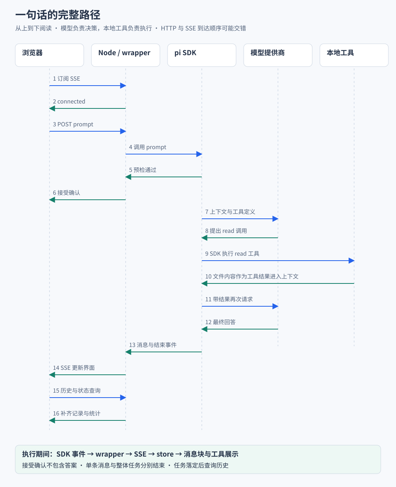

# 从最小 Agent 到 Web 工作台

对应业务流程：[业务篇的完整任务流程](业务流程与前后端协作/B02-创建会话到完成一次任务.md)。先看用户操作、后端接纳与工具结果怎样连成一条任务，再用本篇的最小程序验证这些步骤。

如果面试官问“你是怎么实现这个项目的”，可以先沿一条主线回答：把 pi Agent SDK 跑在 Node 服务里，由网页提交任务，再把 SDK 的执行事件变成页面上的文字和工具过程。会话管理、文件预览和能力中心都建立在这条主线上。

本文按四个阶段把应用搭起来：

1. **跑通 SDK**：让一个没有网页的 Agent 回答一句话。
2. **接上网页**：把输入框和回答区域连接到 Node 服务。
3. **显示过程**：让回答逐段出现，再展示工具调用与结果。
4. **回到项目**：把完整链路对应到源码，并组织面试表达。

> 阅读起点：熟悉 JavaScript 异步函数和普通 HTTP 请求即可。SDK 对象和事件会在用到时解释。

前半段使用“用一句话解释什么是 Agent”验证文本闭环；加入文件工具后，任务升级为“阅读 README，说明这个项目应该怎样启动”。这是教学上的逐步扩展，不代表项目真实的开发历史。

## 实现思路 从 SDK 执行到用户可见结果

### 先确定需要接通什么

这个项目需要同时接通三件事：用户能把任务交给指定项目中的 Agent；执行期间能看到文字和工具过程；任务结束后能继续对话并重新打开历史。单次模型请求只覆盖其中的生成环节，还需要应用把执行能力变成持续可用的工作台。

关键约束是运行环境不同。输入框在浏览器，文件工具和 SDK 在 Node；浏览器不能直接引用服务端的 session 对象，SDK 的回调也不会自动触发 Vue 更新。因此需要在中间建立身份、通信与状态转换规则。

### 将要求落实到四个设计决定

1. **先复用 SDK 的执行循环，再补 Web 接入。** 模型何时调用工具、结果怎样回到后续模型请求，由 SDK 推进。应用先用最小程序验证 `prompt` 与 `subscribe`，再把调用入口搬到 HTTP、把事件出口接到 SSE。这样每增加一层，都知道原来的哪段输入输出被替换。
2. **用会话 ID 连接多次请求。** 创建、发送、订阅和历史读取是不同请求，但必须围绕同一段任务。服务端通过 ID 找到持有 SDK 对象的 wrapper，页面不需要携带整个运行对象。创建和发送分开，也让浏览器有机会先准备事件监听。
3. **用事件描述变化，用前端状态保存当前画面。** 文本增量只是新增片段，工具事件也只是执行过程的一部分。store 将事件交给 reducer 组装当前消息，再由 Vue 组件展示。刷新时没有经历旧事件，就改用历史与快照重建状态。
4. **分别确认命令、消息与任务的完成。** HTTP 确认表示命令被接受，消息结束表示一个内容单元定稿，任务落定才表示这轮执行收敛。前端保留这几层区别，才能在工具运行时继续显示进度，而不是收到一条结束事件就提前恢复空闲。

> 后续 MVP 每次只扩展一个环节：先验证执行，再接通网络，最后丰富消息与工具展示。下面的代码也按这个顺序解释。

## 一 先认识 pi Agent SDK

### 直接调用模型和使用 Agent SDK 有什么关系

直接调用模型 API 时，应用组织输入并向模型提供商请求输出。模型可以生成答案，也可以根据提供的工具定义生成结构化的调用请求。但真正读取文件、执行命令以及把结果交回模型，仍需要运行模型之外的程序。

假设用户要求“读取 README”。模型服务看不到本机磁盘，应用需要提供读取能力。模型提出读哪个文件，程序执行读取，把内容放进后续请求，模型才能依据文件继续回答。如果还需要 package.json，就再次执行这个过程。

pi Agent SDK 把模型接入、工具执行循环、会话记录和运行事件等能力组织成可供程序调用的库。

- **依赖包**：`@earendil-works/pi-coding-agent`，仓库固定版本为 `0.85.1`。
- **SDK 运行位置**：Node 环境。
- **模型推理位置**：由配置的模型提供商决定，可以是远程服务或本地端点。

可以先把整个应用分成三部分：

```text
模型负责决定下一步并生成内容
        ↕ 模型请求与响应
SDK 负责组织会话 执行工具 推进任务并报告事件
        ↕ 方法调用与事件订阅
Web 应用负责用户操作 网络接入 状态管理和界面展示
```

因此，接入 SDK 后，不需要在 Vue 里重新实现模型与工具的循环。需要实现的是用户怎样操作这个循环，以及怎样看到它的过程和结果。

### SDK 提供什么 本项目用什么

| 能力 | SDK 提供的入口或对象 | 本项目怎样使用 |
| --- | --- | --- |
| 创建运行会话 | `createAgentSession`，或 services 与 session 分步创建 | 服务端为会话准备模型 设置 资源和执行环境 |
| 提交任务 | `session.prompt()` | 把浏览器命令交给已有会话 |
| 观察过程 | `session.subscribe()` | 订阅消息和工具事件，再转发到网页 |
| 工具执行 | 内置工具及自定义工具和扩展机制 | 使用会话已加载的工具执行本地任务，展示工具参数与结果 |
| 保存与恢复记录 | `SessionManager` | 新建会话，读取历史，恢复已有会话 |
| 控制执行 | `abort()`、模型切换和压缩等接口 | 接入停止按钮 模型选择和上下文管理 |
| 加载资源 | 设置与资源加载机制 | 接入技能 扩展和相关配置管理 |

第一次只需要用到创建会话、订阅事件和提交任务。后面的能力等最小程序跑通之后再加入。

先区分两个对象：

- **`AgentSession` 负责运行**：接收任务并推进执行，在同一会话中连续提问可以延续上下文。
- **`SessionManager` 负责记录**：管理会话历史，可以使用内存记录或持久文件。

## 二 MVP 1 在 Node 中发送一句话并取得回答

暂时去掉网页、工具和历史恢复。我们只需要验证一件事：程序能把文字交给 SDK，并取得模型的文本回答。

下面是完整的单文件教学示例。准备方式：

1. 在仓库中安装好项目依赖，并确保 Pi 模型配置与认证可用。
2. 在仓库根目录将示例保存为 `minimal-agent.mjs`。
3. 使用 `node minimal-agent.mjs` 执行，SDK 会按配置选择模型。

> 示例未进行真实模型运行验收。安装 npm 包本身不会提供模型访问凭据。

```js
import {
  createAgentSession,
  SessionManager,
} from "@earendil-works/pi-coding-agent";

const cwd = process.cwd();
const { session } = await createAgentSession({
  cwd,
  tools: [],
  sessionManager: SessionManager.inMemory(cwd),
});

let answer = "";

// 先订阅再提交 防止遗漏快速返回的内容
const unsubscribe = session.subscribe((event) => {
  if (event.type !== "message_update") return;
  const update = event.assistantMessageEvent;
  if (update.type === "text_delta") answer += update.delta;
});

try {
  await session.prompt("用一句话解释什么是 Agent");
  console.log(answer);
} finally {
  unsubscribe();
  session.dispose();
}
```

这里的 `cwd` 是执行目录，`tools: []` 明确不启用工具，内存记录让示例不必先处理历史文件。模型配置和资源发现仍使用 SDK 的默认机制，内存会话只改变记录的保存方式。

重点是三个调用如何配合：

1. `createAgentSession()` 准备运行环境，返回 `session`。
2. `subscribe()` 注册回调，执行期间每有相关事件就调用一次。
3. `prompt()` 提交输入并返回一个表示本次调用完成的 Promise。

> **`await session.prompt()` 的结果不是答案字符串。** 文字来自订阅回调，`await` 负责等待执行完成，之后才打印收集好的 `answer`。

`message_update` 表示一条消息正在变化，内部的 `text_delta` 表示本次新增的正文片段。模型输出可能分多次到达，例如先收到“Agent 是”，再收到“能够调用工具的程序”。回调把它们拼成完整文本。

```text
prompt 输入
  → SDK 组织模型请求
  → 模型提供商生成响应
  → SDK 发出文本更新事件
  → 回调累计 answer
  → prompt 完成
  → 打印 answer
```

至此，最小 Agent 已经成立。SDK 负责执行，应用负责选择怎样消费输出。我们现在选择最后一次性打印，下一步可以把同一份输出交给网页。

## 三 MVP 2 把输入框和回答区域接到这个 Agent

### 从同一进程调用变成前后端协作

Node 示例里，输入字符串和 `session` 在同一进程，直接调用即可。换成网页后，输入在浏览器，SDK 仍在 Node 服务端，需要增加一个 HTTP 接口把它们连接起来。

先设想一个最简单的网页版本：页面 POST 一段文字，服务端执行上面的程序，收集完整答案后返回 `{ answer }`，页面再把它显示出来。

```text
输入框 → POST 文本 → Node 调用 SDK
                           ↓
页面显示 answer ← JSON 响应 ← 收集答案并等待执行完成
```

这个版本可以解释前后端怎样连通，但用户只能在最后看见答案。这里是教学过渡方案；当前项目的 prompt 接口返回命令确认，答案通过独立的事件连接传回。

### 先给会话一个可以跨请求使用的身份

接下来用户会追问“再解释一下”。如果每次 POST 都创建一个新会话，就会丢掉前面那段对话的连续性。因此 Web 服务需要保留运行实例，并给浏览器一个能够再次找到它的 ID。

当前项目的基本关系是：

```text
浏览器持有 sessionId
  → 请求携带 sessionId
  → 服务端注册表查找 wrapper
  → wrapper 持有 SDK AgentSession
```

wrapper 是本项目对 SDK 实例的包装，统一处理命令和事件监听。先理解它让“发送请求”和“订阅请求”找到同一个 Agent 即可，并发启动和回收策略留到专题。

创建过程分成三步：

1. 用户选择目录，通过 `POST /api/sessions` 创建会话。
2. 服务端返回真实 `sessionId`，页面进入 `/session/:id`。
3. 后续请求携带这个 ID，访问同一会话。

> 执行目录决定 Agent 在哪个项目中工作，会话 ID 决定正在继续哪段对话。

Node 示例在一次回答后释放对象；Web 工作台需要复用会话，所以由服务端统一管理实例生命周期，不在每个命令请求结束时立刻释放。

## 四 MVP 3 让回答一边生成一边显示

### SDK 的输出事件怎样到浏览器

Node 示例已经能在回调里逐段得到文字。要让网页也逐段显示，只需把回调中的事件跨网络送给浏览器，而不必等待任务全部完成。

本项目使用两个通道：

| 通道 | 做什么 | 返回什么 |
| --- | --- | --- |
| `POST /api/agent/:id` | 发送 prompt 停止或切换模型等命令 | 本次命令的确认或错误 |
| `GET /api/agent/:id/events` | 保持连接，订阅执行过程 | 文本 工具和生命周期事件 |

第二条通道使用 SSE，工作方式是：

1. 浏览器发起 HTTP 请求，服务端保持响应打开。
2. 服务端不断向响应中写入事件。
3. 浏览器通过 `EventSource` 持续接收。

本项目的上行操作是离散命令，下行是持续事件，因此采用这组组合。SSE 只承担传输，会话记录与 Agent 执行由其他模块负责。

```text
发送方向
输入框 → chat store → POST 命令 → wrapper → session.prompt

返回方向
session.subscribe → wrapper 监听者 → SSE → EventSource
  → chat store → 消息状态 → Vue 组件
```

### 命令接口里的 await 到底等什么

当前命令路由的存活实例分支节选如下：

```ts
const existing = getRpcSession(id);
if (existing?.isAlive()) {
  return { success: true, data: await existing.send(command) };
}
```

`getRpcSession` 用 URL 中的 ID 找实例。存在存活实例就调用它的 send，没有时才进入后面的历史恢复分支。这里 await 的是 wrapper 的命令结果，具体含义由命令类型决定：prompt 等待接受确认，查询命令返回所查询的数据。

因此不要仅看到了 await 就推断“接口会等待模型输出结束”。要继续追进 send 的 prompt 分支，确认它最终等待的是哪一个 Promise。后面会解释应用自己的确认 Promise 怎样与 SDK 的完整执行分开。

### 服务端怎样把 SDK 回调接到网络流

从源码责任来看，中间有两次订阅：

1. wrapper 的 start 调用 SDK `subscribe`，将每个事件分发给应用 listeners。
2. `createAgentEventStream` 调用 wrapper 的 `onEvent`，将事件适配、编码并写入当前响应流。

SDK 订阅属于运行实例，SSE 监听属于某条浏览器连接。分成两层后，关闭一个页面只移除对应连接监听，运行实例仍可处理任务，下一条连接也能注册新的观察者。

服务端会把 SDK 事件转换为面向浏览器的数据。例如文本增量原本附带的重复完整快照会被裁剪，再把事件编码成 `data: JSON内容` 加两个换行。EventSource 识别事件边界，连接管理器解析 JSON，交给 store。

### 为什么先连接 再提交

如果先调用 `prompt()`，再安装事件监听，短回答可能在订阅准备好之前就生成了一部分。Node 示例通过先 `subscribe()` 避免这个问题，Web 版本也需要相同的顺序。

但 `EventSource` 的网络连接打开，只能证明 HTTP 通道打开，不代表 SDK 实例和服务端监听者已经准备好。本项目在监听装好之后发送业务事件 `connected`，前端等它到达再提交 prompt。

```text
创建或打开会话
  → 请求 SSE
  → 服务端取得实例并注册监听
  → 服务端发送 connected
  → 前端确认就绪
  → POST prompt
```

页面会先显示用户输入，给点击动作即时反馈，然后等待连接就绪。乐观显示的用户气泡表达“用户已经提交操作”，不代表服务端已经接受。

### 命令确认为什么不是任务完成

在 Node 示例中，可以一直 `await prompt()`。Web 项目则希望尽早告知“任务已接受”，同时继续展示执行过程。

wrapper 分别观察两个时点：

- **接受时点**：SDK 成功预检回调完成单独的确认 Promise，使 HTTP 可以先返回。
- **完成时点**：继续观察完整 prompt Promise，处理结束通知和异步错误。

> prompt 命令的成功响应通常是 `{ success: true, data: null }`。它表达接受确认，答案通过事件流取得。

```text
提交 prompt → 预检接受 → 命令响应可以返回
                 └──── 文本和工具事件继续到达 ──── 执行完成
```

两条网络通道独立传输，部分事件可能比 POST 响应更早到达。页面应该根据各自语义更新状态，不能在 POST 成功时就把运行标记关闭。

### 一个增量怎样变成屏幕上的文字

先看简化过程。假设页面当前保存“启动方式：”，收到增量“npm run dev”，更新后的状态就是“启动方式：npm run dev”。Vue 读取这个状态并更新界面。

真实项目需要区分一条消息里的不同内容，因此事件还携带 `contentIndex`，告诉前端这次修改哪个块。下面是面向浏览器的事件形状示例：

```json
{
  "type": "message_update",
  "assistantMessageEvent": {
    "type": "text_delta",
    "contentIndex": 0,
    "delta": "npm run dev"
  }
}
```

前端分别保存三种数据：

- **`draft`**：输入框里尚未提交的用户文字。
- **`stream.streamingMessage`**：正在生成的助手消息。
- **`messages`**：用于完整消息展示的列表，也暂存乐观用户气泡。

一次正常的文本生成可以手算为：

| 接收内容 | 状态怎样变化 | 页面显示 |
| --- | --- | --- |
| 助手 `message_start` | 放入助手消息快照 | 准备当前回复 |
| `text_start`，索引 0 | 建立第一个文本块 | 文本块为空 |
| `text_delta`，内容为“启动方式：” | 追加到块 0 | 启动方式： |
| `text_delta`，内容为“npm run dev” | 再追加到块 0 | 启动方式：npm run dev |
| `text_end` | 采用该块的完整最终文本 | 显示最终正文 |
| 助手 `message_end` | 完整消息进入列表，清空当前草稿 | 回答成为已完成消息 |

这里负责计算新消息状态的函数叫 reducer。它接收旧状态和事件，返回新状态；store 把结果写入 Vue 响应式容器，组件消费它。理解上面的演算之后，再读 reducer 的数组复制和分支实现即可。

展示层继续分工：

- **`ChatPanel`**：展示消息列表和当前流式消息。
- **`MessageItem`**：按内容类型展示消息。
- **Markdown 渲染器**：把正文转成 HTML。

> 当前 Markdown 仍接收文本块的累计全文。逐段收到数据，不等于只解析新增字符。

## 五 MVP 4 加入工具 让 Agent 读取真实文件

现在把输入改为：

> 阅读 README，说明这个项目应该怎样启动。

仅有文本闭环还不够，模型需要真实文件内容。修改最初的 Node 示例：

1. 把 `tools: []` 改为 `tools: ["read"]`，启用内置读取工具。
2. 把 prompt 替换为上面的 README 任务。
3. 保持 `cwd` 指向目标项目，执行同一个程序。

工具启用意味着模型有可选的读取操作，并不保证每次输入一定触发调用。当前 Web 项目使用 services 与配置加载工具，实际可用工具可以通过运行信息查询；教学示例的只读白名单不是项目固定的工具配置。

### 工具为什么既有定义 又有实现

工具定义包含名称、描述和参数结构，让模型知道可以做什么以及怎样提出请求。工具实现是实际执行动作的程序，例如按路径读取本地文件。SDK 将可用工具的信息交给模型，并负责处理模型产生的工具调用。

假设模型决定读取 README，它产生的内容可以简化为：

```json
{
  "type": "toolCall",
  "id": "call-1",
  "name": "read",
  "arguments": { "path": "README.md" }
}
```

这段数据表达“请执行 read 并传入这个路径”。随后由 SDK 执行侧找到 read 的实现，完成读取。浏览器既不执行 read，也不需要根据回答文字猜测应该调用什么工具。

执行完成后，结果以工具结果消息进入后续上下文。下面是简化数据示例，内容是教学用值：

```json
{
  "role": "toolResult",
  "toolCallId": "call-1",
  "toolName": "read",
  "content": [{ "type": "text", "text": "安装依赖后执行 npm run dev" }],
  "isError": false
}
```

`toolCallId` 把结果关联到前面的调用。把这些消息放回上下文后，SDK 继续请求模型，模型才有条件根据 README 生成启动说明。

```text
用户任务
  → 第一次模型请求
  → 模型提出 read 调用
  → SDK 执行 read
  → 文件内容成为 toolResult
  → 带着工具结果再次请求模型
  → 模型生成启动说明
```

如果模型还需要查看 package.json，就继续产生工具调用，循环再次推进。SDK 负责推进这段循环，Web 应用的任务是观察和控制它。

> **一次用户提交可以包含多次模型请求、多条助手消息和多次工具执行。**

如果读取失败，工具结果会表达错误，模型可能调整路径或说明问题。工具返回只表示本次执行有了结果，任务是否达成还要看结果内容和后续回答。

### 工具结果有两个去向

一个去向是模型：结果参与下一次决策。另一个去向是网页：相关消息和执行事件用于展示。页面不需要先显示完工具结果，再把它提交给模型，循环已经在服务端由 SDK 推进。

```text
                       → 加入会话上下文 → 模型继续回答
工具执行产生结果 ──────┤
                       → SDK 事件 → SSE → 网页展示
```

这是理解工具可视化的关键。即使网页只显示文本而忽略工具事件，SDK 仍可能完成工具调用；只是用户看不见过程。想展示它，需要增加前端数据结构和组件。

## 六 工具调用怎样变成前端卡片

### 消息从一个字符串扩展成内容块

一条助手消息可以先说“我先读取 README”，再包含 read 调用。因此 `content` 是有顺序的数组。前端归一化后的简化结构如下：

```js
const content = [
  { type: "text", text: "我先读取 README" },
  {
    type: "toolCall",
    toolCallId: "call-1",
    toolName: "read",
    input: { path: "README.md" },
  },
];
```

SDK 调用中的 `id`、`name`、`arguments` 被归一化为前端使用的 `toolCallId`、`toolName`、`input`。组件按类型展示：

- **文本块**：交给 Markdown 渲染。
- **工具块**：交给 `ToolCallCard`。
- **思考块**：若存在，交给 `ThinkingBlock`。

`contentIndex` 定位某条消息内部的块，例如这里的索引 1；`toolCallId` 关联调用和结果，例如 `call-1`。连续两次 read 具有相同工具名，但属于不同调用，所以不能按名字配结果。

### 调用生成 执行过程和最终结果是三件事

| 阶段 | 相关数据或事件 | 当前前端处理 |
| --- | --- | --- |
| 模型正在生成调用参数 | `toolcall_start`、`toolcall_delta`、`toolcall_end` | 在助手消息中组装工具块和参数 |
| 工具正在执行 | `tool_execution_start`、`tool_execution_update`、`tool_execution_end` | 在 `activeTools` 中维护名称和进度，供运行状态条展示 |
| 工具结果已经形成消息 | `message_end` 中的 `toolResult` | 写入消息列表，按调用 ID 提供给工具卡片 |
| 模型根据结果继续回答 | 新的助手消息和文本事件 | 沿既有流式链路显示后续回答 |

参数生成期间，JSON 可能尚不完整。项目先累计 `rawInput` 供展示，在 `toolcall_end` 时使用完整的结构化参数 `input`，因此不必对每个片段强行做 JSON 解析。

执行结束事件会从 `activeTools` 删除对应项。最终可展示的工具结果由结果消息提供，不能把“已经从执行中列表移除”直接当作拿到了结果正文。

工具结果进入卡片的过程是：

1. store 从 `messages` 中建立 `toolResultsByCallId` 索引。
2. `MessageItem` 用工具块的调用 ID 查找结果。
3. 调用参数和结果一起传入 `ToolCallCard`。

> 一张工具卡片组合了两份数据：助手提出的调用，以及 SDK 执行产生的结果。

### 为什么一条消息结束 页面还显示运行中

包含工具调用的助手消息可以先结束，随后工具才执行，再产生下一条助手消息。如果收到任意 `message_end` 就结束整个任务，页面会在读文件之前过早关闭运行状态。

本项目按职责分别处理结束事件：

- **`message_end`**：保存当前完整消息。
- **`agent_end`**：触发历史查询。
- **`agent_settled`**：清理整体运行和工具状态，刷新历史与运行信息。
- **`prompt_done`**：报告 wrapper 命令调用完成，还覆盖未启动 Agent 循环等情况。

先记住“消息结束不等于任务结束”，再去研究各个终态分支，比先背事件名称更容易理解。

## 七 把一句话沿当前项目完整走一遍

现在把前面的增量版本合在一起。假设用户已经选择项目、创建会话，然后输入“阅读 README，说明这个项目应该怎样启动”，并且模型选择调用 read。



图中展示一条正常教学路径。HTTP 确认和 SSE 到达顺序不固定，模型也可能追加工具调用。

对应源码可以按同样的顺序阅读，每次只回答当前这一段的问题：

| 步骤 | 数据与动作 | 阅读位置 |
| --- | --- | --- |
| 1 创建会话 | cwd 交给服务端，获得 session ID | [创建接口](../../server/api/sessions/index.post.ts) |
| 2 用户发送 | Composer 读取输入，调用 store，先显示用户气泡 | [ChatComposer](../../app/components/ChatComposer.vue)、[chat store](../../app/stores/chat.ts) |
| 3 等待通道 | 连接管理器等待业务握手，再允许发命令 | [连接管理](../../shared/lib/agent-event-connection.ts) |
| 4 提交命令 | 命令客户端 POST，路由找到 wrapper 并调用 send | [命令客户端](../../shared/lib/agent-client.ts)、[命令接口](../../server/api/agent/[id]/index.post.ts) |
| 5 启动执行 | wrapper 调用 SDK prompt，区分接受与完成 | [会话管理](../../server/utils/rpc-manager.ts) |
| 6 传回事件 | wrapper 监听 SDK，事件转换后进入 SSE | [事件接口](../../server/api/agent/[id]/events.get.ts)、[事件流](../../server/utils/event-stream.ts)、[事件转换](../../shared/lib/agent-event-wire.ts) |
| 7 组装消息 | store 分发，reducer 更新指定内容块，结果写回响应式状态 | [chat store](../../app/stores/chat.ts)、[reducer](../../shared/lib/streaming-message.ts) |
| 8 展示过程 | 消息组件显示正文与工具块，运行状态条显示执行中工具 | [ChatPanel](../../app/components/ChatPanel.vue)、[MessageItem](../../app/components/MessageItem.vue)、[ToolCallCard](../../app/components/ToolCallCard.vue) |
| 9 任务落定 | 完整消息入列表，查询历史补齐记录和统计 | [chat store](../../app/stores/chat.ts)、[详情接口](../../server/api/sessions/[id].get.ts) |

项目实际创建 SDK 会话时，将最小示例里的创建步骤展开为：

1. 准备 `SessionManager`，决定新建记录还是恢复已有记录。
2. 按会话目录准备 settings 和 services。
3. 调用 `createAgentSessionFromServices` 创建运行会话。
4. 将运行会话放进 wrapper，供后续请求复用。

它与最小示例使用同一套 SDK 能力，显式拆开依赖准备与会话创建，是为了接入创建、恢复与复用。

至此应当能把原始输入、SDK 事件、前端消息状态和组件显示连起来，而不是只记住几个文件名。

## 八 面试时怎样讲这条实现主线

下面是对项目实现的表达示例，不代表个人开发经历，也不表示所有代码均为原创。部分接入与流式逻辑的来源见 [第三方来源声明](../../THIRD_PARTY_NOTICES.md)。

> 这个项目是基于 pi Agent SDK 的本地 Web 编程工作台。SDK 在 Node 服务端负责模型调用、工具执行循环和会话记录，Vue 前端负责输入和过程展示。
>
> 用户先选择目录并创建会话，服务端保存 session ID 与运行实例的对应关系。发送时前端先确认 SSE 订阅就绪，再通过 HTTP 提交 prompt，服务端找到对应实例调用 SDK。HTTP 返回任务接受确认，执行过程通过 SSE 持续返回。
>
> 前端把事件转成响应式消息状态。文本增量更新指定内容块，工具调用形成工具块，执行事件维护进度，最终工具结果按调用 ID 配到卡片。SDK 在服务端把工具结果加入上下文并继续调用模型，所以一次输入可能产生多轮工具操作和多条回答。
>
> 消息完成时前端保存完整内容，任务落定后更新运行状态并查询历史。随后再围绕这条链路增加历史恢复、文件预览、模型配置和资源管理。

面试追问可以沿这四个节点展开：

- **SDK 已经做了什么，应用还做了什么？** 从模型与工具循环，讲到网络协议、实例管理、前端状态和展示。
- **一句话怎么从输入框到最终答案？** 沿发送和返回两个方向讲清数据经过的节点。
- **模型怎么读文件，网页怎么显示？** 分开解释工具定义、SDK 执行、结果回填与前端可视化。
- **为什么消息结束了，任务还没结束？** 用一次工具调用后的继续回答解释多层生命周期。

回答这些问题时，先讲过程，再用一处对应源码证明。启动锁、状态复制和缓存参数适合在对方追到具体机制时展开。

## 九 核心链路之后 再学习具体功能

现在新增功能都有明确的接入位置：

| 接下来想弄清的问题 | 它扩展了主线的哪里 | 对应专题 |
| --- | --- | --- |
| 项目有哪些页面和能力 | 完整产品范围 | [项目总览](01-项目总体架构与核心功能.md) |
| SDK 还提供哪些会话与资源能力 | 执行层与依赖 | [SDK 补充说明](01a-认识pi-SDK与Web工作台.md) |
| 代码怎样组织 | 各段链路在 Nuxt 中的位置 | [工程结构](02-工程结构与前端组织.md) |
| 多个项目与会话如何管理 | 执行环境和会话身份 | [工作区与会话](03-工作区与会话管理.md) |
| 多请求如何复用实例 | 服务端实例生命周期 | [Agent 服务](04-Agent服务与生命周期.md) |
| 事件怎样握手 裁剪和保持连接 | 网络传输 | [HTTP 与 SSE](05-HTTP与SSE协议.md) |
| reducer 和工具组件怎样实现 | 前端消息组装与展示 | [消息状态与工具渲染](06-消息状态与工具渲染.md) |
| 刷新 断线 停止与切换如何处理 | 主线在异常时的行为 | [异步协作与恢复](07-异步协作与恢复.md) |
| 历史和模型上下文如何保存 | 会话记录与后续模型输入 | [会话存储与上下文](08-会话存储与上下文.md) |
| 文件链接如何变成预览 | 工具任务周边的文件阅读能力 | [文件访问与预览](09-文件访问与预览.md) |
| 模型 技能 扩展怎样配置 | SDK 的执行条件 | [模型配置与能力中心](10-模型配置与能力中心.md) |
| 怎样证明这些机制正确 | 链路和时序验证 | [测试体系](11-测试体系与验证边界.md) |

本文解释正常核心链路。当前自动重连不等同于完整历史重放，断线期间任务完成等情况仍有恢复边界；具体分析放在恢复专题。SDK 支持某种能力也不代表应用已接通，例如 fork 和 MCP 不能当作已完成的 Web 功能。

SDK 示例依据当前安装版本的 [SDK 文档](../../node_modules/@earendil-works/pi-coding-agent/docs/sdk.md) 和类型定义，项目链路依据上述本地源码。示例未调用真实模型进行运行验收。

返回 [文档目录](../README.md)。
