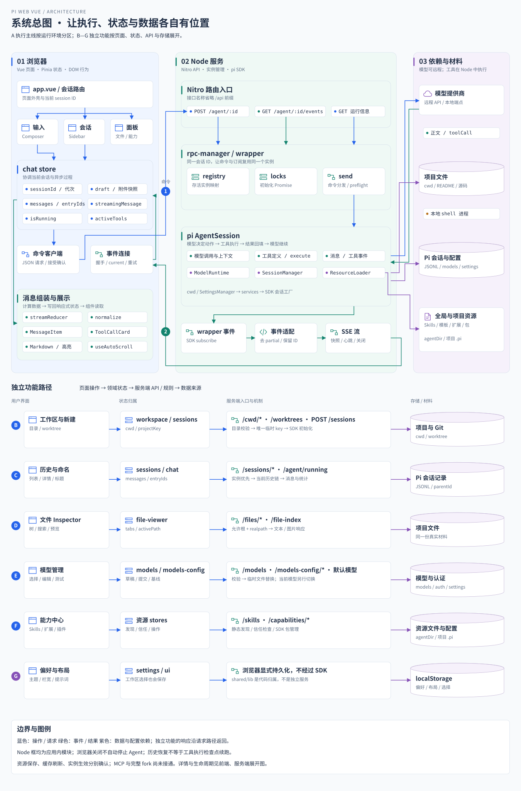
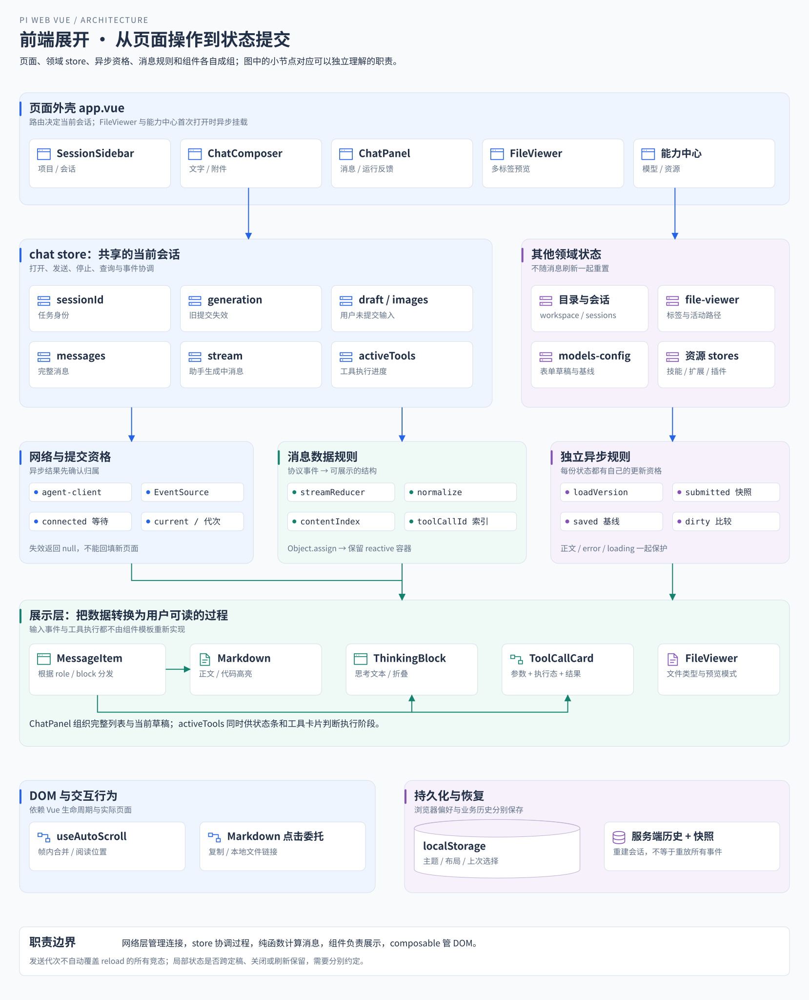
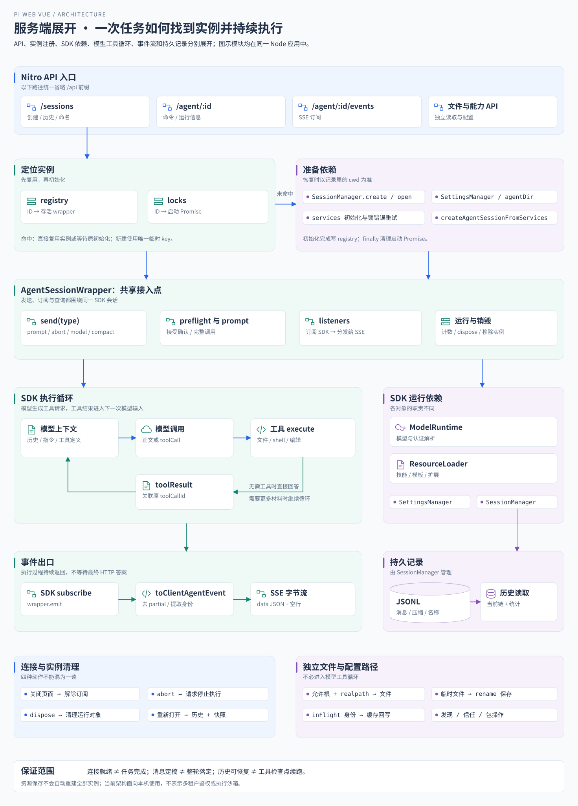

# 项目总体架构与核心功能

对应业务流程：[业务对象与职责分工](业务流程与前后端协作/B01-业务对象与职责分工.md)。本篇把工作区、会话、执行实例和页面状态放进架构图；读图时可逐个对应业务篇的对象与存储位置。

> 先读 [从最小 Agent 到 Web 工作台](00-从最小Agent到Web工作台.md)。本篇把已经理解的消息链路放回完整产品，回答系统有哪些部分、各功能接在哪里。

## 实现思路 按执行与观察的边界组织系统

### 先确定需要保证什么

用户换页面、打开文件或调整侧栏时，不应让正在执行的 Agent 随组件销毁。用户也需要知道当前任务在哪个项目运行、用了哪些工具、结果保存在哪里。因此系统的组织依据是执行、观察与记录的生命周期。

### 三个设计决定

1. **把运行对象放在 Node，页面只持有身份与展示状态。** SDK 和本地文件能力属于服务端；浏览器通过会话 ID 操作它。刷新网页可以重新观察原实例，而不需要把执行任务绑在某个 Vue 组件上。
2. **将控制方向和反馈方向分别接通。** 用户操作通过命令 API 到达 wrapper，SDK 的变化通过事件适配与 SSE 返回 store。两条方向共享会话身份，但完成时点不同，所以消息状态不能只根据 POST 成功与否更新。
3. **让持久记录承担重新进入的依据。** 内存实例提供即时运行信息，历史文件提供已保存内容，项目目录保存真实文件。应用按数据来源恢复页面，避免把 localStorage 中的选择、网页气泡与 SDK 的持久记录当成同一份事实。

图中重点看两条路径：蓝色的命令从页面进入 SDK，绿色的事件返回消息状态。文件预览走独立读取接口，不需要让模型代替用户每次读取预览内容。

## 一 从最小聊天页扩展成工作台

最小版本只有输入框和回答区域。真正操作本地项目时，用户还需要：

1. **指定项目**：这次任务应该在哪个目录执行。
2. **继续任务**：打开之前的会话，接着已有上下文提问。
3. **观察过程**：看到文字、工具调用、执行进度和错误。
4. **查看材料**：从文件树或消息链接打开真实文件。
5. **调整能力**：配置模型、技能、扩展和应用偏好。

pi-web-vue 将这些能力组织成本机运行的 Web 工作台，界面名称为 agentDesk。

> “本地工作台”指应用和本地工具的运行位置。模型推理的位置由配置的提供商决定。

## 二 系统的三个参与方

| 参与方 | 负责什么 | 典型数据 |
| --- | --- | --- |
| 浏览器 | 用户操作 消息组装和展示 | 输入草稿 当前消息 文件标签 |
| Node 服务与 SDK | 接收命令 管理实例 执行工具和访问文件 | 会话实例 监听者 配置与记录 |
| 模型提供商 | 根据上下文生成内容和工具调用 | 模型请求与响应 |

技术栈可以沿这三方理解：

- **Vue 与 Pinia**：界面和前端业务状态。
- **Nuxt 与 Nitro**：在一个工程中组织浏览器代码和 Node API。
- **pi SDK**：模型接入、工具循环和会话能力。
- **HTTP 与 SSE**：把浏览器操作和服务端执行过程连起来。

### 1 完整总图 从入口到运行与存储

[单独打开完整总图并放大](assets/01-system-architecture.svg)。图中 API、实例管理和历史读取都是应用内模块，不是独立部署的微服务。

图中的元素按职责区分：页面图标表示用户入口，堆叠图标表示状态与实例，连接图标表示协议适配，圆柱表示持久数据。浅色分组定义归属，小标签拆开关键字段，带箭头的连线表示调用、事件或数据依赖。这样可以先扫描结构，再查看具体名称。

建议按 A—G 分区阅读，而不是一次记住全部节点：

1. **A 执行主线**：输入进入 chat store，经握手和命令客户端到达 wrapper；SDK 调用模型与本地工具，再经事件桥返回前端状态和组件。
2. **B 工作区与创建**：目录校验确定项目身份，新建取得会话 ID，再进入 A 的订阅和发送流程。
3. **C 历史与运行查询**：从存活实例或会话文件取得记录，恢复消息与统计；运行摘要和列表使用不同查询入口。
4. **D 文件阅读**：文件树、消息链接和 Inspector 使用独立文件 API，经过路径检查后读取，不必让模型介入每次预览。
5. **E 模型配置**：表单草稿、服务端持久化、模型列表缓存和当前实例切换分开处理。
6. **F 资源管理**：技能、扩展、插件和信任分别经过对应 API；发现资源与运行会话使用资源是两个阶段。
7. **G 浏览器偏好与共享代码**：布局、主题等显式写 localStorage；shared/lib 是按调用方执行的代码，不是额外部署的服务。

> 右侧既包含模型服务，也包含本地文件和配置材料。工具实现仍运行在 Node 侧；图中的项目文件与命令环境表示它访问的对象，不表示另有一个远程工具服务。

### 2 前端展开图 状态归属与展示关系

[单独打开前端展开图](assets/01-frontend-architecture.svg)。这张图重点回答“数据由谁拥有，界面如何得到它”：

- **组件产生操作**，路由提供当前会话身份，store 协调业务过程。
- **网络层产生结果和事件**，连接身份与请求资格决定它们能否写入当前状态。
- **纯函数计算消息变化**，store 将结果写回 Vue 响应式容器，组件按类型显示。
- **文件与配置有独立状态**，不因侧栏或会话刷新而无条件重置。
- **DOM 行为与业务状态分层**，滚动和测量在 composable，消息内容规则在 reducer。

### 3 服务端展开图 实例管理与 SDK 能力

[单独打开服务端展开图](assets/01-server-architecture.svg)。按下面的顺序追踪一次接入：

1. API 拿到会话 ID，先复用 registry 中的存活实例，再复用 locks 中尚未完成的初始化 Promise。
2. 需要初始化时，从 SessionManager 确定 cwd，准备设置、模型认证与资源，再创建 AgentSession。
3. wrapper 把命令转换为 SDK 方法，同时分开管理接受确认与完整调用结果。
4. SDK 推进模型与工具循环，执行事件经 wrapper 分发到 SSE；SessionManager 管理会话记录。
5. 历史、文件与配置接口按各自职责读取或保存，不能把所有接口理解为同一种 Agent 命令。
6. 连接关闭、abort、实例销毁与历史恢复各有含义，沿各自的生命周期清理和重建。

### 4 跨图追踪时要记住的对应关系

| 用户看到的现象 | 前端负责什么 | 服务端或 SDK 负责什么 | 结果保存在哪里 |
| --- | --- | --- | --- |
| 新建会话 | 选择 cwd，取得 ID 后导航 | 创建记录与运行实例 | Node 实例与 SDK 会话记录 |
| 发出文字或图片 | 固定本批输入，乐观反馈，等待握手 | 校验命令并调用 SDK prompt | 输入进入会话，前端即时展示 |
| 逐字看到回答 | reducer 组装内容块，组件渲染 | SDK 生成事件，SSE 传输 | 生成中状态在内存，完整记录由 SDK 管理 |
| 工具卡片显示过程 | 调用参数、activeTools 与结果索引组合 | 执行工具，回填上下文，再调用模型 | 实际副作用在项目环境，结果进入会话 |
| 打开历史 | 重建消息与 entry ID，接回连接 | 读取存活实例或历史文件 | 持久记录与当前实例各有作用 |
| 预览文件 | 标签与请求版本、内容类型展示 | 路径校验、读取与类型响应 | 文件仍在项目目录，标签主要在浏览器内存 |
| 保存模型配置 | 草稿、提交快照与保存基线 | 校验、规范化与文件替换 | Pi 配置文件，运行实例另行生效 |
| 修改主题或栏宽 | settings/ui 更新文档与布局 | 通常无需 SDK 参与 | 浏览器 localStorage |

## 三 每项功能接在核心链路的哪里

### 1 工作区和会话决定任务归属

- 工作区选择回答“新任务在哪个目录执行”。
- 会话 ID 回答“正在继续哪段对话”。
- 已有会话保存自己的 cwd，切换选择器不会迁移旧会话。
- Git worktree 可以属于同一项目，但有不同执行目录。

### 2 对话区把执行过程变成可读内容

1. 输入经 HTTP 提交给会话实例。
2. SDK 产生文本、思考、工具与生命周期事件。
3. SSE 把事件送到前端。
4. reducer 组装消息块，组件按类型显示。
5. 单条消息定稿后进入列表，任务落定后刷新历史和运行信息。

> 一次任务可以产生多条消息。“消息结束”和“任务结束”需要分别处理。

### 3 文件预览把回答与项目材料连接起来

- 文件树负责浏览目录，文件索引支持搜索。
- 文件标签记录用户打开了哪些路径。
- Inspector 请求文件 API，展示代码、Markdown 或图片。
- 消息中的本地文件链接也能进入同一预览流程。

Inspector 当前负责阅读。Agent 工具负责实际文件修改。

### 4 能力中心调整执行条件

- 当前模型切换作用于已有运行会话。
- 提供商配置写入 Pi 配置文件。
- 技能、扩展和插件管理涉及资源发现与加载。
- 主题、减少动效和快捷提示词主要属于浏览器偏好。

保存配置、资源被发现和已有实例使用新配置是不同阶段，具体见 [能力中心](10-模型配置与能力中心.md)。

## 四 页面关闭后 哪些数据还在

先按保存位置区分，再判断恢复方式：

| 数据位置 | 保存内容 | 页面刷新后 |
| --- | --- | --- |
| 浏览器内存 | 当前消息 输入和文件标签 | 需要重建 |
| localStorage | 部分偏好 布局和工作区选择 | 可以重新读取 |
| Node 内存 | SDK wrapper 监听和运行快照 | 服务进程仍在时可能继续存在 |
| Pi 会话与配置文件 | 已保存记录和配置 | 可由服务端读取 |
| 项目目录 | 真实代码和材料 | 独立于页面存在 |

由此可以推导：

1. 关闭网页不等于停止 SDK 任务。
2. 服务端实例消失，不等于持久历史被删除。
3. 历史存在，不等于中断的工具任务可以从原位置自动续跑。

## 五 前端值得展开的实现

这些是可以结合源码讲解的机制，是否构成个人贡献需要另有经历依据。

| 实现 | 解决的问题 | 深入位置 |
| --- | --- | --- |
| 消息块建模与纯 reducer | 把正文 思考和工具等事件组织成可展示状态 | [消息渲染](06-消息状态与工具渲染.md) |
| 业务握手和连接身份检查 | 发送前等待监听就绪，隔离被替换的连接 | [HTTP 与 SSE](05-HTTP与SSE协议.md) |
| 文件请求版本 | 防止慢旧请求覆盖新标签内容及加载状态 | [文件预览](09-文件访问与预览.md) |
| 异步组件与首次打开门控 | 将不立即使用的面板延迟加载和挂载 | [前端组织](02-工程结构与前端组织.md) |
| 表单草稿与保存状态分离 | 允许编辑 测试和正式保存分步完成 | [能力中心](10-模型配置与能力中心.md) |

> 亮点需要说明输入、处理规则和可观察结果。没有测量时，不写性能提升百分比；没有完整恢复协议时，不称为无损重连。

## 六 当前功能范围

- **已接入的核心能力**：会话创建与恢复、文本对话、工具展示、文件预览、模型和资源配置、上下文压缩、分支切换与编辑重发、按会话保存文字草稿、运行中追加与队列撤回。
- **仍有实现边界**：重连已有条件终态对账，尚无完整事件回放；历史 reload 已检查代次与请求序号，历史与实时事件交错仍需进一步协调；停止请求超时、长历史加载和 Markdown 渲染成本也有待补强。
- **尚无完整实现依据的能力**：独立会话 fork、跨进程任务续跑、MCP 管理闭环，以及未接入的定制工具。

具体用户操作与状态规则见 [业务流程与前后端协作](业务流程与前后端协作/README.md)。

项目定位是本机使用。当前 API 没有多用户鉴权，文件预览允许根也不等于 Agent 执行沙箱。远程多人部署需要另行设计身份、目录归属和执行隔离。

## 七 怎样继续阅读

1. 想看代码放在哪：读 [工程结构](02-工程结构与前端组织.md)。
2. 想看任务归属与复用：读 [工作区与会话](03-工作区与会话管理.md) 和 [Agent 服务](04-Agent服务与生命周期.md)。
3. 想讲清前端核心：读 [协议](05-HTTP与SSE协议.md)、[消息渲染](06-消息状态与工具渲染.md) 和 [异步恢复](07-异步协作与恢复.md)。
4. 想扩展具体功能：读存储、文件和能力中心专题。

**本篇读完应能回答**：应用有哪些运行环境；每项功能扩展了消息链路的哪里；页面状态、运行实例和持久记录有什么区别。

源码与导航：

- [Nuxt 配置](../../nuxt.config.ts)
- [页面外壳](../../app/app.vue)
- [会话管理](../../server/utils/rpc-manager.ts)
- [第三方来源声明](../../THIRD_PARTY_NOTICES.md)
- [目录](../README.md)
