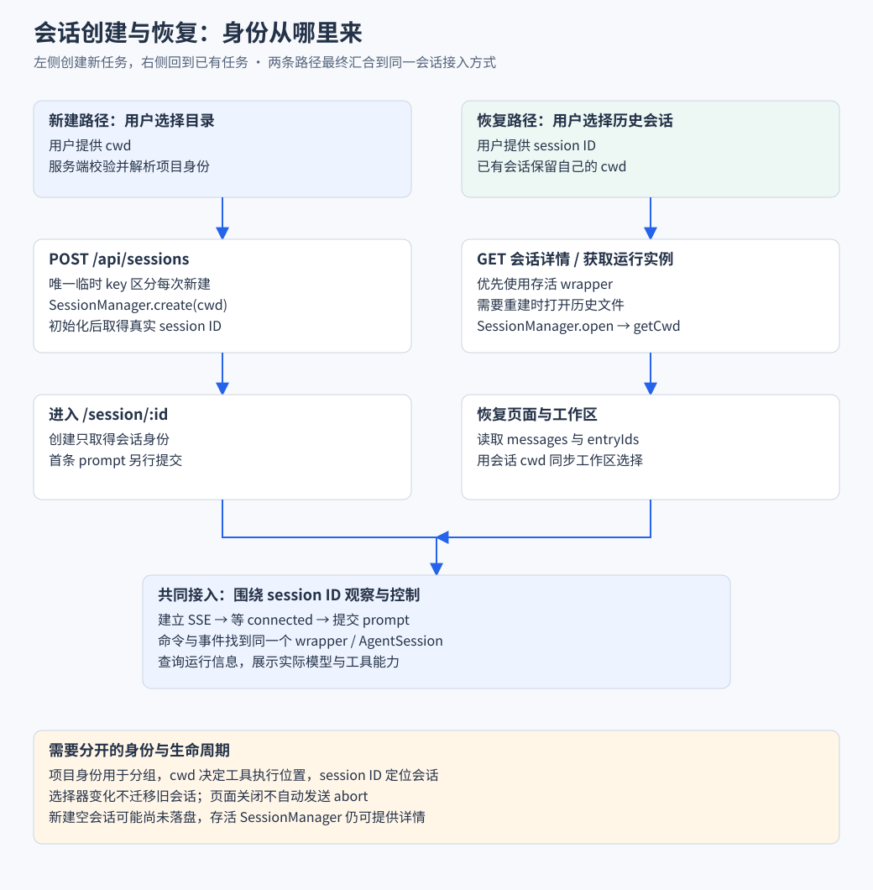

# 工作区与会话管理

对应业务流程：[选择目录与创建会话](业务流程与前后端协作/B02-创建会话到完成一次任务.md)。本篇深入目录校验、项目身份和工作区同步；恢复与编辑的完整操作另见[业务篇 B04](业务流程与前后端协作/B04-历史恢复与编辑重发.md)。

> 本篇从“选择项目后发起任务”开始，解释执行目录、会话身份与页面状态怎样接起来。先读 [核心链路](00-从最小Agent到Web工作台.md)。

## 实现思路 把项目选择与既有会话归属分开

### 先确定不能发生的错配

用户选择项目 B，不应把项目 A 的旧会话改成在 B 中执行；用户打开另一个 worktree 的历史时，文件浏览又应能跟随正确目录。这要求“准备在哪里新建”和“已有任务属于哪里”有各自的来源。

### 四个设计决定

1. **目录先校验，成功后再提交选择。** 输入路径只是用户意图，服务端解析的 ProjectIdentity 才包含 cwd 与项目归属。将校验和 applyIdentity 分开，失败时就能保留原选择，不必先破坏旧状态再回滚。
2. **用项目身份分组，用 cwd 执行。** 同一仓库可以有多个 worktree，项目身份相同但目录不同。保留这两个维度，既能把会话组织在一起，又不会把相对路径解析到错误位置。
3. **创建先取得真实 ID，再进入接收过程。** 首条 prompt 等会话页与 SSE 准备好之后发送。初始化临时 key 只用于区分新建过程，不能让两个独立新建请求共享同一启动结果。
4. **打开旧会话时从历史反向同步工作区。** 先读详情取得会话 cwd，再更新选择器和文件环境。历史、运行信息与实时连接仍有各自请求，异步结果必须检查归属；这个同步方向并不自动解决全部请求竞态。

> 这里的核心不是记住几个 ID 名称，而是知道每个身份由谁确定，以及哪些操作可以改变它。



左右两条路径分别从目录选择和历史身份出发。读图时关注 cwd 的来源，以及新建取得 ID 后为何仍需准备订阅再发送。

## 一 先让任务知道应该读哪个 README

同一句“读取 README”，在不同目录会得到不同内容。因此新建会话前，至少要确定：

- **cwd**：工具解析相对路径的执行目录。
- **session ID**：以后继续这段任务时使用的身份。

最小流程是：

```text
选择目录 → 创建 SDK 会话 → 返回 session ID → 打开会话页 → 提交任务
```

如果加入多个 Git worktree，还需要区分“项目归属”和“实际执行位置”。

| 概念 | 解决的问题 | 例子 |
| --- | --- | --- |
| 项目身份 | 哪些会话属于同一个项目 | 同一仓库的会话分组 |
| 执行目录 cwd | 本次任务实际在哪里读写 | 主目录或某个 worktree |
| 会话 ID | 继续哪段历史与运行实例 | 同一目录下的两个独立任务 |
| entry ID | 指向哪条持久记录 | 某条消息对应的历史记录 |

> Git worktree 分支与会话历史分支是两套关系。普通非 Git 目录也可以创建会话。

## 二 选择目录怎样变成有效工作区

前端不能只把输入框内容当作有效路径。当前选择流程是：

1. 用户输入或选择 cwd。
2. 前端请求 `/api/cwd/validate`。
3. 服务端检查目录并解析项目身份。
4. 成功后更新 `selectedCwd`、`projectRoot` 与 `projectKey`。
5. 将选择写入 localStorage，再加载 worktree 信息。

源码中的状态提交点：

```ts
function applyIdentity(identity: ProjectIdentity) {
  selectedCwd.value = identity.cwd;
  projectRoot.value = identity.projectRoot;
  projectKey.value = identity.projectKey;
  persist();
}
```

- `selectedCwd` 供新会话创建与文件浏览使用。
- `projectKey` 用于稳定分组。
- 校验失败时保留原选择，界面显示错误。

localStorage 保存的是上次选择。目录后来可能被移动或删除，恢复字符串不等于文件系统仍有效。

### 代码为什么把提交放在校验之后

下面节选 `selectProject` 的成功路径，省略请求创建和异常处理：

```ts
const body = (await res.json()) as ProjectIdentity & { error?: string };
if (!res.ok || !body.projectKey) {
  error.value = body.error ?? `HTTP ${res.status}`;
  return false;
}
applyIdentity(body);
await loadWorktrees(body.cwd);
return true;
```

这里同时检查 HTTP 状态与业务身份：即使网络响应存在，没有 projectKey 也不提交。`applyIdentity` 是选择生效点，此前失败只更新错误。随后查询 worktree，补充项目分支信息，而不是用用户最初输入的原始字符串再解释一次目录。

TypeScript 的 `as` 只告诉编译器如何看待返回值，不执行 JSON 的完整运行时校验。读这段代码时，应把实际的条件判断与静态类型标注分开。

## 三 创建会话 为什么不顺便发送第一句话

最小实现可以把创建和发送写在一起。但浏览器还没进入会话页时，通常没有准备好事件监听。快速输出可能在页面连接前就结束。

项目将两步拆开：

1. `POST /api/sessions` 提交 cwd。
2. SDK 创建会话，接口返回真实 session ID。
3. 页面导航到 `/session/:id`。
4. 读取历史、准备 SSE。
5. 发送时等待业务握手，再提交 prompt。

客户端创建逻辑的源码节选：

```ts
const res = await fetch("/api/sessions", {
  method: "POST",
  headers: { "content-type": "application/json" },
  body: JSON.stringify({ cwd }),
});
const body = (await res.json()) as { sessionId?: string; error?: string };
if (!res.ok || !body.sessionId) {
  throw new Error(body.error ?? `HTTP ${res.status}`);
}
await navigateTo(`/session/${body.sessionId}`);
```

服务端还处理两个细节：

- 新建期间真实 ID 尚未得到，使用唯一临时 key，避免两次新建被错误合并。
- 空会话可能尚未落盘，详情优先从存活实例的 SessionManager 读取。

> 文件不存在，不一定代表刚创建的会话不存在。

## 四 打开历史会话时 页面恢复哪些东西

打开历史会话不仅是把消息放进数组，还要恢复执行环境和当前运行信息。

下面是流程节选，省略加载状态清理：

```ts
close();
sessionId.value = id;
const info = await reload();
if (info?.cwd) void workspaceStore.syncFromSessionCwd(info.cwd);
if (sessionId.value !== id) return;
connection.maintain(id);
void refreshRuntimeState();
void fetchRuntimeInfo();
```

沿顺序解释：

1. 解除旧会话的前端连接与状态。
2. 设置目标会话 ID，查询历史详情。
3. 从详情取得 cwd，让工作区跟随会话归属。
4. 检查当前会话是否仍是这次打开的目标。
5. 维护 SSE，查询模型、上下文和可用工具等信息。

这里的数据来自不同位置：

| 数据 | 来源 | 用途 |
| --- | --- | --- |
| 消息与 entry ID | 会话详情 | 重建历史展示 |
| cwd | 会话信息 | 同步项目与文件浏览环境 |
| 模型与上下文 | 运行实例查询 | 展示实际运行配置 |
| 工具与命令 | 运行信息查询 | 提供可用操作 |
| 当前消息快照 | SSE 建连过程 | 接回正在生成的内容 |

`void` 发起的操作不会阻塞后续流程。不能把代码排列顺序理解为所有请求严格串行完成。

## 五 前端实现亮点 列表与当前会话分开

侧栏经常刷新，中央区可能正持续生成文字。如果两者共用一个会被整体替换的状态对象，刷新列表就容易干扰对话。

当前分工是：

- **sessions store**：维护侧栏的会话摘要列表。
- **chat store**：维护当前会话消息、事件连接和运行状态。
- **workspace store**：维护项目选择与分组身份。

这样，重命名后可以刷新列表，而不需要重新创建当前对话区的消息状态。

另一个关键是目录同步方向：

1. 新建时，工作区选择决定新会话 cwd。
2. 打开历史时，会话自身的 cwd 反过来同步工作区。
3. 单纯改变选择器，不会直接迁移已经创建的 SDK 会话。

> 值得讲的是状态的归属与同步方向，不是“使用 Pinia”这个技术名称本身。

## 六 列表 名称和运行标记从哪里来

### 列表

1. 服务端扫描会话文件的有限头部与尾部信息。
2. 提取首条输入、时间、目录和标题。
3. 缓存列表 30 秒，强制刷新可绕过缓存。

当前列表 `messageCount` 是占位值，不能当作准确消息数。

### 名称

- 手动重命名成功后刷新列表。
- 自动命名按会话 ID 维护正在执行的集合，防止重复触发。
- 名称记录可能追加在文件尾部，仅看第一行会漏掉改名。

### 运行标记

侧栏另从 `/api/agent/running` 查询已知运行实例。它与中央区 SSE 使用不同的数据路径，刷新时机也可能不同。

## 七 当前边界与验证方法

已实现身份检查可以拦住部分旧响应，但还要注意：

- `A→B→A` 时，只检查 ID 可能接受第一次 A 的旧结果。
- 工作区异步同步也需要考虑旧结果晚到，不能由会话 ID 检查推导全部状态安全。
- 已选择的目录失效时，恢复 localStorage 不能替代服务端校验。
- 选择已有 worktree 不代表应用实现了 Git 创建、提交或合并。

建议验证：

1. 创建会话 A 后切换工作区，确认 A 的执行目录没有被改写。
2. 从另一 worktree 打开历史，检查工作区是否跟随。
3. 让 A 详情慢于 B 返回，检查中央区与侧栏归属。
4. 再构造 `A→B→A`，区分当前守卫覆盖与未覆盖的情况。

**读完应能回答**：为什么 cwd 和 session ID 不能合并；为什么新建与发送分开；历史页需要协调哪些数据源。

源码与导航：

- [workspace](../../app/stores/workspace.ts)
- [sessions](../../app/stores/sessions.ts)
- [创建接口](../../server/api/sessions/index.post.ts)
- [详情接口](../../server/api/sessions/[id].get.ts)
- [chat](../../app/stores/chat.ts)
- [Agent 服务](04-Agent服务与生命周期.md)
- [目录](../README.md)
