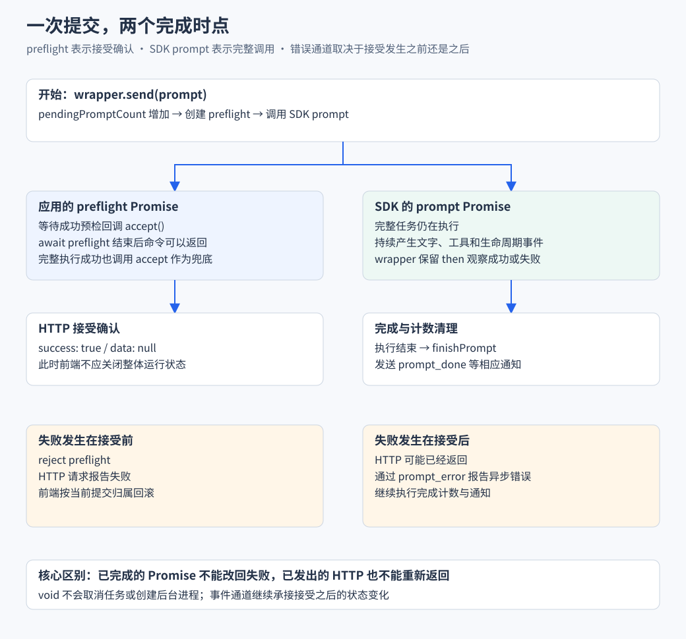

# Agent 服务与生命周期

对应业务流程：[创建与执行完整流程](业务流程与前后端协作/B02-创建会话到完成一次任务.md)。本篇深入实例复用、并发初始化和接受确认；运行中追加怎样复用这套机制，见[业务篇 B03](业务流程与前后端协作/B03-运行中追加与停止.md)。

> SDK 已经能执行任务，Web 服务还要解决“请求怎样找到同一个 Agent”。本篇从保存一个实例开始，逐步加入恢复、并发启动、命令确认和释放。

## 实现思路 让多个请求共享同一次执行

### 先确定需要保证什么

浏览器发送 prompt、订阅 SSE 和查询状态，可能在很短时间内同时到达。它们应使用同一会话实例，命令接受后也应尽早反馈，执行结束或异常后还必须释放相应状态和监听。

困难在于 SDK 初始化与任务执行都跨越 await。代码让出执行权后，另一个请求可能进来，页面也可能断开。仅保存一个 session 变量不足以处理这些时点。

### 四个设计决定

1. **用完成实例与启动 Promise 两级复用。** registry 处理已经存在的实例，locks 处理尚在创建的实例。初始化前先公布等待对象，才能防止两个请求同时越过“没有实例”的检查；这项复用只作用于启动，不替用户命令去重。
2. **让 wrapper 成为共享接入点。** 命令与事件都经过持有同一 SDK 对象的包装器。SSE 可以分别注册自己的监听，而不必让每个网络请求重新订阅或创建一套 Agent 执行环境。
3. **把接受确认从完整执行中分离。** preflight Promise 决定 HTTP 何时返回，SDK prompt Promise 决定何时报告完成与异步错误。两个 Promise 对应两个业务事实，不能通过提前返回一个成功值假装任务已经结束。
4. **将销毁传播给观察者。** wrapper 消失时，SSE 也应停止，浏览器才能识别连接变化。否则网络心跳仍在，执行来源却已经不存在，页面会误以为仍能接收后续输出。

下面的代码按这四个决定展开，重点观察 Map 写入与删除、Promise 的完成位置，以及监听的注册与清理。



图中左右两条路径可以并行推进：HTTP 返回不关闭右侧执行。下方按接受前后划分错误通道，解释为何一个 catch 不能承担全部反馈。

## 一 从一个 SDK 对象到可复用会话

最小 Node 程序可以直接持有 `session`。浏览器却只能通过请求传字符串，无法引用 Node 内存对象。

因此服务端需要一层映射：

```text
浏览器传 session ID
  → registry 找到 wrapper
  → wrapper 持有 SDK AgentSession
  → 调用方法或注册事件监听
```

`AgentSessionWrapper` 是应用包装器，主要提供：

- **命令入口**：把 prompt、abort、set_model 等命令交给 SDK。
- **事件入口**：向 SSE 等监听者分发 SDK 事件。
- **生命周期**：记录运行情况并释放资源。

> wrapper 管理 SDK 怎样被 Web 服务使用。模型决策与工具循环仍由 SDK 执行。

文件名 `rpc-manager.ts` 表达命令调用封装。当前代码直接在 Node 中调用 SDK，并非通过 Pi CLI 子进程的标准输入输出通信。

## 二 先复用已有实例 再考虑恢复

收到会话 A 的请求时：

1. 查 registry，存在存活实例就复用。
2. 没有实例时，查会话记录。
3. 用记录恢复 SessionManager，并取得会话 cwd。
4. 准备 settings 与 services，创建 SDK 会话。
5. 包装、订阅并注册实例，供后续请求使用。

发送命令与订阅事件必须经过同一实例映射。否则发送接口启动 A1，SSE 接口监听 A2，浏览器就收不到实际任务的输出。

## 三 两个请求同时恢复 为什么需要第二张 Map

假设命令接口与 SSE 接口几乎同时请求会话 A：

```text
命令请求  查 registry 没有 A → 开始异步初始化
事件请求  查 registry 仍没有 A → 也开始初始化
```

只保存完成后的实例，填不上初始化期间的空档。因此项目另外保存正在启动的 Promise。

源码中的两个检查：

```ts
const existing = registry.get(sessionId);
if (existing?.isAlive()) return { session: existing, realSessionId: sessionId };

const inflight = locks.get(sessionId);
if (inflight) return inflight;
```

- **registry**：已经完成初始化的运行对象。
- **locks**：尚未完成初始化的 Promise。

加入后，第二个请求等待第一个请求的结果，而不是创建第二个 Agent。

1. 首个请求建立启动 Promise 并保存。
2. 其他同 ID 请求拿到这个 Promise。
3. 初始化成功后注册实例。
4. `finally` 删除启动 Promise，使失败后还能重新尝试。

> 这里合并的是初始化，不是用户命令。提交两次相同 prompt 仍然是两个操作；这也不是跨进程的分布式锁。

### Promise 怎样在初始化完成前公布

当前结构可以缩减为下面的教学骨架，`initialize` 表示前面已经说明的 SDK 创建过程：

```ts
const starting = initialize().finally(() => locks.delete(sessionId));
locks.set(sessionId, starting);
return starting;
```

关键在于保存的是尚未完成的 Promise。首个调用在同步代码中写入 locks，其他请求进入时就能拿到相同等待对象；它们不需要知道初始化目前进行到了哪一步。

- 初始化成功时，真实 wrapper 写入 registry，后续请求走实例复用。
- 初始化失败时，Promise 向所有等待者报告失败。
- 无论成功还是失败，finally 删除启动项，避免失败 Promise 永久挡住重试。

若在 `await initialize()` 之后才写 locks，初始化期间仍没有任何可复用标记，这张 Map 就失去了合并启动的作用。

services 初始化还有单独的重试：

- 仅匹配包含锁路径的特定文件系统错误。
- 从 150 毫秒开始指数延迟，最多追加 5 次。
- 用于共享 Pi 配置的瞬时锁竞争，不是模型错误的通用重试。

## 四 浏览器命令怎样到达 SDK

请求中的 `type` 决定 wrapper 调用哪个方法：

| 命令 | 实际动作 | 需要注意 |
| --- | --- | --- |
| prompt | 发起任务 | 图片先做服务端校验 |
| abort | 请求停止 | 停止与撤销已发生副作用不同 |
| get_state | 查询模型与运行信息 | 查询不等于重建实例状态 |
| set_model | 查找目标模型并切换 | 必要时刷新 runtime 后重查 |
| compact | 调用上下文压缩 | 与普通消息生成不同 |
| abort_compaction | 中止压缩 | 与 abort 分开 |

浏览器不需要知道 SDK 工厂与依赖准备细节，只需引用会话 ID 和命令。

当前存在的接口也不全代表完整用户流程：`navigate_tree` 有服务端调用但前端导航不完整，`fork` 分支仍返回未实现错误。

## 五 接受任务和完成任务 为什么是两个 Promise

### 1 最小写法会等待整段执行

```text
收到 prompt → await SDK prompt → 任务结束 → HTTP 返回
```

模型和工具可能执行较久，浏览器希望先知道任务是否被接受，然后继续观察输出。

### 2 项目增加接受确认

wrapper 创建应用自己的 `preflight` Promise，并把 resolve 与 reject 保存下来。SDK 成功预检时完成这个 Promise，命令请求就可以先返回。

下面是关键控制流的教学节选，省略图片、同步异常和运行计数：

```ts
let accepted = false;
let accept!: () => void;
let rejectFn!: (error: unknown) => void;
const preflight = new Promise<void>((resolve, reject) => {
  accept = () => {
    accepted = true;
    resolve();
  };
  rejectFn = reject;
});

const prompt = this.inner.prompt(String(command.message), {
  source: "rpc",
  preflightResult: (ok: boolean) => {
    if (ok) accept();
  },
});

void prompt.then(
  () => {
    accept();
    this.emit({ type: "prompt_done" });
  },
  (error) => {
    rejectFn(error);
    if (accepted) {
      this.emit({ type: "prompt_error", errorMessage: String(error) });
      this.emit({ type: "prompt_done" });
    }
  },
);

await preflight;
return null;
```

按时间理解：

1. `preflight` 等待接受确认。
2. SDK 的 `prompt` Promise 表示完整调用。
3. 成功预检调用 `accept()`，HTTP 可以返回。
4. `prompt.then()` 继续观察执行结果并报告结束或错误。

`void` 不取消任务，也不创建后台进程，只表示当前方法不等待 `then` 返回的 Promise。

### 3 为什么接受后的错误走事件

| 错误发生时间 | 能通过什么报告 | 原因 |
| --- | --- | --- |
| 接受前 | 拒绝 preflight，使 HTTP 报错 | 命令还在等待确认 |
| 接受后 | `prompt_error` 等事件 | 已完成的 Promise 不能改回 rejected，HTTP 也可能已返回 |

完整调用成功时也会调用 `accept()`，作为没有提前成功回调时的完成兜底。当前 `preflightResult(false)` 本身不直接拒绝，仍依赖 SDK 后续失败路径，升级依赖时需要核对这项契约。

> 前端不能用 HTTP 成功关闭运行状态，也不能把所有错误都只放在提交请求的 catch 中。

## 六 实例怎样报告运行中和清理资源

### 运行状态

- 调用前增加 `pendingPromptCount`。
- 结束路径减少计数，避免实例永久显示运行中。
- wrapper 的 `isRunning()` 综合存活标志、待完成 prompt 数量和 SDK `isStreaming`。
- SSE 握手中的 `isStreaming` 直接来自 SDK，不是同一个综合口径。

### 事件分发

1. wrapper 订阅 SDK。
2. SDK 事件到达后刷新活动时间。
3. wrapper 向当前 listeners 分发。
4. SSE 将事件编码后发给浏览器。

### 资源释放

1. 清除实例回收定时器。
2. 取消 SDK 订阅。
3. 通知仍连接的 SSE 流关闭。
4. 调用 SDK dispose。
5. 删除注册表项。

只销毁 SDK 而不关闭 SSE，可能让浏览器仍收到心跳，却再也没有实际输出。

当前回收策略使用 10 分钟定时器，有监听者时推迟，事件和多数命令会刷新。定时回调没有另查 `isRunning()`，无订阅且长时间无事件的任务仍可能被回收。

## 七 怎样验证 而不用真实模型等十几秒

可以用可控 Promise 构造两个时点：

1. mock prompt 先触发成功预检。
2. 返回一个尚未完成的 Promise。
3. 验证 wrapper 命令已经返回，但仍显示运行中。
4. 手动完成 Promise。
5. 检查计数清理和结束事件。

已有 [wrapper 测试](../../tests/server/utils/rpc-manager.test.ts) 使用这类方法。它验证应用对 SDK 契约的处理，不等于已验证所有提供商的实际运行行为。

**读完应能回答**：为什么需要 wrapper；启动 Promise 合并解决什么；为什么有两个完成时点；关闭页面和销毁实例有什么区别。

源码与导航：

- [rpc-manager](../../server/utils/rpc-manager.ts)
- [services 初始化](../../server/utils/agent-services.ts)
- [关闭钩子](../../server/plugins/cleanup.ts)
- [HTTP 与 SSE](05-HTTP与SSE协议.md)
- [目录](../README.md)
