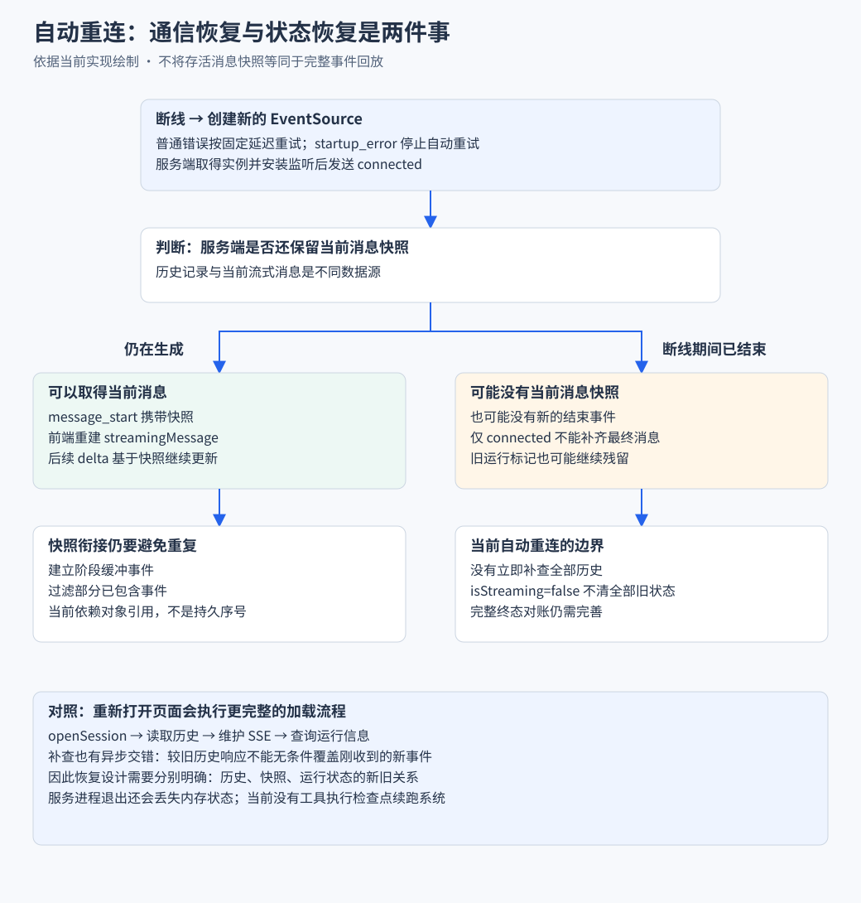

# HTTP 与 SSE 协议

> 已经理解 SDK 方法与事件后，本篇继续讲它们怎样跨过网络。重点是命令、实时事件与历史查询怎样协作，再看握手、快照和重试。

## 实现思路 把命令确认与过程传输分开

### 先确定传输需要表达的事实

浏览器要知道任务是否被接受，也要持续看到输出，还要在重新进入页面时取得旧内容。一个最终 JSON 响应无法同时满足低等待反馈和过程展示；只接实时事件又无法还原连接建立前的历史。

### 四个设计决定

1. **用 HTTP 命令表达意图，用 SSE 表达过程。** 提交、停止和切模型是离散操作，文本与工具变化是持续输出。两条通道分别返回对应事实，前端不把命令成功当作任务已完成。
2. **用业务握手决定什么时候允许发送。** HTTP 响应打开早于 SDK 准备完成是合法情况，因此服务端在取得实例并装好监听后才发送 connected。前端把这个事件转换为 Promise 的完成，让发送顺序在代码中可等待。
3. **把完整快照放在需要重建状态的位置。** 持续在线时发送 delta，建立连接时补当前消息快照，历史查询补已完成记录。三个数据来源各有用途，不能把去掉增量事件里的重复 partial 理解成永远不传完整消息。
4. **让连接身份决定谁还能写入。** 页面切换或重试会替换 EventSource，旧连接的回调必须失效。Promise 结束后再次检查 current，防止“握手曾成功”的旧连接继续推动发送。

> 协议的重点是时序和含义，而不只是把对象 JSON.stringify 后写进响应。后面的代码分别解释就绪、传输、替换与清理。



沿是否仍有当前消息分支阅读。右侧是当前自动重连的未覆盖情况，不能把黄色区域理解为已经完成的补查协议。

## 一 从请求答案 到观察一个持续任务

最小网页可以 POST 输入，等最终 JSON 答案。但 Agent 可能持续输出文字、调用工具、读取文件，用户需要知道中间发生了什么。

项目把交互分成三条路径：

| 路径 | 问题 | 接口 |
| --- | --- | --- |
| 命令 | 希望 Agent 做什么 | `POST /api/agent/:id` |
| 事件 | 当前发生了什么变化 | `GET /api/agent/:id/events` |
| 历史 | 已经记录了什么 | `GET /api/sessions/:id` |

```text
浏览器 ── 命令 ──→ Node wrapper → SDK
浏览器 ←─ SSE 事件 ── Node wrapper ← SDK
浏览器 ── 历史查询 ──→ 会话读取
```

事件连接也是浏览器发起的 GET，反向箭头表示后续响应数据的方向。

> 命令成功、收到正文和历史落盘是不同语义，不能用一条通道的响应代替全部状态。

## 二 先看一条命令怎样发送

文本请求体的形状：

```json
{"type":"prompt","message":"阅读 README 并说明启动方式"}
```

完整过程：

1. `sendAgentCommand` 设置请求头并提交 JSON。
2. 路由根据会话 ID 找到 wrapper。
3. wrapper 根据 `type` 调用 SDK。
4. 接受确认返回 `{ success: true, data: null }`。
5. 后续答案继续从事件通道到达。

客户端把失败转换为 `AgentCommandError`。类型中有可选的 `code` 与 `accepted`，但服务端未对全部错误提供完整语义。

网络错误尤其需要区分：

- 明确拒绝：服务端没有接受命令。
- 确认丢失：服务端可能已接受，但响应没送到浏览器。

后者直接重发可能重复执行，完整幂等需要请求 ID 与接受状态对账，当前不能宣称已具备。

## 三 SDK 事件怎样编码成 SSE

服务端返回 `Content-Type: text/event-stream`，把每个事件写成 data 行，以空行结束。

源码中的编码核心：

```ts
const encode = (data: unknown) => {
  enqueueText(`data: ${JSON.stringify(data)}\n\n`);
};
```

线上的事件示例：

```text
data: {"type":"message_update","assistantMessageEvent":{"type":"text_delta","contentIndex":0,"delta":"你好"}}

```

浏览器的处理分两层：

1. `EventSource` 识别 SSE 的事件边界。
2. 连接管理器解析 `message.data` 中的 JSON，再交给 store。

`delta` 可能是几个字或更长的片段，不保证对应一个 token，也不保证是完整 Markdown 结构。

服务端每 30 秒发送注释心跳。心跳帮助维持连接，不证明模型有进展。当前没有持久事件序号，也没有通过 `Last-Event-ID` 回放事件日志。

## 四 先完成业务握手 再发 prompt

### 1 网络打开不代表监听已经装好

初始化 SDK 可能比打开 HTTP 响应慢。如果仅监听 EventSource 的 open 就发送任务，输出可能早于服务端监听准备完成。

项目额外发送 `connected`：

1. 先写注释行，使响应开始。
2. 等待会话实例。
3. 注册事件监听与销毁监听。
4. 读取当前快照并发送 connected。
5. 处理建立阶段的缓冲事件与快照。
6. 前端收到 connected 后，解除发送等待。

### 2 一个 Promise 怎样连接事件与发送流程

下面是机制示例，省略连接替换、拒绝和超时处理，变量由调用环境提供：

```ts
let resolveReady!: () => void;
const ready = new Promise<void>((resolve) => {
  resolveReady = resolve;
});

source.onmessage = (message) => {
  const event = JSON.parse(message.data);
  if (event.type === "connected") resolveReady();
};

await ready;
await sendAgentCommand(sessionId, { type: "prompt", message: text });
```

- 创建 Promise 时先保存 resolve，等待尚未结束。
- connected 到达后调用 resolve。
- 被挂起的发送流程继续执行。

实际连接管理器保存的是 `attempt.promise`，还保存拒绝路径：启动失败、超时或连接关闭时结束等待，让发送方显示失败。

### 就绪检查怎样落实到连接对象

`ensureConnected` 在 await 之后的源码节选：

```ts
await connection.attempt.promise;
if (this.current !== connection) {
  if (this.current?.sessionId === sessionId) continue;
  throw new AgentEventConnectionError("closed");
}
if (connection.source.readyState === EVENT_SOURCE_OPEN) return;
this.discard(connection, new AgentEventConnectionError("closed"));
```

按分支解释：

1. await 完成，只证明这个 attempt 已经收到握手。
2. current 换成同会话的新连接时，循环继续等待新对象。
3. current 已属于别的会话或被关闭时，旧等待者失败退出。
4. 对象仍有效且网络 OPEN，才允许发送继续。
5. 对象仍是当前对象但网络不再 OPEN，则丢弃它，避免复用曾经成功、现在卡在连接中的 source。

这段代码位于循环内，`continue` 的含义是重新取得当前连接，而不是再次发送 prompt。握手重试和业务命令重发因此保持独立。

## 五 前端实现亮点 连接管理不散落在组件中

连接管理器集中持有：

- 当前 EventSource。
- 当前握手尝试与等待者。
- 重试定时器。
- 连接身份和清理行为。

这样，多个需要同一会话连接的调用方可以复用同一次尝试。

`ensureConnected` 在等待结束后还检查当前连接身份与状态。原因是：

```text
A 的握手完成
  → 页面切到 B 替换连接
  → A 的等待流程恢复执行
```

只知道“A 曾经成功”还不够，必须确认“A 现在仍是有效连接”。收到事件时也检查来源是否仍是 current，减少旧连接污染新状态的机会。

> 这里可以讲的是连接的单一归属、就绪等待和过期隔离。不能由此推导整套历史恢复已经无损。

## 六 断线之后 为什么还需要快照

假设断线前已经生成“启动命令是”，重连后只收到“npm run dev”。前端没有前半句，仅接新 delta 无法完整恢复。

因此服务端尝试取得存活实例中的当前消息快照：

1. 监听安装后，快照发布前的事件先缓冲。
2. 根据快照过滤部分已包含的事件。
3. 使用 `message_start` 携带当前消息。
4. 前端基于这份状态继续应用后续增量。

当前过滤依赖消息对象与快照的引用关系，不是全局序号。需要结合 SDK 事件形状验证快照与增量交错是否正确。

两种恢复情况要分开：

| 重连时的情况 | 可用数据 | 结果 |
| --- | --- | --- |
| 消息还在生成 | 当前消息快照与后续事件 | 可以补上已生成部分 |
| 任务已在断线期间结束 | 可能没有当前快照和新结束事件 | 需要历史与状态对账 |

当前 connected 不立即触发完整历史重载，且 `isStreaming=false` 不主动清除全部旧运行态。因此第二种情况仍有缺口。

## 七 为什么要裁剪 SDK 事件

某些增量事件同时携带 delta 与完整 partial 消息。文本越来越长时，每次都传完整快照会重复发送此前内容。

例如教学数据：

```text
原始全文部分  你 → 你好 → 你好啊
需要的增量    你 → 好   → 啊
```

当前转换执行：

- `message_update` 去掉重复 partial。
- 工具开始与参数增量先从 partial 提取调用 ID 和名称，避免裁剪后丢定位信息。
- 省略 `turn_start`、`turn_end`。
- `agent_end` 只保留类型。
- 工具执行更新保留身份和部分结果。

> 减少的是逐次重复传输。建连快照与最终完整消息仍有用途，不应一起删除。

这是服务端与前端协议协作的优化。示例只说明重复来源，不代表测得的节省比例；该适配层也不是完整的运行时 schema 校验系统。

工具字段保留的顺序可以从源码节选看出：

```ts
const metadata = toolCallMetadata(assistantMessageEvent as Record<string, unknown>);
const { partial: _partial, ...deltaEvent } = assistantMessageEvent as Record<string, unknown>;
void _partial;
return {
  type: "message_update",
  assistantMessageEvent: metadata ? { ...deltaEvent, ...metadata } : deltaEvent,
} as ClientMessageUpdateEvent;
```

先读取 metadata，再解构移除 partial，最后合并必要字段。浏览器不用保留整份快照，也能知道参数片段属于哪个工具。这里 `void _partial` 只是明确不使用被移除的变量，不参与网络发送或异步执行。

## 八 重试与清理怎样结束整个连接生命周期

- 普通连接错误：关闭旧 EventSource，按固定 3 秒延迟重试。
- 业务就绪等待：超时为 30 秒。
- `startup_error`：停止自动重试，交给界面报告启动问题。
- 页面关闭：取消重试并清理当前连接。
- 服务端请求关闭、流取消或 wrapper 销毁：清理监听与心跳。

源码注释曾提到指数重连，但当前使用固定延迟。services 初始化的指数重试是另一套机制。

## 九 检查理解与源码入口

读完应能回答：

1. 为什么命令、事件和历史需要分别理解？
2. `connected` 比网络 open 多保证了什么？
3. 为什么握手结束后还检查连接身份？
4. 快照能补哪种缺失，不能补哪种缺失？
5. 裁掉 partial 前为什么要提取工具元数据？

源码与导航：

- [命令客户端](../../shared/lib/agent-client.ts)
- [连接管理](../../shared/lib/agent-event-connection.ts)
- [事件流](../../server/utils/event-stream.ts)
- [事件裁剪](../../shared/lib/agent-event-wire.ts)
- [消息状态与工具渲染](06-消息状态与工具渲染.md)
- [目录](../README.md)
