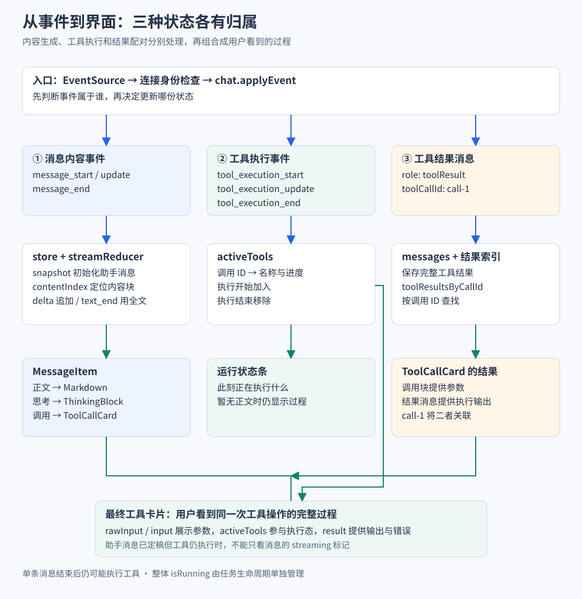

# 消息状态与工具渲染

> 本篇从“收到一段文字”扩展到“显示完整 Agent 执行过程”。先演算数据怎样变化，再看 reducer、Vue 组件和滚动行为。

## 实现思路 先定义消息怎样变化 再决定组件怎样画

### 先确定需要保证什么

一条助手消息可能交错包含正文、思考和工具调用；同名工具也可能出现多次。页面需要保留顺序，把结果配回正确调用，并允许生成中的内容逐步更新。直接把全部事件拼成字符串，会丢失这些关系。

### 四个设计决定

1. **用内容块保留类型和顺序。** contentIndex 只定位当前消息内部的块，toolCallId 关联跨消息的调用和结果。两种身份分开后，正文追加不影响工具结果配对，同名工具也不会靠相邻位置猜测归属。
2. **把生成中的消息与完整列表分开。** delta 主要作用于当前草稿，message_end 提供定稿内容并放进列表。这样组件能明确区分正在变化和已经完整的内容，但定稿时还需要处理草稿清理、记录 ID 与组件局部状态衔接。
3. **将状态变化集中成 reducer。** start、snapshot、delta、end 是应用侧的状态动作，reducer 按动作生成新数据；store 决定事件是否属于当前任务并负责副作用。分开后可以用一段确定的事件序列直接验证消息，而不必先挂载整页。
4. **把工具参数、执行进度和最终结果分开接入。** 参数生成时允许保存未完成的 rawInput；执行期间由 activeTools 描述进度；结果消息到达后按 ID 给卡片提供正文。三个阶段有各自的数据来源，才能解释“参数已经显示，但工具还没完成”。

> 下文先用“你好！”手算状态，再回到更新函数。读代码时关注每次修改的目标和结束时采用的完整内容，而不是先记住全部事件名称。

## 一 最小版本只需要一个字符串

收到文本增量时，可以直接追加：

```ts
let text = "";
for (const delta of ["你", "好"]) text += delta;
```

这能显示“你好”。但真实助手可能先思考，再输出正文，随后请求 read 工具。一个字符串无法保留这些内容的类型和关系。

因此消息逐步扩展为：

1. 一条助手消息包含有顺序的内容块。
2. 每个块有自己的类型和数据。
3. 工具结果作为独立消息，通过调用 ID 与工具块关联。

## 二 先把数据模型讲清楚

下面是前端归一化后的简化示例：

```ts
const message = {
  role: "assistant",
  model: "example-model",
  provider: "example-provider",
  content: [
    { type: "thinking", thinking: "先查看项目说明" },
    { type: "text", text: "我先读取 README" },
    {
      type: "toolCall",
      toolCallId: "call-1",
      toolName: "read",
      input: { path: "README.md" },
    },
  ],
};
```

三个身份各有作用：

| 身份 | 定位什么 | 例子 |
| --- | --- | --- |
| `contentIndex` | 当前消息中的一个块 | 索引 1 是正文 |
| `toolCallId` | 一次调用及其结果 | call-1 对应这次 read |
| entry ID | 持久历史中的一条记录 | 详情查询补回记录身份 |

> 工具名可能重复，数组下标也可能变化。工具结果按调用 ID 配对，历史记录按 entry ID 定位。

## 三 页面状态怎样从最小版本长出来

| 状态 | 保存什么 | 为什么单独保存 |
| --- | --- | --- |
| `draft` | 用户尚未提交的输入 | 不能与助手生成内容混淆 |
| `messages` | 完整消息与临时用户气泡 | 构成历史展示列表 |
| `stream.streamingMessage` | 当前助手草稿 | 承接连续增量 |
| `activeTools` | 此刻正在执行的工具 | 没有新增文字时仍能展示进度 |
| `isRunning` | 整体任务是否运行 | 一条消息结束后可能还要执行工具 |

当前回复完成后，把完整消息放进列表，再清理草稿。这个分离让流式期间的更新目标明确，也产生了定稿、去重和历史对账的责任。



图按列从上到下阅读。三类事件分别更新消息草稿、活跃工具和结果索引，最后组合为正文、运行状态条和工具卡片。

## 四 先手算一遍文本组装

假设当前任务开始，准备生成“你好！”。这里区分两层：

- SDK 与网络层传来消息和内容块事件。
- store 将事件转换成 reducer 的 `start`、`snapshot`、`delta`、`end` 动作。

| 动作或内部事件 | 旧状态 | 新状态 |
| --- | --- | --- |
| start | 没有当前消息 | 进入流式状态，消息仍为 null |
| snapshot | 消息为 null | 放入空 content 的助手消息 |
| text_start，索引 0 | content 为空 | 创建 text 为空的块 |
| text_delta，内容“你” | 空字符串 | 你 |
| text_delta，内容“好” | 你 | 你好 |
| text_end，完整内容“你好！” | 你好 | 你好！ |
| 外层 message_end | 当前助手草稿 | store 保存完整消息，reducer 清空草稿 |

两个容易误解的地方：

1. `start` 只开始流式状态，不会凭空生成完整助手对象，仍需要 snapshot。
2. `text_end` 使用最终全文收尾，不能再次追加，否则会得到重复内容。

下面可以放进项目测试环境演算，使用真实 reducer：

```ts
import { INITIAL_STREAMING_STATE, streamReducer } from "#shared/lib/streaming-message";

let state = streamReducer(INITIAL_STREAMING_STATE, { type: "start" });
state = streamReducer(state, {
  type: "snapshot",
  message: {
    role: "assistant",
    model: "example-model",
    provider: "example-provider",
    content: [],
  },
});
state = streamReducer(state, {
  type: "delta",
  event: { type: "text_start", contentIndex: 0 },
});
for (const delta of ["你", "好"]) {
  state = streamReducer(state, {
    type: "delta",
    event: { type: "text_delta", contentIndex: 0, delta },
  });
}
state = streamReducer(state, {
  type: "delta",
  event: { type: "text_end", contentIndex: 0, content: "你好！" },
});
console.log(state.streamingMessage?.content[0]);
```

预期结果是 `{ type: "text", text: "你好！" }`。跳过消息初始化直接发送 delta，当前实现不会自动猜测消息结构。

## 五 reducer 怎样实现刚才的变化

### 1 先定位块 再执行更新规则

源码核心函数：

```ts
function updateContentBlock(
  state: StreamingState,
  contentIndex: number,
  update: (current: AssistantContentBlock | undefined) => AssistantContentBlock | null,
): StreamingState {
  const message = state.streamingMessage;
  if (!message || !Number.isInteger(contentIndex) || contentIndex < 0) return state;

  const content = [...message.content];
  const nextBlock = update(content[contentIndex]);
  if (!nextBlock) return state;
  content[contentIndex] = nextBlock;
  return {
    isStreaming: true,
    streamingMessage: { ...message, content },
  };
}
```

执行顺序：

1. 检查当前消息与索引。
2. 浅复制 content 数组。
3. 由事件对应的更新函数计算目标块。
4. 返回新消息和新状态。

文本 delta 的规则就是“旧正文加本次增量”。未修改的块仍复用引用：

```text
旧 state → 旧消息 → 旧数组 → [思考块 A 文本块 B]
新 state → 新消息 → 新数组 → [思考块 A 文本块 C]
```

这属于结构共享。它保留旧状态可检查，也避免深复制全部内容，但数组复制和字符串追加仍然有成本。

### 文本分支怎样复用同一个更新框架

下面是 `text_delta` 分支的源码：

```ts
case "text_delta":
  return updateContentBlock(state, event.contentIndex, (current) => (
    current?.type === "text"
      ? { ...current, text: current.text + event.delta }
      : null
  ));
```

外层函数只负责定位和提交，回调只负责文本规则。若块不存在或类型不符，返回 null，外层沿用原状态；这能避免把正文片段写进工具块，但也意味着协议缺少初始化事件时不会自动修复。

`text_end` 则使用 `event.content` 覆盖块正文，因为它携带的是最终全文。同一套定位框架配不同更新函数，统一了数组与引用处理，又保留各类事件的语义。

> 这个抽取的复用依据是相同的状态提交规则，而不是单纯减少几行代码。正文、思考和工具参数都需要按索引定位，但更新内容的方式不同。

### 2 再写回 Vue 响应式状态

```ts
const stream = reactive<StreamingState>({ ...INITIAL_STREAMING_STATE });

function applyStream(action: Parameters<typeof streamReducer>[1]) {
  Object.assign(stream, streamReducer(stream, action));
}
```

- reducer 不操作 DOM 或发送请求。
- store 负责判断事件是否应接收，以及何时查询历史。
- 响应式容器把新值交给组件。

> 这项前端设计值得展开的点，是把协议数据变换与 Vue 运行环境分离。Vue 也支持直接改属性，使用 reducer 是职责与测试上的选择。

## 六 工具参数和结果怎样接到卡片

### 1 参数生成阶段

模型参数可能分片到达：

```text
第一段  {"path":"READ
第二段  ME.md"}
```

项目先累计 `rawInput`，供流式期间展示。`toolcall_end` 到达时采用完整 arguments，得到最终 `input`，并移除旧 rawInput。

这样避免要求每一段不完整 JSON 都能解析。

源码中的参数结束分支直接构造最终工具块：

```ts
case "toolcall_end":
  return updateContentBlock(state, event.contentIndex, () => ({
    type: "toolCall",
    toolCallId: event.toolCall.id,
    toolName: event.toolCall.name,
    input: event.toolCall.arguments,
  }));
```

这里没有把旧块完整展开进去，因此旧 `rawInput` 不会残留。此前片段用于过程展示，结束后以结构化 arguments 为准。卡片优先显示 rawInput 的逻辑由此自然切换为最终 input，避免最终参数仍显示为半截字符串。

### 2 工具执行阶段

1. `tool_execution_start` 向 `activeTools` 加入调用。
2. `tool_execution_update` 更新可用进度。
3. `tool_execution_end` 移除执行中项。

这些状态供运行状态条使用。执行状态结束并不等于工具结果正文已经写入卡片。

### 3 最终结果阶段

工具结果消息进入 `messages` 后，store 建立索引：

```ts
const toolResultsByCallId = computed(() => {
  const map = new Map<string, ToolResultMessage>();
  for (const m of messages.value) {
    if (m.role === "toolResult") map.set(m.toolCallId, m);
  }
  return map;
});
```

随后：

- `MessageItem` 根据工具块的 `toolCallId` 找结果。
- `ToolCallCard` 组合调用参数与结果。
- 实时和历史数据都先归一化字段，避免刷新后同一工具失去展示数据。

computed 在相关依赖失效后重新计算，不是独立持久索引，也不是每个文本 delta 必然遍历全部历史。

### 卡片怎样知道工具仍在执行

当前 `ToolCallCard` 的计算属性：

```ts
const isRunningTool = computed(
  () => !props.result && (props.streaming || chat.activeTools.has(props.block.toolCallId)),
);
```

这个判断把三份数据真正汇合到同一张卡片：

1. 已有 result 时，卡片采用结果状态，不再根据旧 streaming 显示执行中。
2. 参数仍在流式生成时，streaming 可以提示过程尚未完成。
3. 助手消息定稿后 streaming 可能已经为 false，但只要 activeTools 还有该调用，卡片仍显示执行中。

因此消息的定稿不会提前结束工具展示。当前结果缺失且也不在执行中时，状态文案仍可能默认显示完成，不能将该判断扩大为完整的未知结果处理。

## 七 从消息状态到 Markdown 和组件

组件分工：

| 组件 | 展示内容 |
| --- | --- |
| ChatPanel | 完整消息列表 当前流式消息和运行状态 |
| MessageItem | 按消息角色与块类型分发 |
| ThinkingBlock | 折叠思考文本 |
| ToolCallCard | 工具参数和结果 |
| Markdown 渲染器 | 正文 HTML 与代码高亮 |

实际正文模板：

```vue
<div
  v-if="block.type === 'text'"
  class="markdown-body"
  v-html="renderMarkdown(block.text)"
></div>
```

这里每次传入的是当前文本块累计全文。当前没有完成块解析缓存，不能把“数据按 delta 到达”说成“Markdown 只解析新增字符”。

消息定稿时，完整列表实例与流式实例可能不同。折叠状态和复制提示是否跨定稿保留，需要单独处理，不能仅凭消息内容相同推断。

## 八 前端交互亮点 跟随输出但保留阅读位置

用户在底部时希望看到最新输出，上翻读历史时又不希望被强行拉回。

`useAutoScroll` 的实现机制：

1. 计算距底距离，小于 80px 视为接近底部。
2. 依赖变化后，在 Vue DOM 更新后的阶段安排检查。
3. 同一帧有多个触发时，只安排一个 `requestAnimationFrame`。
4. 帧回调重新测量，满足接近底部条件才滚动。
5. 卸载时取消尚未执行的帧。

ChatPanel 另把阅读进度写入按钮的 CSS 变量，供回到最新消息的进度环使用。

**讲解时需要保留两个边界**：

- 当前依赖表达式包含消息数、运行状态和内容块数量，没有显式表达每个文本块的字符长度。不能仅凭注释断言每个 delta 都会触发检查，应在浏览器核验长文本追加。
- DOM 更新后重新测量，单次内容增长很大时可能让距底超过阈值。持续跟随是否满足预期，同样需要真实页面验证。

> 按帧合并的是滚动检查，不是 SSE 事件、reducer 更新或 Markdown 解析。

## 九 当前边界与检查理解

需要继续验证的场景：

- 无工具结果且不在执行中时，卡片可能默认显示完成。
- 消息结束和任务异常结束的草稿清理路径不完全相同。
- 长文本解析与滚动跟随没有量化性能收益依据。
- 组件定稿后的局部状态不保证自动继承。

读完应能回答：

1. 为什么一条消息需要内容块？
2. delta 与 end 分别怎样修改正文？
3. reducer 如何接回 Vue？
4. 同名工具连续调用怎样正确配对？
5. 数据更新、Markdown 解析和滚动检查分别发生在哪里？

源码与导航：

- [reducer](../../shared/lib/streaming-message.ts)
- [store](../../app/stores/chat.ts)
- [归一化](../../shared/lib/normalize.ts)
- [MessageItem](../../app/components/MessageItem.vue)
- [ToolCallCard](../../app/components/ToolCallCard.vue)
- [ChatPanel](../../app/components/ChatPanel.vue)
- [滚动逻辑](../../app/composables/useAutoScroll.ts)
- [异步协作与恢复](07-异步协作与恢复.md)
- [目录](../README.md)
