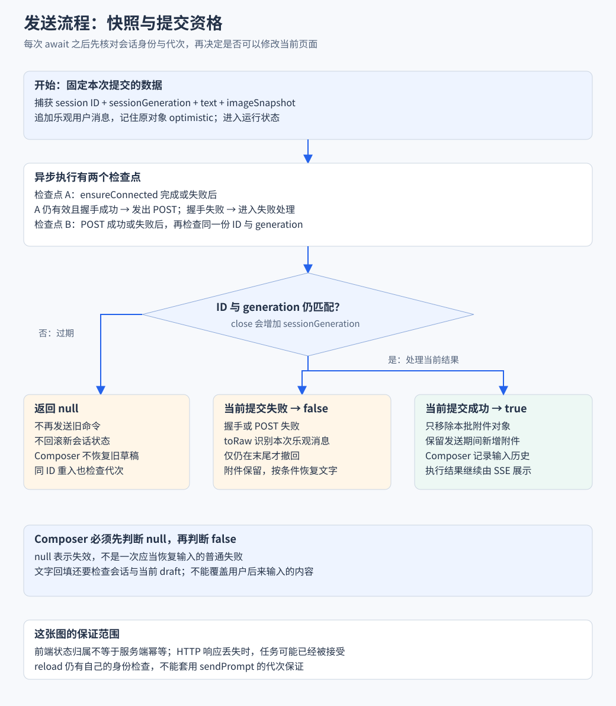

# 异步协作与恢复

> 正常链路已经清楚后，再加入慢请求、切换页面、断线与停止。本篇用时间线解释这些功能，分别标明当前防护和仍需改进的地方。

## 实现思路 给异步结果规定提交资格

### 先确定需要保证什么

发送后用户应该马上得到反馈，失败时保留输入；切换会话后，旧任务又不能撤回新会话的气泡或覆盖新草稿。与此同时，网络错误可能只是响应丢失，不能直接证明服务端没有执行。

这些要求分成两个层次：前端首先决定旧结果还能不能修改当前界面；跨网络是否重复执行，则需要服务端接受状态与幂等契约。前者做好了，不能据此宣称后者也已经解决。

### 四个设计决定

1. **发送开始时固定输入快照和会话身份。** 文字与附件属于本次提交，后续用户新增的附件属于下一次输入。发送流程保存 session ID 与 sessionGeneration，跨越 await 后再核对，避免回调追着变化后的全局状态操作。
2. **区分成功、失败与已过期。** 当前 sendPrompt 返回 true 表示提交成功，false 表示当前提交失败，null 表示该流程所属会话代次失效。Composer 遇到 null 不恢复旧草稿，这让失效路径能够明确停止影响新页面。
3. **回滚只撤本次仍占据的临时状态。** 乐观消息用 toRaw 比较原始身份；成功后只删除本次附件快照里的对象。前端不能因为一个旧提交结束，就无条件清空当前所有输入。
4. **查询与重连分别建立对账规则。** 发送已有代次守卫，但 reload 仍主要比较会话 ID；重连也没有自动补查全部终态。每一条异步入口都需要自己的提交资格，不能将发送路径的保证扩大到整个应用。

> 本章以当前源码为准：发送快照、代次与代理回滚已经落地。历史查询、自动重连和停止兜底的边界在后文分别分析。



先读上方两个异步检查点，再读下方三个结果分支。A 检查点通过且握手成功时继续 POST，只有相应操作失败或 POST 完成后才进入最终处理。

## 一 先知道页面数据从哪里来

用户看到的对话不是单个请求的返回值：

| 数据来源 | 表达什么 | 典型内容 |
| --- | --- | --- |
| 本地操作 | 用户刚刚做了什么 | 乐观用户气泡 |
| SSE | 执行中发生了什么 | 文本增量 工具进度 |
| 历史查询 | 服务端记录了什么 | 完整消息 entry ID 和统计 |
| 运行查询 | 实例此刻是什么状态 | 模型 上下文和运行信息 |

这些来源可以交错到达。页面必须回答两件事：

1. 这份数据属于哪个会话或操作？
2. 这份数据是否仍比当前页面状态新？

> 会话 ID 解决对象归属；请求代次或数据版本解决新旧关系。它们不能互相替代。

## 二 发送后立即显示 怎样在失败时恢复

### 最小乐观流程

1. 先把用户输入显示到消息列表。
2. 设置运行状态，等待 SSE 握手。
3. 提交 prompt。
4. 接受后由真实事件继续更新。
5. 明确失败时撤回临时状态，尝试恢复输入。

这样冷启动期间用户也能立即看见操作反馈。

### 当前实现怎样只撤回本次消息

当前源码先取得 Vue 代理背后的原对象，再判断末尾是否仍是本次乐观消息：

```ts
const last = messages.value[messages.value.length - 1];
if (last && toRaw(last) === optimistic) {
  messages.value.pop();
  entryIds.value.pop();
}
```

`messages` 是 Vue 深响应式数组，读取元素可能得到代理对象。`toRaw(last)` 恢复原始对象身份，让比较能够识别本次提交；比较放在 pop 前，则避免无条件删除已经被其他结果替换的末尾消息。`entryIds` 同时 pop，使消息和记录占位仍然对齐。

输入恢复还有两层归属：

- 旧文本不能覆盖用户后来新输入的文字。
- 即使新文本为空，用户也可能已经添加了新图片。

当前 Composer 在发送前复制附件数组，传给 store，store 根据这份快照构造请求。成功后只移除本次快照里的附件，不清空发送期间新增的附件。失败时原附件仍保留，文字恢复则检查会话身份与当前 draft 是否为空。

### 用返回值告诉 Composer 应该恢复还是忽略

下面节选发送流程中的关键语句，省略请求体与错误展示：

```ts
const id = sessionId.value;
const generation = sessionGeneration;
await connection.ensureConnected(id);
if (sessionId.value !== id || generation !== sessionGeneration) return null;
```

`close()` 会增加 `sessionGeneration`。因此 A→B→A 后，即使 ID 再次相同，旧发送仍因代次不符而失效；相同检查也出现在请求成功与失败之后。

1. 返回 `true`：本次提交成功，Composer 可以记录输入历史。
2. 返回 `false`：当前提交失败，Composer 可以按条件恢复文字。
3. 返回 `null`：流程已过期，Composer 直接退出，不能把旧草稿塞进新会话。

> 三种返回值描述的是本次提交对当前页面的意义。null 不能被 `!sent` 当成普通失败处理，因此 Composer 先单独判断它。

成功后的附件清理使用源码中的引用过滤：

```ts
const sentImages = imageSnapshot.map((image) => toRaw(image));
attachedImages.value = attachedImages.value.filter(
  (image) => !sentImages.includes(toRaw(image)),
);
```

这里数组快照固定的是本批附件成员，`toRaw` 用于跨代理比较对象身份。例如发送开始时有图片 A，等待期间新增 B，成功后移除 A 并保留 B。它不是附件内容的深复制协议，也没有为服务端增加请求去重。

### 不把网络错误当成明确拒绝

```text
服务端已接受任务 → HTTP 确认在网络中丢失 → 前端收到错误
```

此时恢复输入不代表服务端撤销了任务。重新发送可能重复执行文件操作。

更完整的请求 ID、接受状态查询和服务端去重是改进方向，当前没有这套保证。

## 三 切换会话 怎样挡住慢旧响应

### 1 先处理 A 切到 B

```text
t0 打开 A 并发请求
t1 打开 B 并发请求
t2 B 返回并显示
t3 A 返回
```

如果 t3 无条件覆盖状态，B 页面就显示 A 内容。

当前 reload 保存请求时的 ID，并在提交结果前比较：

```ts
const id = sessionId.value;
if (!id) return null;
const res = await fetch(`/api/sessions/${encodeURIComponent(id)}`).catch(() => null);
if (!res || !res.ok) return null;
const body = (await res.json()) as { context?: SessionContext; info?: SessionInfo };
if (sessionId.value !== id) return null;
messages.value = body.context?.messages ?? [];
entryIds.value = body.context?.entryIds ?? [];
```

这个检查能拒绝已经切到 B 后返回的 A 结果。

### 2 再加入 A 切到 B 又切回 A

```text
t0 第一次打开 A  发出 A1
t1 打开 B
t2 第二次打开 A  发出 A2
t3 A2 返回       显示新数据
t4 A1 返回       当前 ID 又是 A
```

ID 相同，但 A1 属于更早的一次打开。仅按 ID 检查会放行。

可选改进是操作代次：

1. 每次打开递增 generation。
2. 请求保存发出时的 generation。
3. 结果提交前比较当前 generation。
4. 即使 ID 相同，旧代次也拒绝。

这是对当前会话 reload 的改进方案。发送流程已经使用 sessionGeneration，但 reload 尚未使用同一代次守卫。文件预览也已采用自己的加载版本机制，见 [文件访问](09-文件访问与预览.md)。

### 3 代次也有作用范围

- 打开代次能隔离不同打开动作。
- 同次打开的两个 reload 倒序返回，还要定义查询先后。
- 查询快照早于刚到的 SSE，还要定义数据新旧关系。

因此不能给所有异步函数随意加一个计数器，就认为完成全部一致性设计。

## 四 前端已经做了哪些归属防护

| 入口 | 当前检查 | 防止什么 |
| --- | --- | --- |
| 会话详情返回 | 请求 ID 与当前 ID 比较 | A 的响应覆盖 B |
| prompt 等待与返回 | ID 与 sessionGeneration 比较 | 旧提交继续发送或回填新页面 |
| 事件连接 | 检查来源是否仍为 current | 被替换的旧连接继续写状态 |
| 路由卸载 | `closeIfCurrent` | 旧页面误关新会话 |
| 文件内容请求 | 加载版本比较 | 旧文件结果覆盖新文件 |

> 可以把“不同入口各自检查结果归属”作为前端设计讲清楚。当前这些防护并不等于所有竞态均已解决。

取消请求主要减少无用工作，结果提交检查负责决定能否修改状态，二者各有用途。

## 五 为什么结束事件要分层

一次任务可能包含多条助手消息与工具结果。前端按不同阶段处理：

| 事件 | 当前动作 |
| --- | --- |
| message_end | 保存完整消息并结束当前流式草稿 |
| agent_end | 发起历史查询 |
| agent_settled | 清理整体运行 工具 压缩和重试状态，刷新历史与运行信息 |
| prompt_done | 处理 wrapper 调用完成，未启动 Agent 时可落定界面 |

前端不能看到名称带 end 就统一关闭 loading。

当前 `agent_settled` 与 `prompt_error` 没有统一调用 stream end，所以异常终态还应检查：

- 是否残留助手草稿。
- 工具是否仍显示执行中。
- 输入区是否恢复可操作。
- 历史中是否有完整最终消息。

## 六 刷新页面和自动重连 为什么不同

### 页面刷新

1. 页面重新执行 openSession。
2. 查询历史并恢复消息列表。
3. 维护事件连接。
4. 查询运行信息，必要时接收当前快照。

### SSE 自动重连

1. 连接管理器建立新的 EventSource。
2. 接收 connected。
3. 服务端若有当前消息，补发快照。
4. 继续处理后续事件。

自动重连没有重新执行完整的页面打开过程。

两种情形：

| 情形 | 当前恢复机制 | 边界 |
| --- | --- | --- |
| 重连时仍在生成 | 当前快照加后续 delta | 依赖实例仍有快照 |
| 断线期间已结束 | 可能没有当前快照或新结束事件 | connected 不立即补查全部历史，可能缺最终消息和终态 |

> “连接重新建立”只完成通信恢复。消息和运行状态是否一致，还需要对账。

服务进程退出又是另一层：内存快照消失，已落盘记录可以读取，但继续中断任务还涉及工具副作用与执行检查点。当前不是持久任务恢复系统。

## 七 停止按钮到底停止了什么

当前顺序是：

```text
点击停止 → 等待 abort 请求返回 → 启动 3 秒兜底计时 → 必要时清理部分状态并 reload
```

需要区分：

1. **请求停止**：浏览器向服务端发 abort。
2. **执行停止**：SDK 响应中止，执行逐步结束。
3. **界面收敛**：收到终态或兜底对账，关闭运行反馈。

当前 3 秒不是从点击瞬间开始。如果 abort 请求一直挂起，定时器还没安装。

即使界面不再显示运行，也不能据此证明所有工具已终止，更不会撤销已写入文件的内容。

离开页面的 close 只清理前端订阅和会话数据，不自动提交 abort。保留的输入文字也只是内存状态，不是按会话持久化的草稿系统。

## 八 怎样验证这些时序

建议用可控 Promise 安排返回顺序，再检查最终状态：

1. A 详情晚于 B：页面应保持 B。
2. A1 晚于第二次 A2：检查当前 ID 防护的局限。
3. 断线期间任务完成：检查最终消息和运行标记。
4. abort 永不返回：检查停止兜底何时安装。
5. 原始乐观对象放入 reactive 数组：检查回滚引用条件。
6. 失败前用户新增图片：检查输入恢复的归属。

现有 chat 测试已覆盖发送失败撤回、保留附件、发送期间新增附件、切走再回到同名会话后的旧提交隔离等场景。reload 的 A→B→A、断线期间任务结束和 abort 永不返回仍需分别验证，不能将发送测试的结论套用过去。

**读完应能回答**：异步结果为什么需要归属和版本；当前防护分别覆盖什么；为什么重连和停止都需要最终状态对账。

源码与导航：

- [chat](../../app/stores/chat.ts)
- [Composer](../../app/components/ChatComposer.vue)
- [连接管理](../../shared/lib/agent-event-connection.ts)
- [会话测试](../../tests/app/stores/chat.test.ts)
- [存储与上下文](08-会话存储与上下文.md)
- [目录](../README.md)
