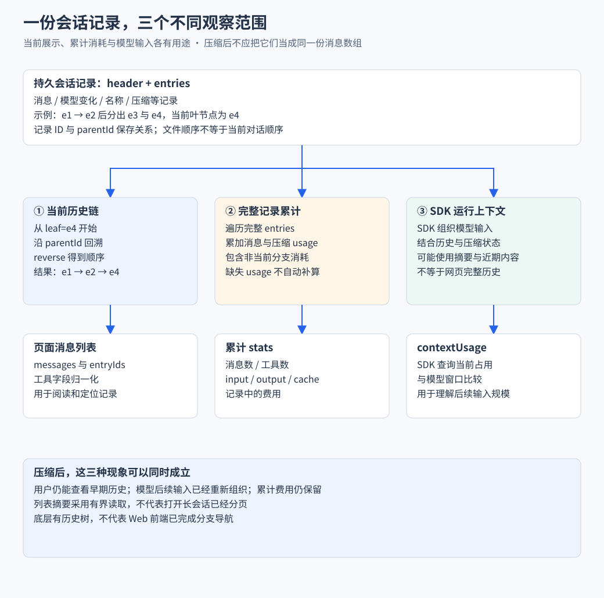

# 会话存储与上下文

对应业务流程：[历史恢复与编辑重发](业务流程与前后端协作/B04-历史恢复与编辑重发.md)。本篇解释记录结构怎样支持这些操作，以及当前历史、模型上下文和累计消耗为什么不同。

> 已经能持续对话之后，下一步是关闭网页还能看见历史，以及长会话仍能继续使用。本篇从保存消息扩展到历史链、压缩和统计。

## 实现思路 从历史记录派生不同用途的数据

### 先确定需要保留什么

关闭页面后要能恢复对话，切换历史位置后要能知道沿哪条路径继续，压缩后还要保留已经发生的用量。仅保存当前屏幕上的消息数组，无法同时表达配置变化、分支关系和压缩记录。

### 四个设计决定

1. **用记录表达会话演进，而不是只存气泡。** 消息、模型切换、改名和压缩都可以影响后续解释。SessionManager 管理这些记录，页面读取时再选择哪些内容需要显示。
2. **沿父链得到当前历史。** parentId 与当前叶节点共同决定正在继续哪条路径。先建立 ID 索引，再回溯和反转，能够保留正确上下文顺序，而不把另一条分支的追问混进来。
3. **让展示消息与记录身份一起返回。** messages 与 entryIds 平行生成，既能显示正文，也能知道对应的持久记录。实时事件先展示，详情查询再补齐身份，前端不自行编造服务端记录 ID。
4. **按用途选择统计范围。** 当前链用于对话展示，完整 entries 用于累计消耗，SDK 上下文查询用于窗口占用。压缩后窗口可以变小，已经花费的 token 不会因页面换了展示范围而消失。

下面重点看同一份记录怎样得到历史链、消息列表和统计，而不把这些输出都叫作“上下文”。



三列来自不同处理范围。当前分支决定显示哪些消息，完整记录用于累计，SDK 决定后续模型输入；页面统计不能将三者混算。

## 一 三种消息集合 为什么不能混在一起

先看用户的三个问题：

- “之前聊了什么”：需要页面历史。
- “服务端保存了什么”：需要会话记录。
- “模型这次知道什么”：需要本次模型上下文。

| 集合 | 主要用途 | 内容范围 |
| --- | --- | --- |
| 网页消息列表 | 给用户阅读 | 当前历史链上的消息与实时状态 |
| 磁盘会话记录 | 持久保存 | 消息 配置 名称 压缩等记录 |
| 模型上下文 | 支撑下一次生成 | SDK 按当前历史与压缩状态组织的输入 |

> 页面能看到旧消息，不代表模型本次请求接收了全部旧消息。记录中也不只有聊天气泡。

## 二 从保存消息数组 到 JSONL 记录

最小实现可以把消息数组写成 JSON。但会话运行中还会发生模型切换、改名和压缩，需要记录这些变化。

SDK 使用会话记录体系，本项目主要负责读取并转成页面数据。JSONL 的含义是每一行都是独立 JSON 对象。

简化示例：

```text
session header  会话 ID 执行目录和创建信息
entry e1        用户消息
entry e2        助手回答          parentId=e1
entry e3        模型配置变化      parentId=e2
entry e4        下一条用户消息    parentId=e3
```

- header 确定会话身份与执行目录。
- message entry 保存可以展示的内容。
- 配置与压缩记录参与后续状态推导。
- entry ID 表达记录身份，不能用数组下标代替。

前端的每个字符 delta 不会被本项目单独写成一条持久记录。SDK 管理会话记录，浏览器管理即时展示状态。

JSONL 格式本身不提供事务、并发写或断电恢复保证，具体保证取决于 SDK 实现。

## 三 为什么历史会成为一棵树

假设在同一回答后，分别继续两个方向：

```text
e1 用户任务
  └─ e2 助手回答
       ├─ e3 追问 A
       └─ e4 追问 B  ← 当前叶节点
```

当前阅读 B 时，应该显示 `e1 → e2 → e4`。按文件物理顺序展示全部记录，会把 A 也误当作 B 的上下文。

当前读取过程：

1. 用 entry ID 建立索引。
2. 找到当前叶节点。
3. 沿 `parentId` 向上回溯。
4. 反转顺序，得到根到叶的历史链。
5. 从链中提取消息与对应 entry ID。

源码核心节选，`byId` 已建立：

```ts
const leaf = leafId ? byId.get(leafId) : entries[entries.length - 1];
if (!leaf) return [];
const chain: SessionEntry[] = [];
let current: SessionEntry | undefined = leaf;
while (current && chain.length < tail) {
  chain.push(current);
  current = current.parentId ? byId.get(current.parentId) : undefined;
}
chain.reverse();
return chain;
```

- Map 避免每找一个父节点就扫描全部记录。
- 迭代回溯避免深历史造成递归调用栈增长。
- 这段逻辑仍依赖合理的记录关系，不是任意损坏数据的修复器。

> 当前 Web 已接入分支切换和编辑重发，并有独立的指定叶节点上下文预览接口。预览只读，导航才改变当前位置；完整流程见 [历史恢复与编辑重发](业务流程与前后端协作/B04-历史恢复与编辑重发.md)。

## 四 历史怎样恢复成前端列表

`buildSessionContext` 组织两组平行数据：

- `messages[i]`：第 i 条展示消息。
- `entryIds[i]`：对应的持久记录 ID。

恢复过程：

1. 详情接口优先取得存活 wrapper 的 SessionManager。
2. 没有存活实例时，再打开会话文件。
3. 根据当前叶节点提取历史链。
4. 归一化工具字段，生成消息与 ID 列表。
5. chat store 更新页面消息和统计。

实时消息可能先显示，再由历史查询补齐记录 ID。这解释了为什么 SSE 和历史查询需要互补。

### 从树到数组 代码中的每一步保护了什么

前面的回溯代码有三个值得理解的选择：

1. **先选择 leaf，再进入循环。** 当前叶节点决定这次展示的分支；没有有效叶节点就返回空链，而不是把全部文件记录误当作一个线性对话。
2. **每次沿 parentId 找一个父节点。** 循环访问的是当前路径上的祖先，旁支记录即使在文件里也不进入这次结果。`chain.length < tail` 约束本次回溯长度，不代表 HTTP 已提供完整分页功能。
3. **回溯结束再 reverse。** 向父节点走得到的是“最近到最早”，页面阅读需要“最早到最近”。反转只改变这条链的排列，不改变持久记录的身份关系。

如果当前叶节点为 e4，byId 中即使保存 e3，也不会因为 e3 出现在文件前面就访问它。决定下一步的是 e4.parentId，而不是数组里的前一项。

前端使用历史配置初始化模型显示，但存活实例的运行查询还会提供当前状态；两份数据不应被当作永远一致。

## 五 列表与详情 为什么使用不同读取策略

侧栏只需要标题、时间与首条输入，打开会话才需要完整当前历史。

| 场景 | 读取方式 | 目的 |
| --- | --- | --- |
| 列表 | 有界读取头部与尾部，缓存 30 秒 | 避免为每个摘要重建全部历史 |
| 详情 | 从 SessionManager 取得当前记录链 | 恢复完整展示和记录身份 |

列表首条文本预览截到 80 字符。名称可能追加在尾部，只读第一行会遗漏后来的改名。

定位文件也经过校验：

1. 检查会话 ID 格式。
2. 按文件名后缀寻找候选。
3. 读取 header 再核对 ID。

> 列表采用有界读取，不代表长会话详情已经分页。当前详情没有消息分页或延迟图片加载。

## 六 上下文压缩 怎样接入页面

随着多轮任务增加，文本、工具结果与指令逐渐占用模型窗口。

压缩过程可以理解为：

1. 用户手动发起，或 SDK 根据自身机制触发。
2. SDK 重新组织后续使用的上下文。
3. 压缩事件通知前端开始与结束。
4. 页面展示状态，并刷新上下文与统计。

本项目通过 `compact` 调用 SDK，没有自行实现摘要算法。

压缩后的两个现象可以同时成立：

- 网页仍显示较早的对话记录。
- 模型后续输入使用摘要等压缩组织。

因为压缩不等于删除历史文件，应用的 `buildSessionContext` 也不是对模型实际请求上下文的完整复刻。

## 七 前端统计 为什么要分累计消耗和窗口占用

假设会话已经进行了很多轮，随后压缩了上下文：

- **累计消耗**：之前已经发生的模型调用成本不会倒退。
- **当前窗口占用**：下一次请求需要携带的上下文可能减少。

当前统计来源：

| 展示数据 | 计算来源 | 含义 |
| --- | --- | --- |
| stats | 完整 entries | 历史累计消息 用量与费用 |
| contextUsage | SDK `getContextUsage()` | 当前上下文与模型窗口的关系 |

累计遍历的源码节选：

```ts
for (const entry of entries) {
  if (entry.type === "compaction") {
    addUsage(stats, entry.usage);
    continue;
  }
  if (entry.type !== "message") continue;
  addMessage(stats, entry.message);
}
```

因此：

1. 未激活分支也可能贡献累计消耗。
2. 压缩自身的 usage 参与累计，但不增加普通消息条数。
3. 当前总 token 汇总 input、output、cacheRead、cacheWrite。
4. 费用采用记录中的 cost，缺失数据不会自动补算。

`continue` 在这里尤其重要：压缩记录先单独累加 usage，随后跳过普通消息计数。普通 message 则进入 `addMessage`，再按 role 增加用户、助手或工具结果计数。一次压缩消耗了模型用量，却不因此凭空多出一条用户气泡。

这使统计规则直接对应业务含义。若把所有 entry 都按一条消息计数，改名和配置变化也会被算进聊天数量；若只沿当前展示链统计，则可能漏掉已经产生费用的其他分支。

**可展开的前端设计点**：用不同数据来源解释不同指标，避免“压缩后为什么花费没变”的界面误导。这是指标语义建模，不是独立计费系统。

## 八 检查理解与源码入口

读完应能回答：

- 为什么不能把会话文件每行 message 直接拼成当前历史？
- 为什么消息列表要配对应 entry ID？
- 为什么新建空会话可能没有文件却仍能读详情？
- 为什么压缩后仍能看到旧消息，累计费用也不会减少？

源码与导航：

- [历史读取](../../server/utils/session-reader.ts)
- [详情接口](../../server/api/sessions/[id].get.ts)
- [统计函数](../../shared/lib/session-stats.ts)
- [历史测试](../../tests/server/utils/session-reader.test.ts)
- [统计测试](../../tests/shared/lib/session-stats.test.ts)
- [目录](../README.md)
