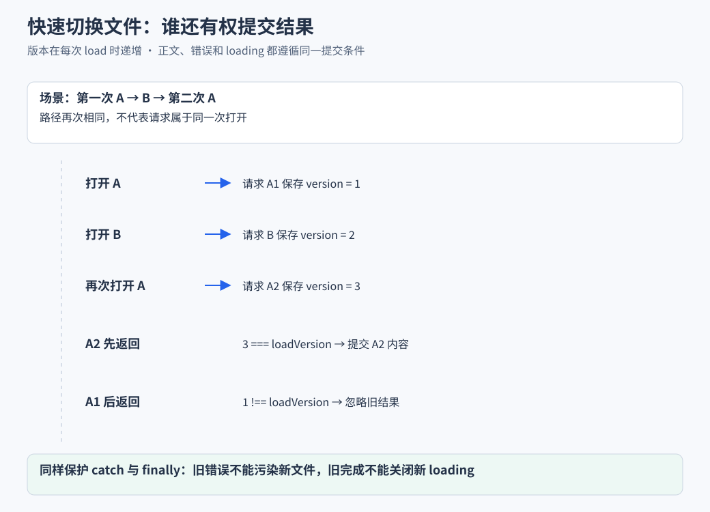

# 文件访问与预览

对应业务流程：[文件浏览与执行目录](业务流程与前后端协作/B05-文件浏览与执行目录.md)。本篇继续展开路径解析、标签加载、渲染和访问校验；每一段实现都对应业务篇里的一种用户操作。

> 主链路让 Agent 读取文件并回答。本篇继续实现“用户自己在网页里打开文件”，从单文件预览扩展到多标签、异步隔离和 Markdown 交互。

## 实现思路 让选择 文件内容和阅读状态保持一致

### 先确定需要保证什么

点击文件后，页面应显示这个文件的内容；快速切换时旧请求不能覆盖新标签；Markdown 中的相对链接应基于当前文件解析；服务端还必须检查请求路径是否在允许范围内。这些要求跨越标签、网络、渲染和文件系统四层。

### 四个设计决定

1. **用路径确定标签，用加载版本确定请求。** tabs 与 activePath 负责阅读位置，每次 load 递增加载版本。两次打开同一路径仍是两次操作，所以异步提交检查版本，而不只比较路径字符串。
2. **把正文、错误和 loading 作为一次加载的共同结果。** 成功返回前、catch 和 finally 都检查版本。否则旧请求虽然没有覆盖正文，仍可能给新文件显示旧错误或提前关闭加载提示。
3. **渲染时传递文件上下文，交互时统一委托。** Markdown 的相对链接需要当前文件路径；v-html 生成的元素则通过容器点击处理接回应用。这样不必让每个动态节点自己管理监听，消息与文件预览也能共享交互规则。
4. **路径表达和真实目标分别校验。** 词法规范化处理目录边界与路径写法，realpath 处理符号链接的实际指向。两层都通过后才读取，前端是否识别为本地链接不代替服务端授权检查。

> 多标签只是界面形态，实现重点是每份状态的身份与提交条件。下文会把 load 的成功、失败与清理三个分支放在一起解释。

## 一 先做一个最小文件预览

最小功能只需要：

1. 用户选择文件路径。
2. 浏览器请求文件 API。
3. Node 读取并返回内容。
4. 页面显示文本。

浏览器不能直接读取任意本机文件路径，因此读取动作在 Node 侧完成。Inspector 当前是预览器，实际修改项目文件由 Agent 工具完成。

## 二 从点击路径到显示内容

当前完整链路：

```text
文件树点击或消息中的本地链接
  → viewer.open(path)
  → 添加标签并更新 activePath
  → FileViewer 观察活动路径
  → 编码路径并请求文件 API
  → 服务端检查访问范围
  → 读取内容
  → 按类型展示
```

路径同时承担两个角色：

- 在前端作为标签身份。
- 在请求中作为访问参数。

Windows 盘符、正反斜杠和特殊字符需要经过共享路径工具转换，不能把任意绝对路径直接拼成普通 URL 片段。

文件 API 用 `type=list` 与 `type=read` 区分目录和内容：

| 内容 | 响应与展示 |
| --- | --- |
| 文本 | 返回 content language size 和 truncated 等字段 |
| Markdown | 文本响应，前端可切换源码与预览 |
| 图片 | 二进制响应，img 使用文件 API URL |
| 不支持的二进制 | 返回错误，页面显示不可预览状态 |

## 三 加入多标签后 状态怎样拆分

只用一个 `currentFile` 能打开文件，但不能记住多个标签。项目扩展出：

- **`tabs`**：已打开的路径集合。
- **`activePath`**：当前展示哪个文件。
- **`viewModes`**：各路径使用 Markdown 源码还是预览模式。
- **`state.text`**：当前请求返回的文本响应对象。

打开动作的源码：

```ts
function open(path: string) {
  if (!tabs.value.includes(path)) tabs.value.push(path);
  activePath.value = path;
  everOpened.value = true;
}
```

1. 相同路径不重复加标签。
2. 再次打开已有路径，激活它。
3. 关闭当前标签时，选相邻标签。
4. 首次打开后保留外壳挂载条件，便于保留部分组件内状态。

> 标签状态在 store，预览模式在组件。刷新页面仍会重建内存数据，当前没有持久文件标签恢复保证。

## 四 前端实现亮点 用加载版本拒绝旧结果

### 1 快速切换时会发生什么

```text
t0 点击 A  请求 A 较慢
t1 点击 B  请求 B 较快
t2 B 返回  页面展示 B
t3 A 返回  如果无检查就覆盖 B
```

只检查路径也有局限：`A→B→A` 时，第一次 A 与第二次 A 路径相同，但属于不同操作。



图中 A1 和 A2 路径相同，版本不同。第二次 A 完成后，第一次 A 即使返回成功，也没有权利覆盖当前内容。

### 2 每次加载分配一个版本

下面是根据当前实现压缩的教学示例，`fileUrl` 表示路径编码后的接口地址：

```ts
let loadVersion = 0;

async function load(path: string) {
  const version = ++loadVersion;
  state.loading = true;
  state.error = "";
  state.text = null;
  try {
    const response = await fetch(fileUrl(path));
    const body = await response.json();
    if (version !== loadVersion) return;
    if (!response.ok || body.error) throw new Error(body.error ?? `HTTP ${response.status}`);
    state.text = body.kind === "text" ? body : null;
  } catch (error) {
    if (version === loadVersion) state.error = String(error);
  } finally {
    if (version === loadVersion) state.loading = false;
  }
}
```

当前正式实现还处理图片分支、响应解析失败与不可预览类型。

逐段看这段 load：

1. `++loadVersion` 在请求前执行，因此新操作一开始就使旧操作失效。
2. 保存局部 version，跨越 await 后仍能知道结果属于哪次请求。
3. 新请求立即清理旧正文与错误，让界面进入本次加载，而不是在 B 标签下继续显示 A 内容。
4. 响应体解析也属于异步工作，版本检查放在解析之后、状态提交之前。
5. `body.kind` 决定是否能按文本展示，避免把错误对象或其他响应当作字符串交给高亮器。

当前图片使用 img 的 API URL 加载，不通过这段 JSON 文本处理。版本规则在同一 load 入口递增，但不能由此声称图片网络错误已有与文本完全相同的反馈流程。

版本的含义是“这是不是最近一次加载”，因此即使路径又变回 A，第一次 A 的版本也已经过期。

### 3 为什么 catch 和 finally 也要检查

- 旧请求失败，不应让新文件显示旧错误。
- 旧请求结束，不应把新文件尚未完成的 loading 关掉。
- 正文、错误和加载状态都属于本次操作，需要一起保护。

> 这项亮点是对整次异步状态提交做版本隔离。它适用于当前文本加载，不代表文件树和全应用已统一具备相同保障。

## 五 读取成功后 怎样选择渲染方式

### 文本与代码

1. 服务端返回内容和语言等信息。
2. 前端按语言高亮。
3. 根据换行计算行号。
4. 若响应带截断标记，显示说明。

### Markdown

1. 尝试提取简单 frontmatter 元数据。
2. 正文进入 Markdown 渲染器。
3. 渲染时传入当前文件路径。
4. 相对图片与文件链接据此解析。

如果缺少文件路径，`./guide.md` 容易被解释成相对网页地址，而不是相对当前文档。

### 图片

使用文件 API URL 加载。SVG 响应另设内容安全策略；普通 Markdown 关闭原始 HTML，链接也经过对应处理。

## 六 前端实现亮点 让动态 Markdown 仍可交互

Markdown 由 `v-html` 生成，里面的复制按钮和文件链接不是 Vue 逐个编译的组件。

项目使用容器点击委托：

1. 在正文容器注册一个点击处理函数。
2. 从点击目标向上查找代码复制按钮或本地文件链接。
3. 复制时读取对应代码块文本。
4. 本地链接满足应用内打开条件时，阻止默认跳转并调用 `viewer.open(path)`。

这样消息正文和文件预览可以复用同一交互处理，不需要每次生成 HTML 后重新给每个节点绑定事件。

源码中的本地文件链接处理如下：

```ts
const anchor = target.closest<HTMLAnchorElement>("a[data-md-file]");
const filePath = anchor?.dataset.mdFile;
if (anchor && filePath && shouldOpenLocalFileInApp(event)) {
  event.preventDefault();
  handlers.onOpenFile(filePath);
}
```

点击目标可能是链接里的文字容器或图标，`closest` 沿父元素找到真正的 anchor。`data-md-file` 提供渲染阶段识别出的路径；满足应用内打开条件后才 preventDefault，避免把所有普通链接行为都截断。最后由调用方的 `onOpenFile` 决定打开位置，交互函数不直接依赖特定 store。

边界也要分清：

- 识别为本地链接，不代表服务端一定允许读取。
- 读取成功，不代表文件类型一定支持预览。
- 复制失败当前静默处理，不能宣称所有失败都有完整反馈。

## 七 前端传来路径 服务端怎样限制访问

### 第一层 检查路径是否属于允许目录

允许根来自会话 cwd、项目根、worktree 和显式选择等信息。

简单 `startsWith` 不够：允许 `D:/work/app` 时，`D:/work/app-secret` 也有相同前缀，但不是子目录。

因此要：

1. 规范化路径与 `..`。
2. 按平台处理大小写与分隔符。
3. 以完整目录边界比较。

### 第二层 检查符号链接的实际目标

路径文字可能在允许根内，却通过链接指向根外。

1. 调用 realpath 解析真实目标。
2. 解析允许根的真实路径。
3. 再对真实路径执行包含检查。

> 这里约束的是文件预览 API。允许根可能包含多个会话目录，Agent 工具执行也不统一由此限制，所以不是每项目执行沙箱。

## 八 文件树 搜索索引和大小限制

### 文件树与搜索索引

- 文件树按需读取展开目录。
- 搜索需要覆盖未展开目录，使用独立索引。
- Git 仓库优先执行 `git ls-files`，当前主要列出已跟踪文件。
- Git 查询不可用时，回退到有深度和数量上限的目录遍历。

当前索引缓存 10 秒，空查询最多返回 5000 个文件，带查询最多返回 100 个结果。新建未跟踪文件可能不在 Git 索引结果中。

### 预览大小

- 文本显示上限为 256 KiB。
- 图片超过 10 MiB 返回错误。
- 当前文本先完整读入 Buffer，再截断显示。

因此限制展示长度不等于限制底层读取内存。文件树支持手动刷新，当前也没有完整 watcher 保证预览随磁盘实时变化。

## 九 怎样验证这项功能

建议按用户动作验证：

1. 从文件树打开 Markdown，再从文内相对链接打开第二个文件。
2. 快速执行 `A→B→A`，安排旧请求最后返回。
3. 让旧请求失败，检查新标签错误和 loading 是否仍正确。
4. 切换源码与预览，再切回标签检查模式。
5. 测试根目录前缀碰撞与符号链接指向根外。
6. 打开大文本，区分展示截断与实际读取开销。

**读完应能回答**：路径怎样跨网络；多标签的状态归属；版本检查为何覆盖 finally；动态 Markdown 怎样复用交互。

源码与导航：

- [FileViewer](../../app/components/FileViewer.vue)
- [标签 store](../../app/stores/file-viewer.ts)
- [Markdown 交互](../../app/utils/markdown-interaction.ts)
- [文件 API](../../server/api/files/[...path].get.ts)
- [索引](../../server/api/file-index.get.ts)
- [允许根](../../server/utils/file-access.ts)
- [路径校验](../../server/utils/path-security.ts)
- [目录](../README.md)
