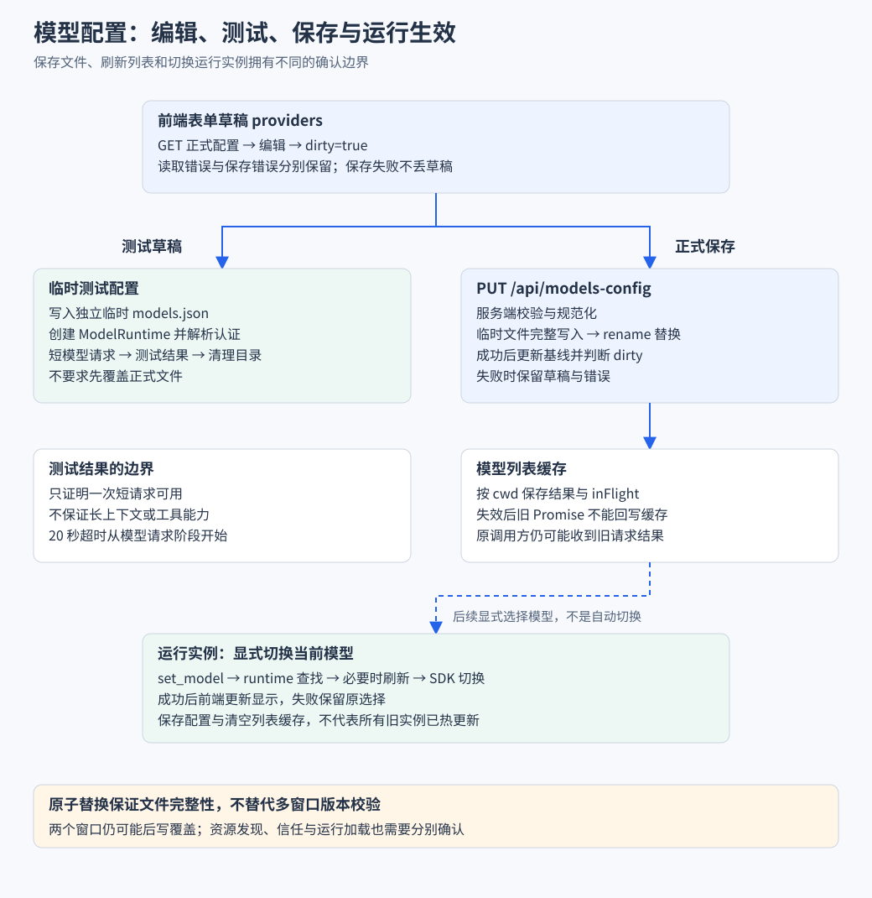
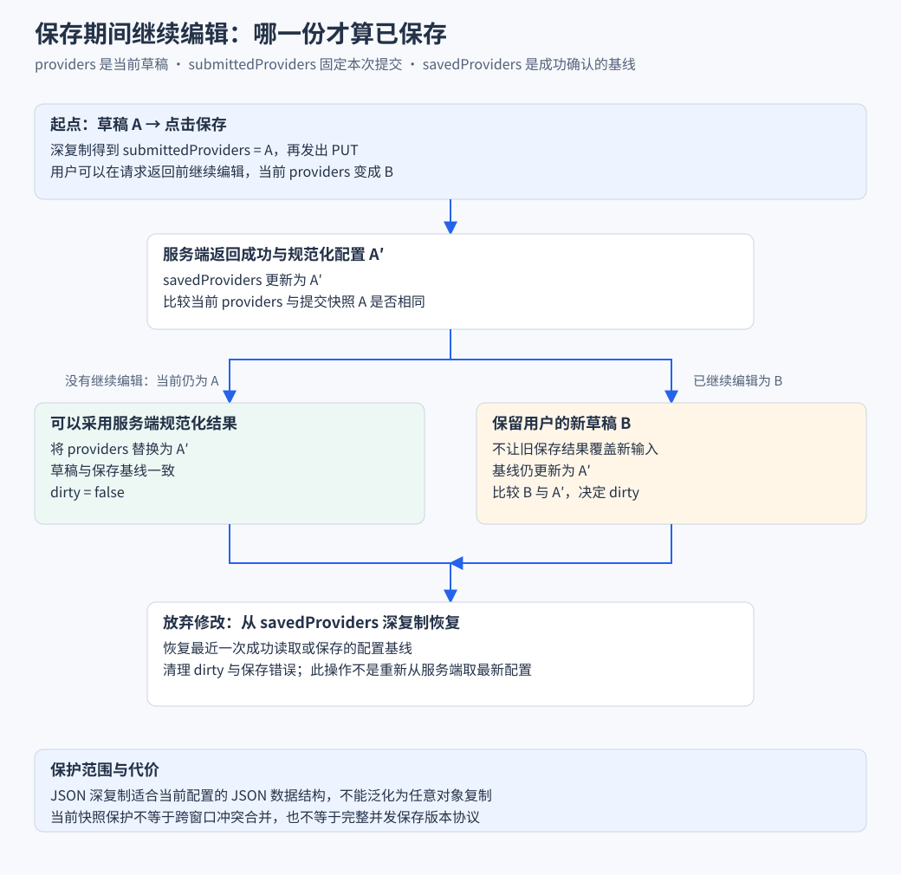
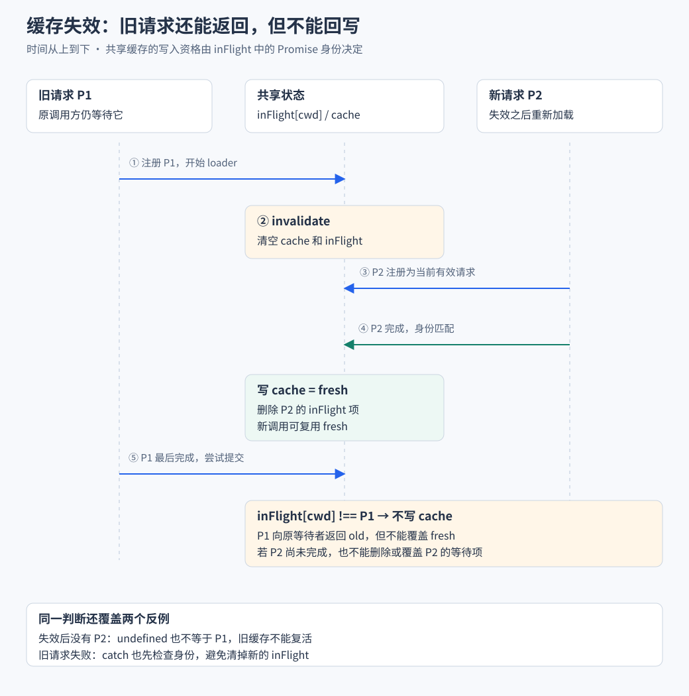

# 模型配置与能力中心

对应业务流程：[配置与能力的生效流程](业务流程与前后端协作/B06-模型配置与能力加载.md)。本篇深入提交快照、文件替换、缓存和资源加载，解释每个成功响应究竟确认了哪一层。

> 核心链路能运行后，用户会希望更换模型、安装技能并调整偏好。本篇从切换当前模型开始，逐步解释表单草稿、持久配置、测试和资源生效。

## 实现思路 将编辑 保存和运行生效分成三个阶段

### 先确定需要保证什么

用户应该能把表单填完整、先试连通性、失败后继续修改，并且知道当前会话是否真的使用了新模型。直接把每次输入写入正式配置，容易让半成品配置影响已有功能；只显示“保存成功”，又无法解释运行实例是否已经刷新。

### 四个设计决定

1. **表单先形成独立草稿，并保存提交快照。** providers 表示当前编辑，submittedProviders 固定本次提交，savedProviders 保存成功确认的基线。返回后比较三者，才能在用户继续编辑时保留新输入，并正确判断 dirty。
2. **测试使用临时配置，正式保存经过校验与原子替换。** 临时目录让一次连通性测试不必改动正式文件。保存时先写完整临时文件再 rename，缩小读到半截 JSON 的风险；这不等于解决两个窗口同时编辑的冲突。
3. **列表缓存按有效请求回写。** 同目录请求复用 inFlight Promise，失效后旧 Promise 可以向原调用方返回，却必须先核对身份才能写共享缓存。这样配置刷新后的列表不会被旧加载结果悄悄覆盖。
4. **当前模型切换与资源配置分别执行。** set_model 作用于已有实例，models.json 作用于模型定义，技能和插件修改影响资源。界面要沿各自链路确认生效，不能把文件写入成功当作所有旧会话已热更新。

下面会分别追踪草稿怎样保存、测试怎样隔离、缓存怎样拒绝旧结果，以及运行实例怎样确认模型切换。



左侧测试不覆盖正式配置，右侧保存后还需要区分列表刷新与运行实例切换。图中从列表到运行层表示后续操作关系，不表示保存后自动切换模型。

## 一 先区分三个看起来相似的操作

用户说“换一个模型”，可能指三件事：

| 操作 | 改什么 | 作用位置 |
| --- | --- | --- |
| 切换当前会话模型 | 当前实例的模型选择 | 已有 AgentSession |
| 设置默认模型 | 后续使用的默认选择 | SDK SettingsManager |
| 新增提供商或模型配置 | 模型定义 接口与相关参数 | Pi 的 models.json |

它们都与模型有关，但不是同一次保存。

> 保存 models.json，不等于正在运行的会话已经切换到这个模型。

能力中心负责组织操作入口，各类业务数据仍由自己的 store 和服务端模块管理。

## 二 最小功能 切换当前会话模型

沿一次点击走完整流程：

1. 用户从模型选择器选中目标。
2. chat store 向当前会话发送 `set_model`。
3. wrapper 在 runtime 中查找模型。
4. 没找到时进行一次本地刷新，再查找。
5. 找到后调用 SDK 切换。
6. 成功后前端更新模型显示，失败则保留原选择并报告错误。

这个顺序让页面展示跟随真实切换结果，避免“选项已变，Agent 仍用旧模型”。

新增模型配置则需要另一条表单与持久化链路。

## 三 从直接改配置 扩展为可编辑草稿

如果表单每改一个字就写文件，用户尚未填完的状态可能立即影响运行。因此前端先维护草稿，用户确认后再保存。

模型配置 store 保存：

- **providers**：正在编辑的提供商与模型草稿。
- **submittedProviders**：每次保存时深复制的提交快照。
- **savedProviders**：最近一次成功读取或保存的配置基线。
- **dirty**：是否有未保存修改。
- **loading / loadError**：读取状态与错误。
- **saving / saveError**：保存状态与错误。

一次编辑流程：

```text
打开面板 → GET 正式配置 → 填入草稿
  → 用户修改 → 标记 dirty
  → 点击保存 → PUT 草稿 → 服务端校验与写入
  → 成功后更新保存基线，再比较当前草稿决定 dirty
```

放弃修改调用 discard，从 savedProviders 深复制恢复最近成功基线，不额外请求服务端。保存失败时返回 false，保留草稿供用户修正和重试。

源码中的保存请求：

```ts
const res = await fetch("/api/models-config", {
  method: "PUT",
  headers: { "content-type": "application/json" },
  body: JSON.stringify({ providers: submittedProviders } satisfies ModelsConfigFile),
});
```

`satisfies` 是编译期结构检查，真正收到请求后，服务端仍需要运行时校验。

保存结果的处理也有明确边界：

- store 先设置 saving，在 finally 中恢复，成功与失败都会解除本次忙碌标记。
- 响应失败只写 saveError 并返回 false，不清空 providers。
- 响应成功清 saveError，更新 savedProviders，并重新判断当前草稿是否还有未保存修改。

“按钮正在保存”和“草稿是否有修改”不能合并成一个布尔值。保存失败后应是 saving=false、dirty 仍为 true，用户才能继续修正，而不是被误导为修改已经落盘。

### 保存返回时 怎样保留请求期间的新编辑

当前源码在响应成功后计算：

```ts
const unchanged = JSON.stringify(providers.value) === JSON.stringify(submittedProviders);
savedProviders = body.config?.providers ?? submittedProviders;
if (unchanged) {
  providers.value = JSON.parse(JSON.stringify(savedProviders)) as Record<
    string,
    CustomProviderConfig
  >;
}
dirty.value = JSON.stringify(providers.value) !== JSON.stringify(savedProviders);
```

这段代码把“本次保存成功”和“当前编辑已全部保存”分开：

1. 提交时复制草稿 A，避免把之后变动的 providers 当成本次请求内容。
2. 返回时若 providers 仍等于 A，说明用户没有继续编辑，可以采用服务端规范化后的配置。
3. 若用户已改成 B，则保留 B，只更新成功基线。
4. 最后比较当前草稿和基线，决定 dirty，而不是无条件清空它。

服务端响应可能把空条目过滤或费用字段规范化，因此采用 `body.config` 比仅把原提交视为正式配置更准确。这套 JSON 比较与复制适用于当前可 JSON 表示的配置，不应直接用于函数、循环对象等任意 JavaScript 数据。



左右分支取决于保存期间有没有继续编辑。服务端返回的成功只确认本次提交，不能把后来输入也自动标成已保存。

## 四 服务端怎样把草稿变成正式配置

1. 检查请求主体结构。
2. 过滤空模型 ID 等无效条目。
3. 规范化费用字段等配置。
4. 在同一目录写入随机命名的临时文件。
5. 用 rename 替换正式文件。
6. 失败时尝试清理临时文件。

这让读取方更不容易看到只写了一半的 JSON。

关键文件操作节选自 `writePrivateFileAtomicSync`，tempPath 是同目录下的随机临时路径：

```ts
writeFileSync(tempPath, contents, {
  encoding: "utf8",
  flag: "wx",
  mode: 0o600,
  flush: true,
});
renameSync(tempPath, path);
```

按执行顺序解释：

1. `wx` 要求新建临时文件，避免意外覆盖同名临时内容。
2. `mode` 请求限制文件权限，实际权限语义仍由操作系统决定。
3. `flush` 请求将写入刷新后，再进入替换步骤。
4. rename 成功后，正式路径才指向完整新内容。
5. finally 尝试删除剩余临时文件，处理失败残留。

写入失败时不继续替换正式文件；替换成功后临时路径已经不存在，清理遇到 ENOENT 属于正常情况。这个顺序解释了为什么需要临时文件，而不是直接 writeFile 到正式路径。

但要区分两个问题：

| 机制 | 解决什么 | 没解决什么 |
| --- | --- | --- |
| 原子替换 | 文件整体写入是否完整 | 两个窗口谁的数据更新 |
| 版本校验或冲突处理 | 旧草稿是否覆盖新配置 | 需要另行设计 |

当前整体保存仍采用后写覆盖，没有多窗口冲突合并。

配置读取返回原始 models 数据，其中若有明文 API key，表单可能收到。主题偏好不存模型凭据，不能据此推导凭据绝不进入浏览器。

## 五 前端实现亮点 测试草稿与正式保存分开

用户常常需要先判断模型配置能否连接，再决定是否保存。如果测试必须覆盖正式配置，会影响原来可用的设置。

当前测试链路：

1. 前端提交调用方提供的提供商和模型草稿。
2. 服务端建立临时目录与独立 models.json。
3. 用临时配置创建 ModelRuntime。
4. 发起一小段模型回复测试。
5. 返回结果和相关信息。
6. 清理临时目录。

> 编辑、测试和保存是三个阶段。测试草稿无需先替换正式文件。

可以展开的前端价值：

- dirty 明确告诉用户存在未保存修改。
- 保存失败保留输入，避免重新填写。
- 草稿测试让用户在正式提交前验证连接。
- 读取错误与保存错误分开，反馈对应具体动作。

边界：

- 测试成功只证明一次短请求可用，不保证工具调用、长上下文和全部参数兼容。
- 20 秒超时从模型请求阶段开始，不覆盖此前全部配置与认证准备。
- 当前保存快照已保护请求期间的新编辑，但不等于已完成多窗口冲突或所有并发保存保护。

## 六 保存后 为什么列表与运行实例不一定立即一致

涉及三个不同对象：

1. 磁盘中的正式配置。
2. 用于模型选择器的列表缓存。
3. 已有 AgentSession 的运行依赖。

模型列表按 cwd 缓存，TTL 为 60 秒，同目录进行中的加载复用 Promise。

```text
配置保存
  → 正式文件变化
  → 相关列表后续刷新
  → 运行实例是否重载 由具体接入流程决定
```

清空列表缓存不等于重建全部运行会话。当前实现已经检查 Promise 身份，失效前启动的 loader 可以向原调用方返回，但不能回填共享缓存。



图用 P2 先完成、P1 后完成展示最容易覆盖新缓存的顺序。图底再补充没有新请求和旧请求失败的分支，三种情况使用同一个身份规则。

### 代码怎样判断加载结果是否仍然有效

下面节选 `loadModelsWithCache`，省略容量淘汰与 catch 分支：

```ts
const promise = loader().then((data) => {
  if (inFlight.get(cwd) !== promise) return data;
  inFlight.delete(cwd);
  cache.set(cwd, { data, expiresAt: Date.now() + MODELS_CACHE_TTL_MS });
  return data;
});
inFlight.set(cwd, promise);
return promise;
```

可以用两个请求解释这段自引用检查：

1. 旧请求 P1 注册到 `inFlight[cwd]`，此时有缓存写入资格。
2. 配置修改清空缓存与 inFlight，P1 失去资格，但底层工作可能还在执行。
3. 新请求 P2 注册到同一 cwd，成为当前有效请求。
4. P1 完成时发现表里不是自己，只返回 data，不删 P2，也不写 cache。
5. P2 完成且身份仍匹配时，才删除自己的 inFlight 项并更新缓存。

catch 分支也先检查身份再删除，避免旧失败清掉新的等待对象。失效后即使没有 P2，表中 undefined 也不等于 P1，所以旧结果仍不能复活缓存。

> 这是对共享缓存写入资格的保护。已经等待 P1 的原调用方仍可能收到旧数据，需要按自己的界面生命周期决定是否采用。

## 七 从模型扩展到技能 扩展与插件

先区分资源作用：

| 资源 | 主要作用 | 当前接入方式 |
| --- | --- | --- |
| Skill | 提供任务方法与指令 | 按 cwd 通过 SDK ResourceLoader 读取 |
| Extension | 用代码注册能力或参与事件 | 静态扫描列表，并管理信任信息 |
| 插件包 | 分发技能 模板和代码等资源 | 通过 SDK 包管理器执行操作 |
| 快捷提示词 | 组织常用输入 | 应用 settings 保存到 localStorage |

### 技能列表与许可

- 按项目目录发现技能资源。
- 修改模型调用许可时，会改技能文件的 `disable-model-invocation` 字段。
- 这不是只改页面开关，也不自动证明所有旧会话已加载新值。

### 扩展发现与信任

1. 静态扫描资源位置与信息。
2. 页面展示名称、位置与信任状态。
3. 用户信任操作写入 Pi 信任记录。
4. 具体运行实例再按其生命周期加载可用资源。

为展示列表进行静态扫描，不需要执行扩展代码。

### 插件操作

- 操作进入 `runPluginAction`，调用 SDK 包管理器。
- 项目作用域修改要求相应信任。
- 全量更新涉及未信任项目包时会拒绝。
- 安装与更新可能执行第三方代码，不能当作纯表单赋值。
- 相对包来源按全局 agent 目录或项目 `.pi` 目录恢复，避免在错误 cwd 下解释路径。

> 发现资源、允许加载与当前会话已经使用资源，是三个不同状态。

## 八 能力中心怎样组织这些面板

顶层包括通用设置、快捷提示词、模型、Skills、Extensions 和 MCP。

- PluginsPanel 嵌在 Extensions 下方，不是独立顶层标签。
- 能力中心 store 管打开状态与当前面板。
- 具体资源交给对应业务 store。
- 通用偏好如 theme、reduceMotion 写 localStorage，并更新文档属性。
- MCP 当前显示未接入说明，没有实际管理闭环。

这种拆分让“打开哪个面板”和“正在编辑哪份业务数据”拥有不同生命周期。切标签并不应该被当作统一保存或统一重载所有资源的命令。

## 九 怎样检查是否真正生效

验证一项配置功能时，逐层检查：

1. **输入层**：草稿是否正确，失败是否保留。
2. **请求层**：服务端收到什么，错误是否反馈到对应动作。
3. **持久层**：正式文件是否已更新。
4. **列表层**：选择器是否刷新。
5. **运行层**：当前会话是否实际使用新模型或资源。

**读完应能回答**：模型切换与配置保存的区别；草稿如何保存和测试；原子替换为何不能处理多窗口覆盖；安装资源后为什么还要确认实例生效。

源码与导航：

- [能力中心](../../app/components/capabilities/CapabilityCenterModal.vue)
- [模型草稿](../../app/stores/models-config.ts)
- [模型草稿测试](../../tests/app/stores/models-config-draft.test.ts)
- [模型配置持久化](../../server/utils/models-config-store.ts)
- [原子文件](../../server/utils/atomic-file.ts)
- [模型缓存](../../server/utils/models-cache.ts)
- [插件操作](../../server/utils/plugins.ts)
- [chat 模型切换](../../app/stores/chat.ts)
- [目录](../README.md)
